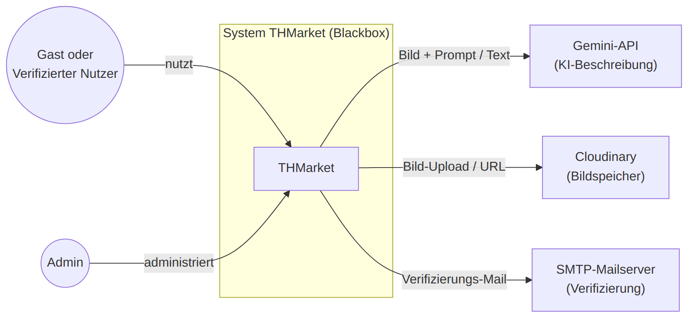
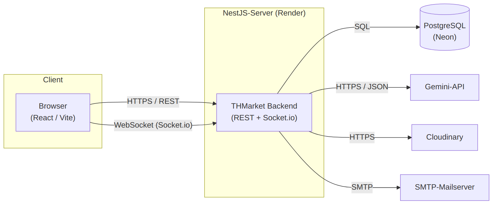

# 3. Kontextabgrenzung
THMarket wird in diesem Kapitel als Blackbox betrachtet. Die Kontextabgrenzung zeigt seine Beziehungen zu Nutzern, Administratoren und externen technischen Diensten. Die internen Bausteine des Systems werden erst in den späteren Architekturkapiteln beschrieben

## 3.1 Fachlicher Kontext


THMarket interagiert fachlich hauptsächlich mit zwei Rollen:

* dem verifizierten THM-Studierenden,
* dem Administrator.

Ein verifizierter THM-Studierender kann sowohl als Käufer als auch als Verkäufer auftreten.

### Verifizierter Nutzer

Ein Nutzer kann insbesondere:

* Inserate suchen und filtern,
* Inserate favorisieren,
* eigene Inserate erstellen und verwalten,
* Bilder hochladen,
* KI-Unterstützung für Titel, Beschreibung und Kategorie verwenden,
* andere Nutzer über den Echtzeit-Chat kontaktieren,
* einen Kauf über die simulierte Zahlungsfunktion durchführen,
* andere Nutzer nach einem abgeschlossenen Verkauf bewerten,
* problematische Inhalte melden.

### Administrator

Der Administrator ist für die Moderation und den Betrieb der Plattform zuständig.

Zu seinen Aufgaben gehören insbesondere:

* Bearbeitung von Meldungen,
* Durchführung abgestufter Moderationsmaßnahmen,
* Verwaltung administrativer Funktionen,
* Einsicht in dafür vorgesehene Audit- und Systeminformationen.

Private Chat-Inhalte sind für Administratoren nicht einsehbar.

### Externe Dienste

THMarket kommuniziert mit folgenden externen Diensten:

#### Cloudinary

Cloudinary speichert und liefert die von Nutzern hochgeladenen Bilder.

THMarket übermittelt die Bilddatei an Cloudinary und erhält eine URL zurück. Diese URL wird in PostgreSQL gespeichert.

#### Google Gemini

Google Gemini unterstützt die Erstellung von Inseraten.

Das System übermittelt die erforderlichen Bild- beziehungsweise Inseratsinformationen an Gemini und erhält Vorschläge für Titel, Beschreibung und Kategorie zurück.

Eine Preisempfehlung durch Gemini ist nicht vorgesehen.

#### SMTP / Gmail

Für die E-Mail-Verifizierung wird ein SMTP-Maildienst über Gmail verwendet.

Nach der Registrierung erhält der Nutzer eine E-Mail mit einem Verifizierungslink. Erst nach erfolgreicher Verifizierung wird das Konto vollständig freigeschaltet.

### Abgrenzung

Nicht Teil von THMarket sind:

* Cloudinary,
* Google Gemini,
* Gmail beziehungsweise der SMTP-Maildienst,
* reale Zahlungsanbieter,
* die Endgeräte und Browser der Nutzer.

Die innerhalb der Anwendung dargestellte Zahlung ist lediglich eine Simulation und löst keine reale Transaktion aus.

### Fachliches Kontextdiagramm

Das fachliche Kontextdiagramm wird als Mermaid-Quelltext im Repository abgelegt und zusätzlich als gerenderte Grafik eingebunden.

## 3.2 Technischer Kontext


Der technische Kontext beschreibt die Kommunikationskanäle zwischen Browser, Backend, Datenbank und externen Diensten.

Der Browser führt das React-Frontend als Single-Page-Application aus.

Für reguläre Anwendungsfunktionen kommuniziert das Frontend über HTTPS und REST mit dem NestJS-Backend. Für den Echtzeit-Chat wird zusätzlich eine Socket.io-Verbindung verwendet.

Das NestJS-Backend greift über Prisma auf die PostgreSQL-Datenbank bei Neon zu und bindet Cloudinary, Google Gemini und den SMTP-Dienst serverseitig an.

### Technische Kommunikationswege

| Fachliche Schnittstelle | Technischer Kanal                                       |
| ----------------------- | ------------------------------------------------------- |
| Registrierung / Login   | HTTPS REST mit JSON und Authentifizierung               |
| Verifizierungs-E-Mail   | SMTP über Gmail                                         |
| Inserats- und Suchdaten | HTTPS REST; Datenbankzugriff über Prisma und PostgreSQL |
| Bild-Upload             | HTTPS vom Backend zu Cloudinary                         |
| KI-Beschreibung         | HTTPS vom Backend zu Google Gemini                      |
| Chat-Nachrichten        | Socket.io / WebSocket                                   |
| Persistente Daten       | Prisma / SQL zu PostgreSQL auf Neon                     |

### Frontend ↔ Backend

Das React-Frontend kommuniziert für CRUD-Funktionen über eine REST-Schnittstelle mit dem NestJS-Backend.

Zu diesen Funktionen gehören insbesondere:

* Registrierung und Login,
* Inseratsverwaltung,
* Suche und Filter,
* Favoriten,
* Kauf- und Bewertungsfunktionen,
* Meldungen,
* administrative Funktionen.

### Echtzeit-Kommunikation

Für den Chat wird Socket.io verwendet.

Dadurch kann zwischen Browser und Backend eine dauerhafte bidirektionale Verbindung aufgebaut werden. Nachrichten werden in Echtzeit übertragen und zusätzlich in PostgreSQL gespeichert.

### Backend ↔ PostgreSQL

Das Backend greift über Prisma auf PostgreSQL bei Neon zu.

Ein direkter Datenbankzugriff aus dem Browser ist nicht vorgesehen.

### Backend ↔ Cloudinary

Bilddateien werden serverseitig über HTTPS an Cloudinary übertragen. Cloudinary liefert eine Bild-URL zurück, die anschließend in PostgreSQL gespeichert wird.

### Backend ↔ Google Gemini

Die Kommunikation mit Google Gemini erfolgt serverseitig über HTTPS.

Gemini liefert Vorschläge für Titel, Beschreibung und Kategorie zurück. Der zugehörige API-Schlüssel bleibt ausschließlich auf der Serverseite.

### Backend ↔ SMTP / Gmail

Für den Versand von Verifizierungs-E-Mails kommuniziert das Backend über SMTP mit Gmail.

### Vereinfachter technischer Kontext

```text
THM-Nutzer / Administrator
           |
           | Browser
           v
     React / Vite / TS
           |
     HTTPS REST
           |
           +------ Socket.io ------+
           |                       |
           v                       v
        NestJS Backend / Chat
           |
     +-----+----------+-----------+-----------+
     |                |           |           |
     | Prisma         | HTTPS     | HTTPS     | SMTP
     v                v           v           v
PostgreSQL         Cloudinary   Gemini      Gmail
  (Neon)
```

### Technisches Kontextdiagramm

Das technische Kontextdiagramm wird als Mermaid-Quelltext im Repository abgelegt und zusätzlich als gerenderte Grafik eingebunden.
