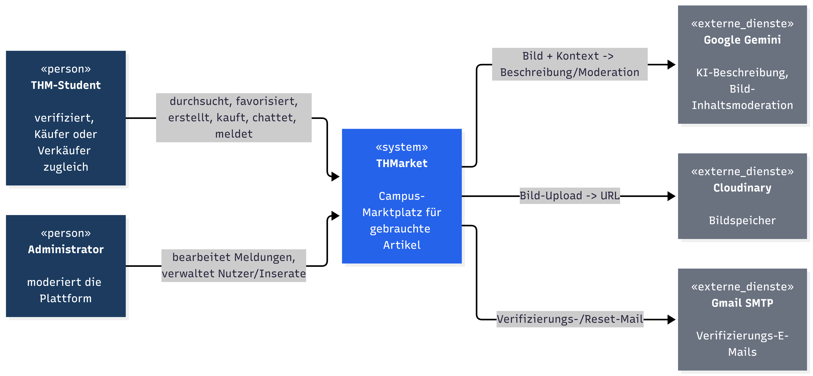
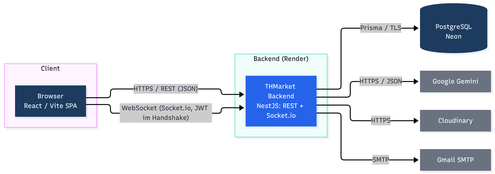

# 3. Kontextabgrenzung

---

THMarket wird in diesem Kapitel als Blackbox betrachtet. Die Kontextabgrenzung zeigt seine Beziehungen zu Nutzern, Administratoren und externen technischen Diensten.

## 3.1 Fachlicher Kontext

*Abbildung 1: Fachlicher Kontext der THMarket-Anwendung*

📊 Diagramm anzeigen

THMarket interagiert fachlich mit zwei Rollen: dem verifizierten THM-Studierenden und dem Administrator. Ein verifizierter Studierender kann sowohl als Käufer als auch als Verkäufer auftreten.

**Verifizierter Nutzer**

Ein Nutzer kann insbesondere Inserate durchsuchen und favorisieren, eigene Inserate erstellen und verwalten, Bilder hochladen, KI-Unterstützung für die Beschreibung verwenden, andere Nutzer über den Echtzeit-Chat kontaktieren, einen Kauf über die simulierte Zahlungsfunktion durchführen sowie problematische Inhalte oder Nutzer melden.

**Administrator**

Der Administrator ist für Moderation und Betrieb zuständig: Bearbeitung von Meldungen, abgestufte Maßnahmen (Inserat löschen, Nutzer verwarnen, Nutzer löschen), Verwaltung von Nutzerkonten und Inseraten, Einsicht in das Audit-Log. Private Chat-Inhalte sind für Administratoren ohne Meldungskontext nicht einsehbar.

**Externe Dienste**

- Cloudinary speichert und liefert die hochgeladenen Bilder. THMarket übermittelt die Bilddatei und erhält eine URL zurück, die in PostgreSQL gespeichert wird.
- Google Gemini unterstützt das Erstellen von Inseraten (Beschreibungsvorschlag) und prüft jedes Foto auf unangemessene Inhalte; eine Preis- oder Titelempfehlung ist nicht vorgesehen.
- Gmail SMTP versendet die Verifizierungs- und Passwort-Reset-E-Mails.

Nicht Teil von THMarket sind: Cloudinary, Google Gemini, Gmail SMTP, reale Zahlungsanbieter sowie die Endgeräte und Browser der Nutzer. Die dargestellte Zahlung ist lediglich eine Simulation.

## 3.2 Technischer Kontext

*Abbildung 2: Technischer Kontext der THMarket-Anwendung*

📊 Diagramm anzeigen

Der Browser führt das React-Frontend aus. Für reguläre Anwendungsfunktionen kommuniziert das Frontend über HTTPS/REST mit dem NestJS-Backend, und für den Echtzeit-Chat wird zusätzlich eine Socket.io-Verbindung aufgebaut, bei der das JWT im Verbindungs-Handshake mitgeschickt wird. Das Backend greift über Prisma auf PostgreSQL bei Neon zu und bindet Cloudinary, Google Gemini und Gmail SMTP serverseitig an. Ein direkter Datenbankzugriff aus dem Browser ist nicht vorgesehen.

| Fachliche Schnittstelle | Technischer Kanal |
|---|---|
| Registrierung / Login | HTTPS REST mit JSON, JWT-Authentifizierung |
| Verifizierungs-/Reset-E-Mail | SMTP über Gmail |
| Inseratsdaten, Kauf, Favoriten | HTTPS REST; Datenbankzugriff über Prisma und PostgreSQL |
| Bild-Upload | HTTPS vom Backend zu Cloudinary |
| KI-Beschreibung / -Moderation | HTTPS vom Backend zu Google Gemini |
| Chat-Nachrichten | Socket.io / WebSocket |
| Persistente Daten | Prisma / SQL zu PostgreSQL auf Neon |

*Zuordnung fachlicher Schnittstellen zu technischen Kanälen*
