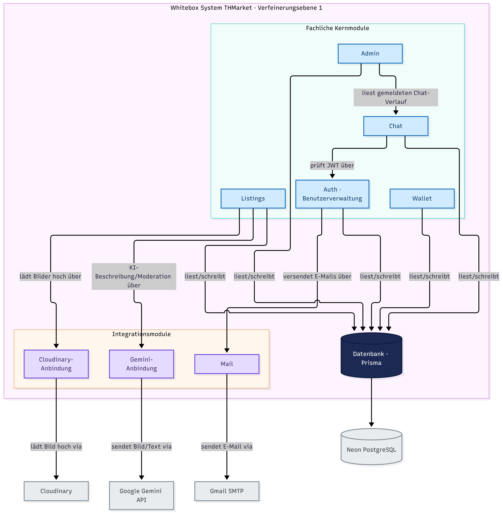
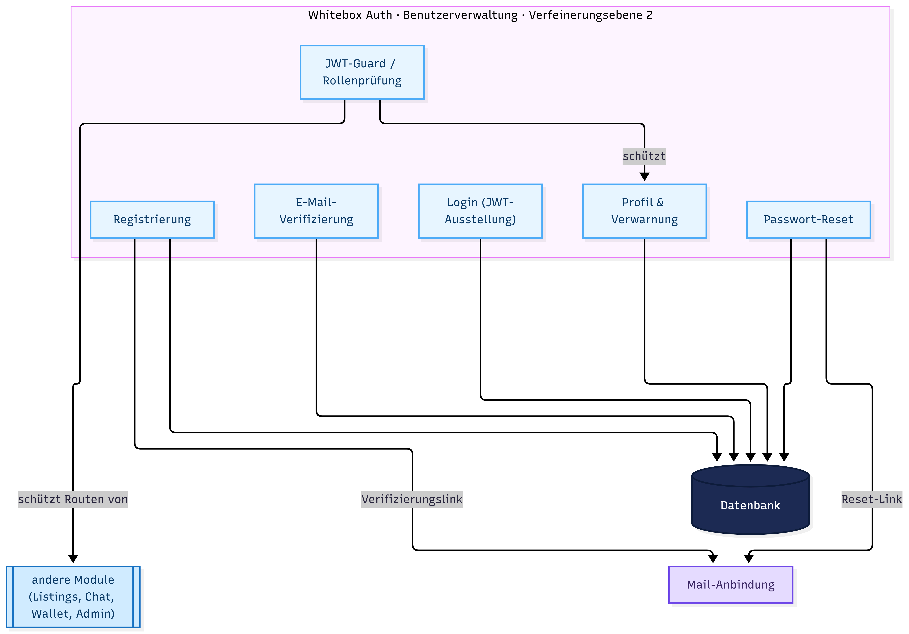
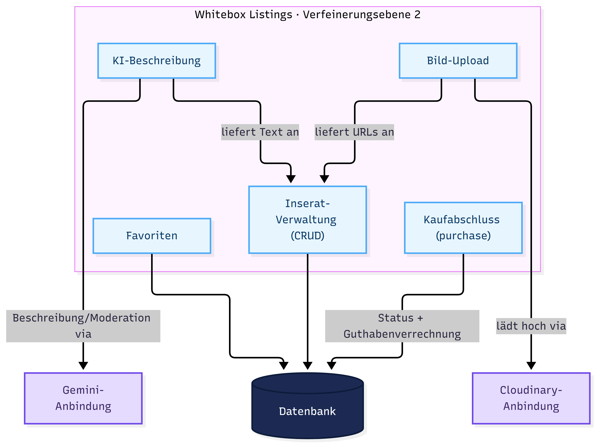
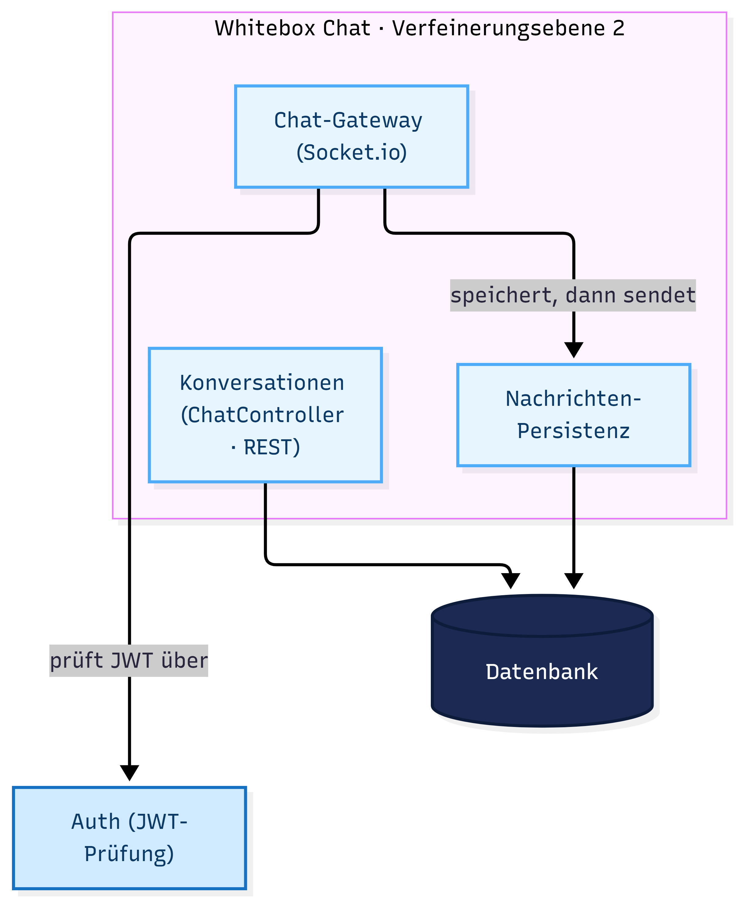
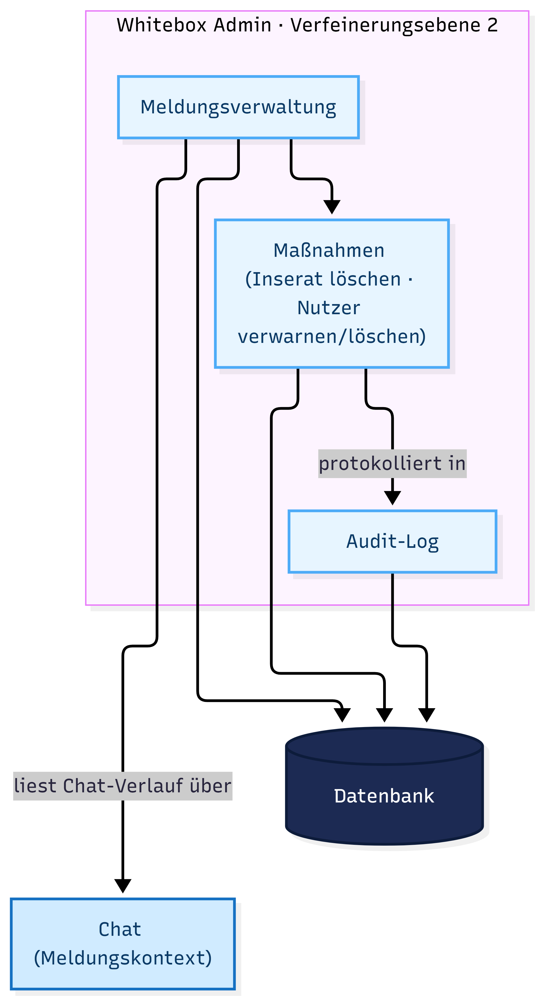

# 5. Bausteinsicht

Die Bausteinsicht zeigt, wie THMarket von innen aufgebaut ist. Die Zerlegung erfolgt in drei Verfeinerungsebenen: Ebene 0 betrachtet das System als Blackbox im Systemkontext, Ebene 1 öffnet es in seine fachlichen Kern- und Integrationsmodule, und Ebene 2 verfeinert die vier zentralen Kernmodule in ihre inneren Bausteine.

Die folgende Zerlegungsübersicht stellt alle drei Ebenen gestapelt dar, die gestrichelten „verfeinert"-Pfeile verbinden jede Ebene mit ihrer nächsttieferen Detaillierung.

*Abbildung 3: Bausteinsicht — Zerlegungsübersicht (Ebene 0 → 2)*

 Diagramm anzeigen

*Farben: Blau = fachliche Kernmodule, Violett = Integrationsmodule, Navy = Datenbank, Grau = externe Nachbarsysteme.*

## 5.1 Whitebox „System THMarket" (Ebene 1)

Auf Ebene 1 besteht THMarket aus fünf fachlichen Kernmodulen (Auth, Listings, Wallet, Chat, Admin) und drei Integrationsmodulen (Mail, Cloudinary-Anbindung, Gemini-Anbindung), die jeweils genau ein externes Nachbarsystem kapseln, sowie der über Prisma angesprochenen Datenbank.

*Abbildung 4: Whitebox „System THMarket" (Verfeinerungsebene 1)*

 Diagramm anzeigen

| Bezeichnung | Bedeutung |
|---|---|
| **Name** | System THMarket |
| **Lokale Bausteine** | Kernmodule: Auth (Benutzer- und Zugriffsverwaltung), Listings, Wallet, Chat, Admin. Integrationsmodule: Mail, Cloudinary-Anbindung, Gemini-Anbindung. Datenbank (Prisma). |
| **Lokale Beziehung und Abhängigkeiten** | Admin liest bei einer gemeldeten Konversation deren Chat-Verlauf über das Chat-Modul, das Chat-Gateway prüft das JWT über das Auth-Modul, Listings nutzt die Cloudinary-Anbindung (Bild-Upload) und die Gemini-Anbindung (KI-Beschreibung/Moderation), Auth versendet E-Mails über die Mail-Anbindung. Alle Kernmodule lesen/schreiben über die Datenbank, jedes Integrationsmodul spricht genau ein Nachbarsystem an. |
| **Entwurfsentscheidungen** | Kaufabschluss im Listings-Modul statt in einem eigenen Transaktionsmodul. |

*Whitebox-Beschreibung „System THMarket" (Ebene 1)*

### Blackbox-Beschreibungen der Ebene-1-Bausteine

**Auth (Benutzer- und Zugriffsverwaltung)**

| Bezeichnung | Bedeutung |
|---|---|
| **Zweck & Verantwortlichkeit** | Registrierung, THM-E-Mail-Verifizierung, Login, Passwort-Reset sowie das User-Profil. |
| **Schnittstelle(n)** | Von außen aufrufbare REST-Endpunkte unter `/auth/*` (register, verify-email, resend-verification, login, logout, forgot-password, reset-password, me, dismiss-warning). Nach innen stellt das Modul den JWT-Guard bereit, über den alle anderen Module den angemeldeten Nutzer und dessen Rolle prüfen. |
| **Abhängigkeiten** | Mail-Anbindung (Versand der Verifizierungs- und Reset-Links), Datenbank (Prisma). Basis-Baustein: Listings, Chat, Wallet und Admin hängen über den JWT-Guard von Auth ab. |
| **Erfüllte Anforderungen** | UC01 (Registrieren), UC02 (Anmelden), UC03 (Passwort zurücksetzen) sowie die Sicherheitsanforderungen bcrypt-Hashing und Zugang nur für verifizierte `@thm.de`-Adressen. |
| **Variabilität** | Authentifizierungsverfahren und Token-Lebensdauer austauschbar, ohne die fachlichen Module zu ändern. |

**Listings**

| Bezeichnung | Bedeutung |
|---|---|
| **Zweck & Verantwortlichkeit** | Verwaltung von Inseraten (Anlegen, Bearbeiten, Löschen, Als-verkauft-Markieren), Bild-Upload, KI-Beschreibungsvorschlag, Favoriten und der Kaufabschluss selbst inkl. Guthabenverrechnung bei Käufer und Verkäufer. |
| **Schnittstelle(n)** | REST-Endpunkte unter `/listings/*`, u. a. Liste und Detail, Anlegen/Bearbeiten, `/listings/upload` (Bild-Upload), `/listings/generate-description` (KI-Vorschlag), `/listings/:id/sold`, `/listings/:id/purchase` und `/listings/:id/favorite`. |
| **Abhängigkeiten** | Cloudinary-Anbindung (Bild-Upload), Gemini-Anbindung (Beschreibung und Moderation), Datenbank. |
| **Erfüllte Anforderungen** | UC04 (Inserat erstellen), UC05 (Inserat verwalten), UC06 (Inserate durchsuchen und favorisieren), UC08 (Kauf abschließen). |
| **Variabilität** | Kategorienliste, maximale Bildanzahl (1–6) und Zahlungsmodi erweiterbar. |

**Wallet**

| Bezeichnung | Bedeutung |
|---|---|
| **Zweck & Verantwortlichkeit** | Auf- und Auszahlen des simulierten In-App-Guthabens, mit erneuter serverseitiger Guthabenprüfung unmittelbar vor der Verrechnung. |
| **Schnittstelle(n)** | Zwei REST-Endpunkte: `/wallet/topup` (Aufladen) und `/wallet/withdraw` (Auszahlen). Einfachstes Modul, ohne weitere interne Untergliederung. |
| **Abhängigkeiten** | Nur die Datenbank (Feld `USER.balanceCents`). |
| **Erfüllte Anforderungen** | UC09 (Guthaben aufladen), UC10 (Guthaben auszahlen). |
| **Variabilität** | Betragsgrenzen (5–500 €) konfigurierbar. |

**Chat**

| Bezeichnung | Bedeutung |
|---|---|
| **Zweck & Verantwortlichkeit** | Privater Echtzeit-Chat zwischen Interessent und Anbieter zu einem Inserat, mit dauerhafter Speicherung der Nachrichten. |
| **Schnittstelle(n)** | REST-Endpunkte unter `/conversations/*` (Konversation starten, auflisten, Nachrichtenverlauf laden, als gelesen markieren) sowie die Socket.io-Ereignisse `joinConversation` und `sendMessage` für die Echtzeit-Übertragung. |
| **Abhängigkeiten** | Auth (der Socket.io-Gateway prüft dasselbe JWT wie die REST-API), Datenbank. |
| **Erfüllte Anforderungen** | UC07 (Chat mit Nutzer führen) sowie NFA-04 (Echtzeit-Zustellung in unter einer Sekunde). |
| **Variabilität** | Nachrichten-Längenlimit und weitere Echtzeit-Ereignisse erweiterbar. |

**Admin**

| Bezeichnung | Bedeutung |
|---|---|
| **Zweck & Verantwortlichkeit** | Meldungen zu Inseraten und Nutzern bearbeiten, abgestufte Maßnahmen ausführen (Inserat löschen, Nutzer verwarnen, Nutzer löschen), Nutzer und Inserate verwalten sowie das Audit-Log einsehen. |
| **Schnittstelle(n)** | REST-Endpunkte unter `/admin/*` — reports (erstellen, auflisten, auflösen), users, listings, audit-log sowie `/admin/conversations/:id/messages` für den Chat-Verlauf im Meldungskontext. |
| **Abhängigkeiten** | Chat (Einsicht in eine gemeldete Konversation), Datenbank. |
| **Erfüllte Anforderungen** | UC11 (Inserat melden), UC12 (Nutzer melden), UC13 (Meldungen bearbeiten), UC14 (Admin-Verwaltung). |
| **Variabilität** | Weitere Maßnahmen und Filter ergänzbar. |

**Mail-Anbindung**

| Bezeichnung | Bedeutung |
|---|---|
| **Zweck & Verantwortlichkeit** | Versand der Verifizierungs- und Passwort-Reset-E-Mails über einen externen SMTP-Dienst. |
| **Schnittstelle(n)** | Interne Methoden zum Versand der Verifizierungs- und der Reset-Mail, die ausschließlich das Auth-Modul aufruft; nach außen das SMTP-Protokoll. |
| **Abhängigkeiten** | Gmail SMTP (über die Bibliothek `nodemailer`). |
| **Erfüllte Anforderungen** | Teil von UC01 (Registrieren) und UC03 (Passwort zurücksetzen) — der E-Mail-Versand innerhalb dieser Abläufe. |
| **Variabilität** | SMTP-Anbieter und E-Mail-Templates austauschbar. |

**Cloudinary-Anbindung**

| Bezeichnung | Bedeutung |
|---|---|
| **Zweck & Verantwortlichkeit** | Hochladen der Inseratbilder zu Cloudinary und Rückgabe der dauerhaften Bild-URLs, die am Inserat gespeichert werden. |
| **Schnittstelle(n)** | Interne Upload-Methode, die ausschließlich das Listings-Modul aufruft; nach außen die Cloudinary-REST-API. Der Client lädt nie direkt zu Cloudinary hoch. |
| **Abhängigkeiten** | Cloudinary-Dienst. |
| **Erfüllte Anforderungen** | Teil von UC04 (Inserat erstellen) und UC05 (Inserat verwalten) — die Bildspeicherung. |
| **Variabilität** | Bild-Storage-Anbieter austauschbar. |

**Gemini-Anbindung**

| Bezeichnung | Bedeutung |
|---|---|
| **Zweck & Verantwortlichkeit** | Erzeugen eines KI-Beschreibungsvorschlags und Moderation jedes hochgeladenen Fotos. Fail-open: bei Ausfall wird der Upload dennoch zugelassen und im Audit-Log vermerkt. |
| **Schnittstelle(n)** | Interne Methoden zum Generieren einer Beschreibung und zum Moderieren eines Bildes, die ausschließlich das Listings-Modul aufruft; nach außen die Google-Gemini-API. |
| **Abhängigkeiten** | Google Gemini, Datenbank (Audit-Log-Eintrag bei fehlgeschlagener Moderation). |
| **Erfüllte Anforderungen** | Teil von UC04 (Inserat erstellen); NFA-06 (Fail-open-Verhalten des externen KI-Dienstes). |
| **Variabilität** | KI-Modell und Prompt konfigurierbar. |

**Datenbank**

| Bezeichnung | Bedeutung |
|---|---|
| **Zweck & Verantwortlichkeit** | Persistente Speicherung aller sieben Kern-Entitäten: User, Listing, Favorite, Report, AuditLogEntry, Conversation und Message. |
| **Schnittstelle(n)** | Der global bereitgestellte Prisma-Client (`PrismaService`), über den alle Kernmodule ihre Datenzugriffe abwickeln. |
| **Abhängigkeiten** | Neon PostgreSQL als Datenbankserver. |
| **Erfüllte Anforderungen** | Querschnittliche Grundlage für alle Use Cases UC01–UC14. |
| **Variabilität** | Datenbank-Host austauschbar, solange PostgreSQL-kompatibel. |

## 5.2 Verfeinerungsebene 2

Die vier zentralen Kernmodule werden nun in ihre inneren Bausteine zerlegt. Für jedes Modul zeigt eine Whitebox-Abbildung die Bausteine samt Beziehungen, gefolgt von einer Whitebox-Tabelle und einer Kurzbeschreibung jedes Bausteins mit dem zugehörigen Use Case. Das Wallet-Modul hat keine weitere interne Verfeinerung und wird daher nicht erneut aufgeteilt.

### 5.2.1 Whitebox „Auth"

*Abbildung 5: Whitebox „Auth" (Verfeinerungsebene 2)*

 Diagramm anzeigen

| Bezeichnung | Bedeutung |
|---|---|
| **Name** | Auth (Verfeinerungsebene 2) |
| **Lokale Bausteine** | Registrierung, E-Mail-Verifizierung, Login (JWT-Ausstellung), Passwort-Reset, Profil & Verwarnung, JWT-Guard / Rollenprüfung. |
| **Lokale Beziehung & Abhängigkeiten** | Registrierung und Passwort-Reset nutzen die Mail-Anbindung für den Link-Versand, alle Bausteine lesen/schreiben über die Datenbank, der JWT-Guard prüft das Token für den Login und für die geschützten Routen aller anderen Module. |
| **Entwurfsentscheidungen** | `passwordChangedAt` entwertet zuvor ausgestellte Tokens, THM-Domain- und Passwortregeln liegen zentral im Auth-Modul. |

**Blackbox „Registrierung"**

| Bezeichnung | Bedeutung |
|---|---|
| **Zweck & Verantwortlichkeit** | Legt ein unverifiziertes Konto an, hasht das Passwort mit bcrypt (12 Runden) und stößt den Versand der Verifizierungs-E-Mail an. Ein bereits existierendes Konto erhält dieselbe Erfolgsantwort. |
| **Schnittstelle(n)** | REST-Endpunkt `POST /auth/register`. |
| **Abhängigkeiten** | Mail-Anbindung (Versand des Verifizierungslinks), Datenbank (User anlegen). |
| **Erfüllte Anforderungen** | UC01 (Registrieren) sowie die Sicherheitsvorgaben „nur `@thm.de`-Adressen" und „bcrypt-Hashing". |
| **Variabilität** | Passwortregeln und THM-Domain-Muster liegen zentral und sind ohne Änderung der übrigen Bausteine austauschbar. |

**Blackbox „E-Mail-Verifizierung"**

| Bezeichnung | Bedeutung |
|---|---|
| **Zweck & Verantwortlichkeit** | Bestätigt die `@thm.de`-Adresse über einen zeitlich begrenzten Token-Link; erst nach erfolgreicher Verifizierung ist ein Login möglich. Ein neuer Link kann angefordert werden. |
| **Schnittstelle(n)** | REST-Endpunkte `GET /auth/verify-email?token=…` und `POST /auth/resend-verification`. |
| **Abhängigkeiten** | Datenbank (Token prüfen, Flag `verified` setzen), Mail-Anbindung (erneuter Versand). |
| **Erfüllte Anforderungen** | Teil von UC01 (Registrieren). |
| **Variabilität** | Token-Gültigkeit (24 h) und Wiederholungssperre (60 s) konfigurierbar. |

**Blackbox „Login"**

| Bezeichnung | Bedeutung |
|---|---|
| **Zweck & Verantwortlichkeit** | Prüft die Zugangsdaten mit `bcrypt.compare` und stellt bei Erfolg ein signiertes JWT mit Nutzer-ID und Rolle aus, das als httpOnly-Cookie gesetzt wird. Unverifizierte Konten werden vor der Passwortprüfung abgewiesen. |
| **Schnittstelle(n)** | REST-Endpunkte `POST /auth/login` (AccountThrottlerGuard: 5 / Minute pro E-Mail + IP) und `POST /auth/logout`. |
| **Abhängigkeiten** | Datenbank (Nutzer laden), JwtService (Signatur), Auth-Cookie-Konfiguration. |
| **Erfüllte Anforderungen** | UC02 (Anmelden). |
| **Variabilität** | Token-Lebensdauer (`JWT_EXPIRES_IN`) und Authentifizierungsverfahren austauschbar. |

**Blackbox „Passwort-Reset"**

| Bezeichnung | Bedeutung |
|---|---|
| **Zweck & Verantwortlichkeit** | Versendet auf Anfrage einen Reset-Link (mit generischer Antwort gegen Konto-Enumeration) und setzt anschließend das neue Passwort. Dabei wird `passwordChangedAt` gesetzt, was alle älteren Sitzungstoken entwertet. |
| **Schnittstelle(n)** | REST-Endpunkte `POST /auth/forgot-password` (5 / Minute pro E-Mail + IP) und `POST /auth/reset-password`. |
| **Abhängigkeiten** | Mail-Anbindung (Reset-Link), Datenbank (Token, Passwort-Hash, `passwordChangedAt`). |
| **Erfüllte Anforderungen** | UC03 (Passwort zurücksetzen). |
| **Variabilität** | Reset-Token-Gültigkeit (1 h, bewusst kürzer als die Verifizierung) konfigurierbar. |

**Blackbox „Profil & Verwarnung"**

| Bezeichnung | Bedeutung |
|---|---|
| **Zweck & Verantwortlichkeit** | Anzeige und Änderung des eigenen Profils sowie das Quittieren einer durch einen Admin ausgesprochenen Verwarnung. |
| **Schnittstelle(n)** | REST-Endpunkte `GET` / `PATCH /auth/me` und `POST /auth/dismiss-warning` (alle JWT-geschützt). |
| **Abhängigkeiten** | Datenbank, JWT-Guard. |
| **Erfüllte Anforderungen** | Angemeldeter Bereich aus UC02. Anzeige der Verwarnung aus UC13 / UC14. |
| **Variabilität** | Profilfelder erweiterbar, ohne die anderen Bausteine zu berühren. |

**Blackbox „JWT-Guard / Rollenprüfung"**

| Bezeichnung | Bedeutung |
|---|---|
| **Zweck & Verantwortlichkeit** | Zentrale Prüfung von Token, Sitzungsgültigkeit (`passwordChangedAt`, gelöschte Konten) und Rolle (`STUDENT` / `ADMIN`) für die geschützten Routen aller Module. Kein eigener Endpunkt, sondern ein modulübergreifend genutzter Baustein. |
| **Schnittstelle(n)** | Interner NestJS-Guard (`JwtAuthGuard` / `JwtStrategy`) und die Funktion `assertSessionStillValid`, die HTTP und Socket.io gemeinsam nutzen. |
| **Abhängigkeiten** | Datenbank (Sitzungsprüfung), `JWT_SECRET`. |
| **Erfüllte Anforderungen** | Sicherheitsgrundlage für UC02–UC14 (jede geschützte Aktion). |
| **Variabilität** | Token-Quelle (Cookie / Bearer) und Rollenmodell erweiterbar. |

### 5.2.2 Whitebox „Listings"

*Abbildung 6: Whitebox „Listings" (Verfeinerungsebene 2)*

 Diagramm anzeigen

| Bezeichnung | Bedeutung |
|---|---|
| **Name** | Listings (Verfeinerungsebene 2) |
| **Lokale Bausteine** | Inserat-Verwaltung (CRUD), Bild-Upload, KI-Beschreibung, Favoriten, Kaufabschluss (purchase). |
| **Lokale Beziehung & Abhängigkeiten** | Bild-Upload nutzt die Cloudinary-Anbindung und liefert die URLs an die Inserat-Verwaltung. KI-Beschreibung nutzt die Gemini-Anbindung und liefert den Textvorschlag. Der Kaufabschluss setzt Status und Käufer und verrechnet das Guthaben in der Datenbank. |
| **Entwurfsentscheidungen** | Kaufabschluss inkl. Guthabenverrechnung liegt hier (ADR-002), kein eigenes Transaktionsmodul. Bilder als URL-Liste direkt am Inserat. |

**Blackbox „Inserat-Verwaltung (CRUD)"**

| Bezeichnung | Bedeutung |
|---|---|
| **Zweck & Verantwortlichkeit** | Anlegen, Bearbeiten, Löschen und Als-verkauft-Markieren eines Inserats mit Titel, Beschreibung, Kategorie, Preis, Bild-URLs und Sofortkauf-Flag. Eigentümerprüfung bei jeder ändernden Aktion. |
| **Schnittstelle(n)** | REST-Endpunkte `GET /listings`, `GET /listings/:id`, `POST /listings`, `PATCH /listings/:id`, `PATCH /listings/:id/sold`, `DELETE /listings/:id`. |
| **Abhängigkeiten** | Datenbank, Auth (Eigentümer- und Guard-Prüfung). |
| **Erfüllte Anforderungen** | UC04 (Inserat erstellen), UC05 (Inserat verwalten). |
| **Variabilität** | Kategorienliste und Inseratfelder erweiterbar. |

**Blackbox „Bild-Upload"**

| Bezeichnung | Bedeutung |
|---|---|
| **Zweck & Verantwortlichkeit** | Nimmt die (bereits clientseitig komprimierten) Fotos entgegen, lädt sie über die Cloudinary-Anbindung hoch und gibt die dauerhaften URLs an das Inserat zurück. Jedes Foto durchläuft zuvor die KI-Bildmoderation. |
| **Schnittstelle(n)** | REST-Endpunkt `POST /listings/upload` (JWT-geschützt, ThrottlerGuard). Der Client lädt nie direkt zu Cloudinary hoch. |
| **Abhängigkeiten** | Cloudinary-Anbindung, Gemini-Anbindung (Moderation), Datenbank. |
| **Erfüllte Anforderungen** | Teil von UC04 (Inserat erstellen) und UC05 (Inserat verwalten). |
| **Variabilität** | Maximale Bildanzahl (1–6) und Storage-Anbieter austauschbar. |

**Blackbox „KI-Beschreibung"**

| Bezeichnung | Bedeutung |
|---|---|
| **Zweck & Verantwortlichkeit** | Erzeugt aus Fotos, Titel, Kategorie und optionalem Hinweis einen Beschreibungsvorschlag über die Gemini-Anbindung. Der Text ist vor der Veröffentlichung frei bearbeitbar; fällt Gemini aus, bleibt die manuelle Eingabe möglich. |
| **Schnittstelle(n)** | REST-Endpunkt `POST /listings/generate-description` (enger gedrosselt: 3 / Minute pro IP). |
| **Abhängigkeiten** | Gemini-Anbindung, Auth (JWT-Guard). |
| **Erfüllte Anforderungen** | Teil von UC04 (Inserat erstellen). |
| **Variabilität** | KI-Modell und Prompt konfigurierbar, keine Preis-/Titel-/Kategorieempfehlung (ADR-005). |

**Blackbox „Favoriten"**

| Bezeichnung | Bedeutung |
|---|---|
| **Zweck & Verantwortlichkeit** | Merken und Entfernen fremder Inserate sowie das Auflisten der eigenen Favoriten. |
| **Schnittstelle(n)** | REST-Endpunkte `POST` / `DELETE /listings/:id/favorite` und `GET /listings/favorites`. |
| **Abhängigkeiten** | Datenbank (Favorite-Entität); Auth (JWT-Guard). |
| **Erfüllte Anforderungen** | UC06 (Inserate durchsuchen und favorisieren). |
| **Variabilität** | Struktur der Favoriten erweiterbar. |

**Blackbox „Kaufabschluss (purchase)"**

| Bezeichnung | Bedeutung |
|---|---|
| **Zweck & Verantwortlichkeit** | Wickelt den simulierten Kauf ab (Modus Simulation oder Guthaben), setzt den Status atomar auf `VERKAUFT` und verrechnet bei der Guthaben-Variante den Betrag serverseitig gegen eine erneute Guthabenprüfung. Eigentümer-, Rollen- und Sofortkauf-Prüfung inklusive. |
| **Schnittstelle(n)** | REST-Endpunkt `POST /listings/:id/purchase`. Kein separater Payments-Controller. |
| **Abhängigkeiten** | Datenbank (Transaktion über Listing und User), `mock-card.ts` für die Testkarten-Validierung. |
| **Erfüllte Anforderungen** | UC08 (Kauf abschließen). |
| **Variabilität** | Zahlungsmodi erweiterbar; echte Zahlung bewusst nicht angebunden (ADR-006). |

### 5.2.3 Whitebox „Chat"

*Abbildung 7: Whitebox „Chat" (Verfeinerungsebene 2)*

 Diagramm anzeigen

| Bezeichnung | Bedeutung |
|---|---|
| **Name** | Chat (Verfeinerungsebene 2) |
| **Lokale Bausteine** | Konversationen (ChatController · REST), Chat-Gateway (Socket.io), Nachrichten-Persistenz. |
| **Lokale Beziehung & Abhängigkeiten** | Das Gateway prüft dasselbe JWT wie die REST-API über das Auth-Modul. Jede Nachricht wird zuerst gespeichert und danach über Socket.io zugestellt. |
| **Entwurfsentscheidungen** | Socket.io statt nativem WebSocket (ADR-008), Persistenz vor Zustellung. |

**Blackbox „Konversationen (REST)"**

| Bezeichnung | Bedeutung |
|---|---|
| **Zweck & Verantwortlichkeit** | Startet und listet Konversationen, lädt den Nachrichtenverlauf und markiert Konversationen als gelesen. Teilnehmerprüfung bei jedem Zugriff. |
| **Schnittstelle(n)** | REST-Endpunkte `POST /conversations`, `GET /conversations`, `GET /conversations/:id/messages`, `POST /conversations/:id/read`. |
| **Abhängigkeiten** | Datenbank (Conversation, Message), Auth (JWT-Guard). |
| **Erfüllte Anforderungen** | UC07 (Chat mit Nutzer führen). |
| **Variabilität** | Weitere Konversations-Metadaten erweiterbar. |

**Blackbox „Chat-Gateway (Socket.io)"**

| Bezeichnung | Bedeutung |
|---|---|
| **Zweck & Verantwortlichkeit** | Stellt Nachrichten in Echtzeit zu. Prüft das JWT einmalig beim Verbindungsaufbau über dasselbe Verfahren wie die REST-API und begrenzt die Senderate pro Socket. |
| **Schnittstelle(n)** | Socket.io-Ereignisse `joinConversation` und `sendMessage` im Namespace `/chat`. |
| **Abhängigkeiten** | Auth (JWT-Prüfung, `assertSessionStillValid`), Datenbank, ChatService. |
| **Erfüllte Anforderungen** | UC07 (Chat) sowie NFA-04 (Echtzeit-Zustellung unter einer Sekunde). |
| **Variabilität** | Weitere Echtzeit-Ereignisse und Rate-Limit-Fenster erweiterbar. |

**Blackbox „Nachrichten-Persistenz"**

| Bezeichnung | Bedeutung |
|---|---|
| **Zweck & Verantwortlichkeit** | Speichert jede Nachricht dauerhaft, bevor sie über das Gateway zugestellt wird, damit der Verlauf beim nächsten Laden vollständig vorliegt. |
| **Schnittstelle(n)** | Interne Service-Methoden des ChatService (keine eigenen Endpunkte). |
| **Abhängigkeiten** | Datenbank (Message-Entität). |
| **Erfüllte Anforderungen** | Teil von UC07 (Chat mit Nutzer führen). |
| **Variabilität** | Nachrichten-Längenlimit (2000 Zeichen) konfigurierbar. |

### 5.2.4 Whitebox „Admin"

*Abbildung 8: Whitebox „Admin" (Verfeinerungsebene 2)*

 Diagramm anzeigen

| Bezeichnung | Bedeutung |
|---|---|
| **Name** | Admin (Verfeinerungsebene 2) |
| **Lokale Bausteine** | Meldungsverwaltung, Maßnahmen (Inserat löschen, Nutzer verwarnen/löschen), Audit-Log. |
| **Lokale Beziehung & Abhängigkeiten** | Die Meldungsverwaltung liest bei Chat-Meldungen den Konversationskontext über das Chat-Modul. Jede Maßnahme wird im Audit-Log protokolliert und in der Datenbank wirksam. |
| **Entwurfsentscheidungen** | Kein genereller Admin-Chatzugriff (ADR-007), die zulässige Maßnahme wird strikt gegen den Meldungstyp geprüft. |

**Blackbox „Meldungsverwaltung"**

| Bezeichnung | Bedeutung |
|---|---|
| **Zweck & Verantwortlichkeit** | Nimmt Meldungen zu Inseraten und Nutzern entgegen, listet offene Meldungen und stellt bei Chat-bezogenen Meldungen den Konversationskontext lesend bereit. |
| **Schnittstelle(n)** | REST-Endpunkte `POST /admin/reports`, `GET /admin/reports`, `GET /admin/conversations/:id/messages`. |
| **Abhängigkeiten** | Chat (Einsicht in die gemeldete Konversation), Datenbank, AdminGuard. |
| **Erfüllte Anforderungen** | UC11 (Inserat melden), UC12 (Nutzer melden), UC13 (Meldungen bearbeiten). |
| **Variabilität** | Weitere Meldungsgründe und Filter ergänzbar. |

**Blackbox „Maßnahmen"**

| Bezeichnung | Bedeutung |
|---|---|
| **Zweck & Verantwortlichkeit** | Führt die abgestuften Moderationsmaßnahmen aus: Inserat löschen, Nutzer verwarnen oder Nutzer löschen. Die zulässige Maßnahme wird strikt gegen den Meldungstyp geprüft. |
| **Schnittstelle(n)** | REST-Endpunkte `PATCH /admin/reports/:id/resolve`, `DELETE /admin/users/:id`, `DELETE /admin/listings/:id`, `GET /admin/users`. |
| **Abhängigkeiten** | Datenbank; AdminGuard (nur Rolle `ADMIN`). |
| **Erfüllte Anforderungen** | UC13 (Meldungen bearbeiten), UC14 (Admin-Verwaltung). |
| **Variabilität** | Weitere Maßnahmen ergänzbar. |

**Blackbox „Audit-Log"**

| Bezeichnung | Bedeutung |
|---|---|
| **Zweck & Verantwortlichkeit** | Protokolliert jede Admin-Aktion sowie sicherheitsrelevante Systemereignisse (z. B. fehlgeschlagene KI-Bildmoderation) chronologisch und nachvollziehbar. |
| **Schnittstelle(n)** | REST-Endpunkt `GET /admin/audit-log`; interne Schreibzugriffe aus Admin- und Gemini-Anbindung. |
| **Abhängigkeiten** | Datenbank (AuditLogEntry-Entität); AdminGuard. |
| **Erfüllte Anforderungen** | UC14 (Admin-Verwaltung). |
| **Variabilität** | Weitere protokollierte Ereignistypen ergänzbar. |

