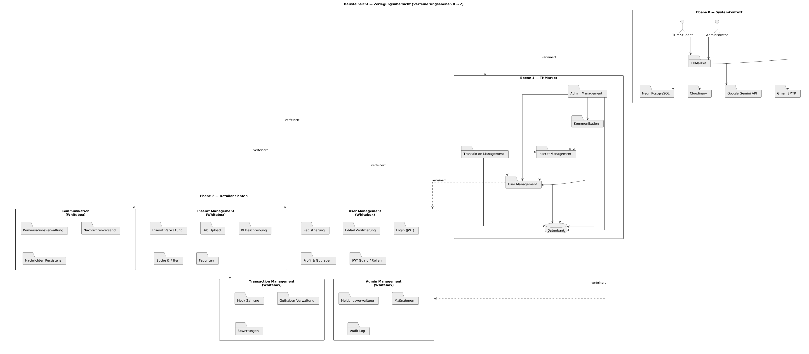
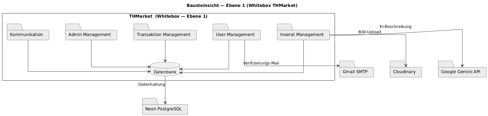
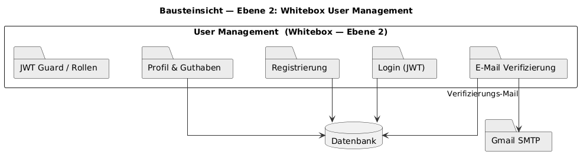
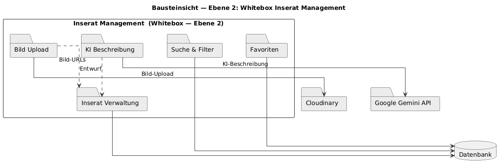
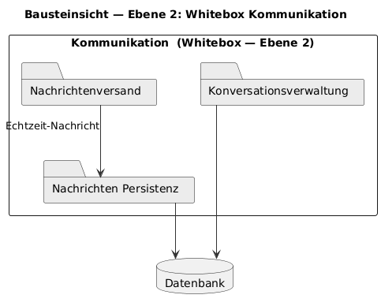
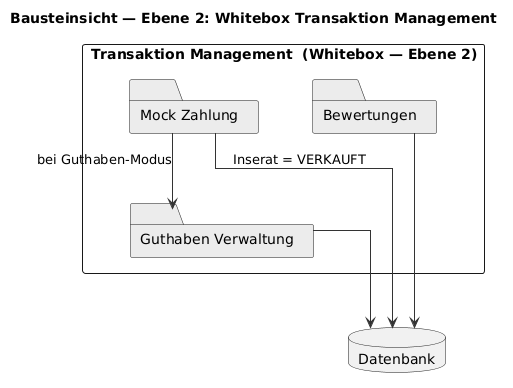
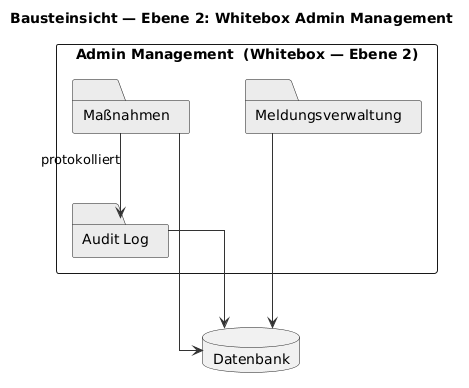

# 5. Bausteinsicht
 
Die Bausteinsicht zeigt, wie THMarket von innen aufgebaut ist.
Auf der obersten Ebene (Ebene 0, Systemkontext) sieht man nur, wie sich THMarket nach außen abgrenzt: Der THM-Student und der Administrator nutzen das System als Akteure, und THMarket kommuniziert mit vier externen Diensten — Neon PostgreSQL, Cloudinary, der Google Gemini API und Gmail SMTP.
Eine Ebene tiefer (Ebene 1) wird THMarket in seine fünf fachlichen Module zerlegt: User Management, Inserat Management, Kommunikation, Transaktion Management und Admin Management, die alle auf eine gemeinsame Datenbank zugreifen.
Noch eine Ebene tiefer (Ebene 2) wird jedes der fünf Module im Detail betrachtet.
 

 
*Abbildung 4: Bausteinsicht — Zerlegungsübersicht (Ebenen 0–2)*
*(Quelltext: `diagrams-code/a05-bausteinsicht.plantuml`)*
 
## 5.1 Whitebox „System THMarket" (Ebene 1)
 
Alle fünf Module greifen für ihre Daten auf die gemeinsame Datenbank zu.
Zusätzlich sprechen einzelne Module direkt mit externen Diensten: User Management mit Gmail SMTP, um die Verifizierungs-Mail zu verschicken; Inserat Management mit Cloudinary für den Bild-Upload und mit der Google Gemini API für die KI-Beschreibung.
Die Datenbank selbst liegt bei Neon PostgreSQL, dorthin geht die eigentliche Datenhaltung.
 
Zwischen den fünf Modulen gibt es außerdem fachliche Abhängigkeiten, die in der Ebene-1-Übersicht als eigene Pfeile eingezeichnet sind:
 
- **Admin Management** braucht User Management, Inserat Management und Kommunikation — denn Meldungen können sich sowohl auf Nutzer als auch auf Inserate oder (mit Einwilligung) auf Chats beziehen.
- **Transaktion Management** braucht User Management und Inserat Management — um zu wissen, wer kauft, wer verkauft und welches Inserat gekauft wird.
- **Kommunikation** braucht ebenfalls User Management und Inserat Management — der Chat findet zwischen zwei Nutzern über ein bestimmtes Inserat statt.
- **Inserat Management** braucht seinerseits User Management, um den Anbieter eines Inserats zu kennen.

 
*(Quelltext: `diagrams-code/a05-bausteinsicht_whitebox_level_1.plantuml`)*
 
**Die fünf Module im Überblick:**
 
- **User Management** — Registrierung, THM-Verifizierung, Login, Profil, Guthaben
- **Inserat Management** — Inserate, Bild-Upload, KI-Beschreibung, Suche/Filter, Favoriten
- **Kommunikation** — der private Echtzeit-Chat
- **Transaktion Management** — Mock-Kauf, Guthaben, Bewertungen
- **Admin Management** — Meldungen, Maßnahmen, Audit-Log
**Begründung:** Die fachlichen Themen wurden sauber getrennt, damit jedes Modul für sich verständlich und wartbar bleibt, auch wenn dadurch bewusst Abhängigkeiten zwischen den Modulen entstehen (z.
B. braucht fast jedes Modul das User Management).
Externe Dienste sind bewusst als eigene Bausteine markiert, damit klar ist, an welchen Stellen THMarket von außen abhängig ist und wo ein Ausfall eines externen Dienstes (z.
B. der Gemini API) welche Module direkt betreffen würde.
 
### 5.1.1 Blackbox „User Management"
 
Verwaltet die Benutzerkonten: Registrierung, THM-Verifizierung, Login (per JWT), Profil und das In-App-Guthaben.
Greift für all das auf die Datenbank zu und spricht zusätzlich mit Gmail SMTP, um die Verifizierungs-Mail zu verschicken.
Da praktisch jedes andere Modul wissen muss, wer der aktuelle Nutzer ist, hängen Inserat Management, Kommunikation, Transaktion Management und Admin Management alle (direkt oder indirekt) von diesem Baustein ab.
 
### 5.1.2 Blackbox „Inserat Management"
 
Verwaltet die Inserate — inklusive Bild-Upload, KI-Beschreibung sowie Suche, Filter und Favoriten.
Greift auf die Datenbank zu, spricht mit Cloudinary für den Bild-Upload und mit der Google Gemini API für die KI-Beschreibung, und braucht das User Management, um zu wissen, wer der Anbieter eines Inserats ist.
 
### 5.1.3 Blackbox „Kommunikation"
 
Der private Echtzeit-Chat zwischen Käufer und Verkäufer, mit dauerhafter Speicherung in der Datenbank.
Braucht User Management (wer chattet mit wem) und Inserat Management (worüber wird gechattet — jede Konversation hängt an einem Inserat).
 
### 5.1.4 Blackbox „Transaktion Management"
 
Simuliert den Kauf — entweder ganz ohne Geldfluss oder über In-App-Guthaben — und verwaltet Bewertungen nach dem Verkauf.
Braucht die Datenbank sowie User Management und Inserat Management, um Käufer, Verkäufer und das gekaufte Inserat zuzuordnen.
 
### 5.1.5 Blackbox „Admin Management"
 
Nimmt Meldungen entgegen und führt darauf abgestufte Maßnahmen durch, alles mit Audit-Log in der Datenbank.
Braucht User Management, Inserat Management und Kommunikation, da eine Meldung sich auf einen Nutzer, ein Inserat oder — mit Einwilligung des Meldenden — auf eine Konversation beziehen kann.
 
## 5.2 Ebene 2
 
Auf dieser Ebene wird jedes der fünf Module nochmal genauer in seine Unterbausteine zerlegt.
 
### 5.2.1 Whitebox „User Management"
 
Besteht aus fünf Teilen: **Registrierung**, **E-Mail Verifizierung**, **Login (JWT)**, **Profil & Guthaben** und **JWT Guard / Rollen**.
 
Registrierung, E-Mail Verifizierung, Login sowie Profil & Guthaben greifen jeweils auf die Datenbank zu.
Die E-Mail Verifizierung spricht zusätzlich mit Gmail SMTP, um den Bestätigungslink zu verschicken.
Der JWT Guard / Rollen-Teil prüft Anfragen anhand des Tokens, hat dafür aber keine eigene, direkte Datenbankverbindung eingezeichnet — er arbeitet mit den Daten, die Login bzw.
Registrierung bereits abgelegt haben.
 

 
*(Quelltext: `diagrams-code/a05-bausteinsicht_whitebox_user_management.plantuml`)*
 
### 5.2.2 Whitebox „Inserat Management"
 
Besteht aus fünf Teilen: **Inserat Verwaltung**, **Bild Upload**, **KI Beschreibung**, **Suche & Filter** und **Favoriten**.
 
Bild Upload liefert der Inserat Verwaltung die Bild-URLs, KI Beschreibung liefert ihr den Beschreibungsentwurf — beide sind also Zulieferer für die eigentliche Inserat Verwaltung, nicht eigenständige Endpunkte für den Nutzer.
Bild Upload spricht dafür mit Cloudinary (dabei werden EXIF-Metadaten, u. a. GPS-Standortdaten, aus den Bildern entfernt), KI Beschreibung mit der Google Gemini API.
Inserat Verwaltung, Suche & Filter und Favoriten greifen jeweils direkt auf die Datenbank zu.
 

 
*(Quelltext: `diagrams-code/a05-bausteinsicht_whitebox_inserat_management.plantuml`)*
 
### 5.2.3 Whitebox „Kommunikation"
 
Besteht aus drei Teilen: **Konversationsverwaltung**, **Nachrichtenversand** und **Nachrichten Persistenz**.
 
Der Nachrichtenversand übergibt jede einzelne Nachricht in Echtzeit an die Nachrichten Persistenz, die sie dauerhaft in der Datenbank ablegt.
Auch die Konversationsverwaltung greift eigenständig auf die Datenbank zu, um Konversationen anzulegen und Teilnehmer zuzuordnen.
 

 
*(Quelltext: `diagrams-code/a05-bausteinsicht_whitebox_kommunikation.plantuml`)*
 
### 5.2.4 Whitebox „Transaktion Management"
 
Besteht aus drei Teilen: **Mock Zahlung**, **Guthaben Verwaltung** und **Bewertungen**.
 
Im Guthaben-Modus ruft die Mock Zahlung die Guthaben Verwaltung auf, damit diese das Guthaben des Verkäufers in der Datenbank erhöht.
Unabhängig vom gewählten Modus setzt die Mock Zahlung außerdem das betroffene Inserat in der Datenbank auf den Status VERKAUFT.
Guthaben Verwaltung und Bewertungen greifen jeweils eigenständig auf die Datenbank zu.
 

 
*(Quelltext: `diagrams-code/a05-bausteinsicht_whitebox_transaktion_management.plantuml`)*
 
### 5.2.5 Whitebox „Admin Management"
 
Besteht aus drei Teilen: **Meldungsverwaltung**, **Maßnahmen** und **Audit Log**.
 
Jede Maßnahme, die der Admin ergreift, wird vom Audit-Log-Teil protokolliert — die Maßnahmen-Komponente schreibt also nicht nur die eigentliche Aktion, sondern stößt zusätzlich den Log-Eintrag an.
Meldungsverwaltung, Maßnahmen und Audit Log greifen alle jeweils eigenständig auf die Datenbank zu.
 

 
*(Quelltext: `diagrams-code/a05-bausteinsicht_whitebox_admin_management.plantuml`)*