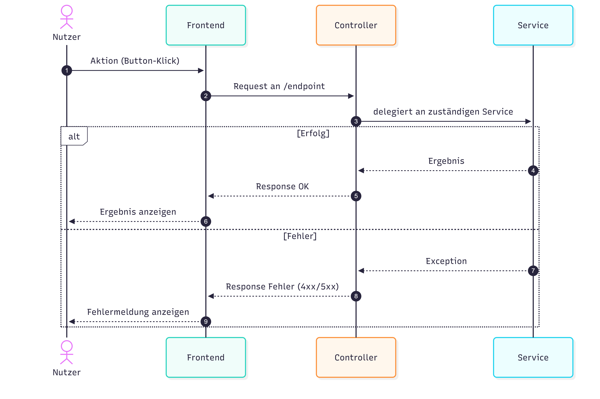
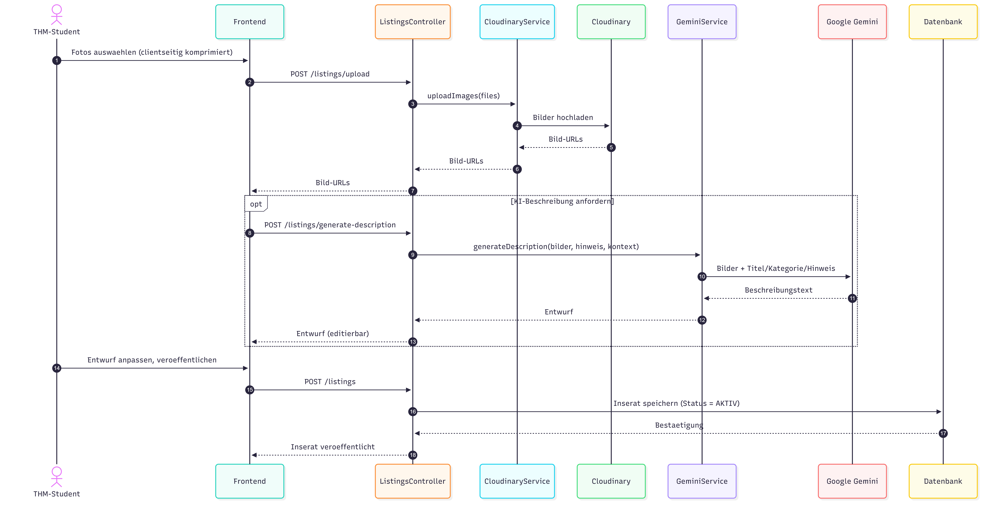
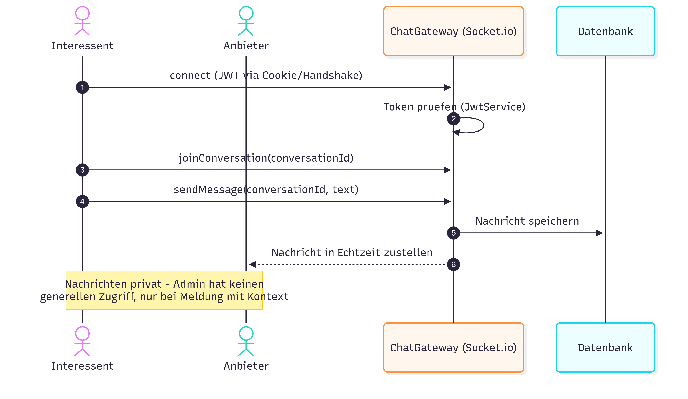
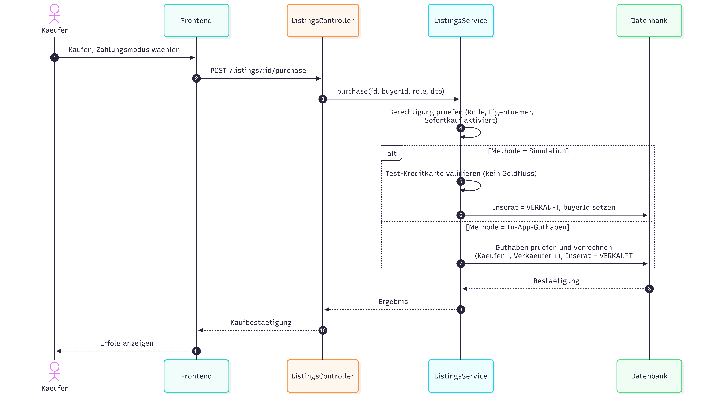
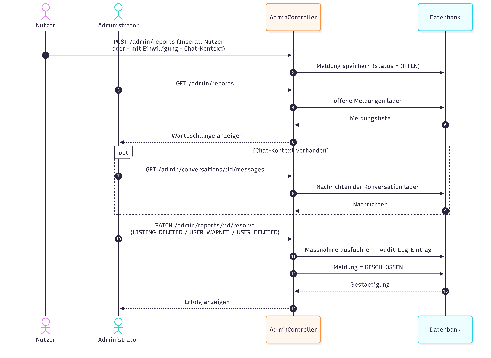

# 6. Laufzeitsicht

Die Laufzeitsicht zeigt das dynamische Verhalten von THMarket anhand der wichtigsten Abläufe.

## 6.1 Allgemeiner Ablauf

Das Grundmuster gilt für die meisten Anfragen: Der Nutzer löst im Frontend eine Aktion aus. Das Frontend schickt einen Request an den zuständigen Controller, der an den passenden Service weiterleitet. Der Service antwortet entweder mit einem Ergebnis (erfolgreiche Response) oder mit einer Exception, die der Controller als Fehler-Response abbildet.

- Nutzer löst im Frontend eine Aktion aus (z. B. Button-Klick)
- Frontend sendet Request an den zuständigen Controller
- Controller delegiert die Fachlogik an den passenden Service
- Erfolg: Service liefert Ergebnis → Controller antwortet OK → Frontend zeigt Ergebnis
- Fehler: Service wirft Exception → Controller antwortet 4xx/5xx → Frontend zeigt Fehlermeldung
- Grundmuster für fast alle Abläufe: Nutzer → Frontend → Controller → Service → DB/externer Dienst → Frontend

*Abbildung 9: Laufzeitsicht — Allgemeiner Ablauf*

Diagramm anzeigen

## 6.2 Registrierung & Verifizierung

**Ablauf:**

- Studierender füllt Formular aus (Name, THM-E-Mail, Passwort)
- `POST /auth/register`: Prüfung der THM-Domain (`@thm.de`) und der Passwortstärke
- Prüfung, ob die E-Mail bereits vergeben ist → falls ja: gleiche Erfolgsantwort (Anti-Enumeration)
- Falls frei: Passwort per bcrypt hashen, Verifizierungs-Token erzeugen, Konto mit `verified = false` anlegen
- Verifizierungs-E-Mail über die Mail-Anbindung versenden
- Studierender öffnet den Link → `GET /auth/verify-email?token` → Token prüfen, `verified = true`
- Erst danach ist ein Login möglich

*Abbildung 10: Laufzeitsicht — Registrierung & Verifizierung*

Diagramm anzeigen

## 6.3 Inserat mit KI-Beschreibung

**Ablauf:**

- Fotos auswählen (clientseitig komprimiert)
- `POST /listings/upload`: Cloudinary-Upload → Rückgabe der Bild-URLs
- Optional `POST /listings/generate-description`: Gemini erhält Bilder + Titel/Kategorie/Hinweis → editierbarer Beschreibungsentwurf
- Nutzer passt den Entwurf an und veröffentlicht: `POST /listings` → Inserat mit Status `AKTIV` speichern
- KI liefert nur die Beschreibung — kein Titel, keine Kategorie, kein Preis
- Fällt Gemini aus: manuelle Eingabe bleibt möglich (fail-open)

*Abbildung 11: Laufzeitsicht — Inserat mit KI-Beschreibung*

Diagramm anzeigen

## 6.4 Echtzeit-Chat

**Ablauf:**

- Interessent verbindet sich per Socket.io mit dem ChatGateway
- JWT (Cookie/Handshake) wird einmalig beim Verbindungsaufbau geprüft
- `joinConversation` → Beitritt zur Konversation
- `sendMessage`: Nachricht wird zuerst gespeichert, dann in Echtzeit an den Anbieter zugestellt
- Nachrichten privat: kein genereller Admin-Zugriff, nur im Kontext einer Meldung
- Weicht bewusst vom Request-Response-Muster ab (dauerhafte Verbindung)

*Abbildung 12: Laufzeitsicht — Echtzeit-Chat*

Diagramm anzeigen

## 6.5 Mock-Kauf

**Ablauf:**

- Käufer wählt „Kaufen" + Zahlungsmodus → `POST /listings/:id/purchase`
- Berechtigungsprüfung: Rolle `STUDENT`, nicht das eigene Inserat, Sofortkauf aktiviert
- Simulation: Test-Kreditkarte validieren (kein Geldfluss) → Inserat `VERKAUFT`
- In-App-Guthaben: Guthaben prüfen und verrechnen (Käufer −, Verkäufer +) → Inserat `VERKAUFT`
- Atomarer Schreibvorgang → keine Doppelkäufe, keine Guthaben-Überziehung
- Kein separater Payments-Endpunkt — alles über `ListingsController`/`-Service`

*Abbildung 13: Laufzeitsicht — Mock-Kauf*

Diagramm anzeigen

## 6.6 Meldung

**Ablauf:**

- Nutzer meldet via `POST /admin/reports` (Inserat, Nutzer oder – mit Einwilligung – Chat-Kontext) → Status `OFFEN`
- Admin lädt offene Meldungen: `GET /admin/reports`
- Bei Chat-Kontext: `GET /admin/conversations/:id/messages` → nur die betroffene Konversation einsehbar
- Maßnahme via `PATCH /admin/reports/:id/resolve`: Inserat löschen / Nutzer verwarnen / Nutzer löschen (strikt gegen den Meldungstyp geprüft)
- Jede Maßnahme wird im Audit-Log protokolliert → Meldung `GESCHLOSSEN`

*Abbildung 14: Laufzeitsicht — Meldung*

Diagramm anzeigen

