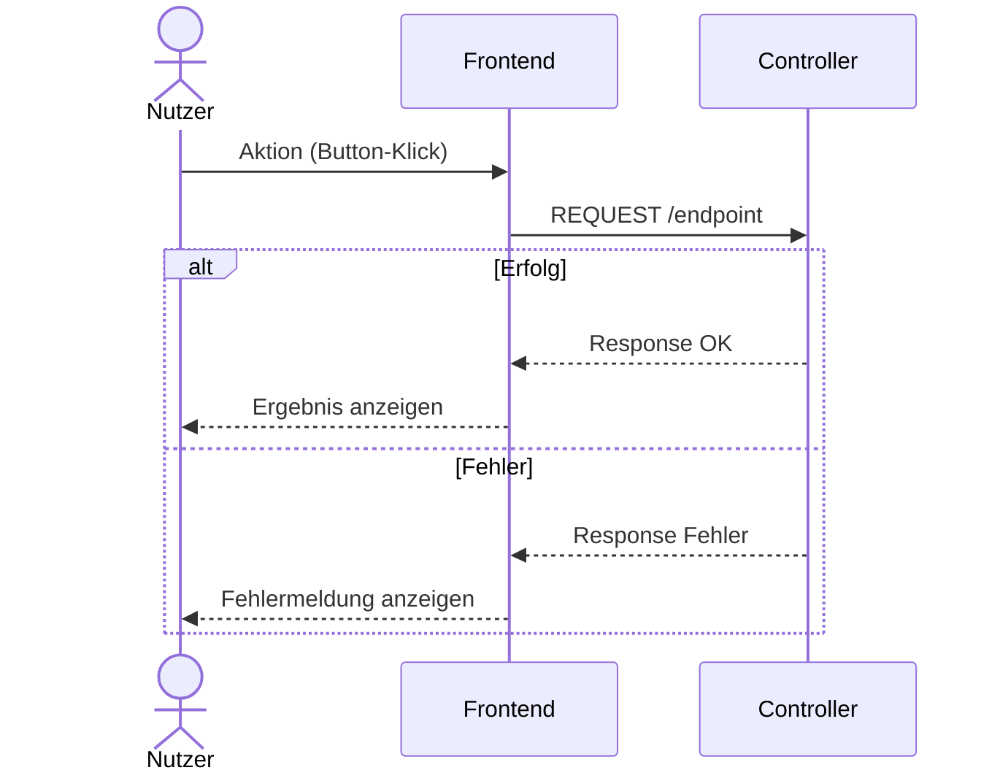
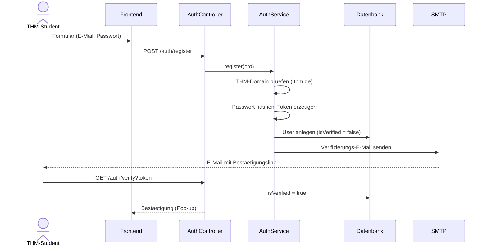
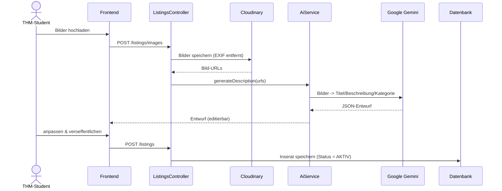
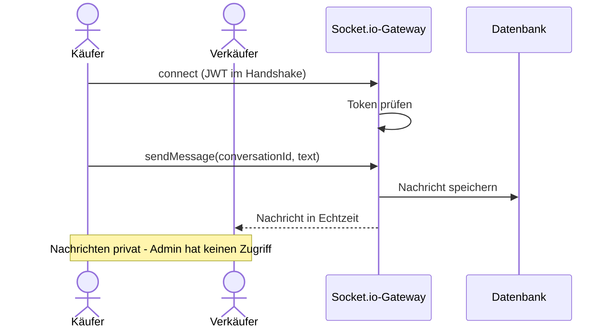
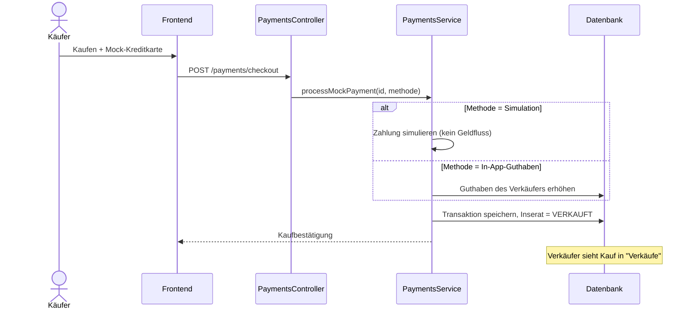
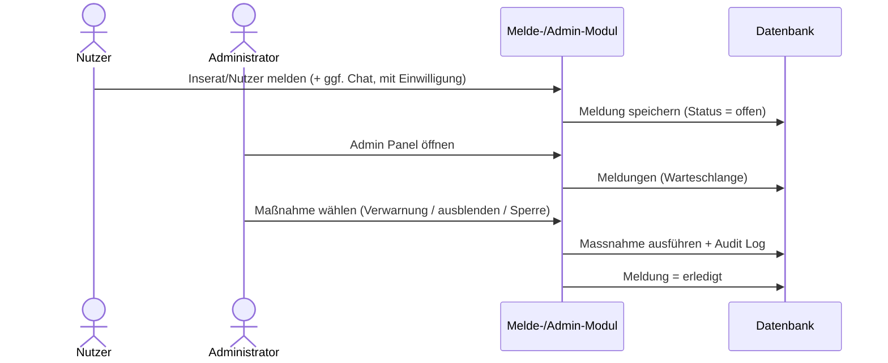

# 6. Laufzeitsicht

Die Laufzeitsicht zeigt, wie sich THMarket zur Laufzeit verhält — anhand der wichtigsten Abläufe.
Zu jedem Ablauf gehört ein Sequenzdiagramm, dessen Quelltext als eigene `.mmd`-Datei im Repository liegt.

## 6.1 Allgemeiner Ablauf

Das Grundmuster gilt für die meisten Anfragen im System: Der Nutzer löst im Frontend eine Aktion aus, zum Beispiel einen Button-Klick.
Das Frontend schickt daraufhin einen Request an den zuständigen Controller unter `/endpoint`.
Der Controller verarbeitet die Anfrage und antwortet entweder mit einer erfolgreichen Response, die das Frontend dem Nutzer als Ergebnis anzeigt, oder mit einer Fehler-Response, woraufhin das Frontend eine Fehlermeldung anzeigt.
Dieses Muster liegt praktisch allen anderen Abläufen in diesem Kapitel zugrunde.

*Abbildung 11: Laufzeitsicht — Allgemeiner Ablauf*
*(Quelltext: `diagrams-code/a06-laufzeitdiagramm_allgemeiner_ablauf.mmd`)*

## 6.2 Registrierung & Verifizierung

Ein THM-Student füllt im Frontend das Formular mit E-Mail-Adresse und Passwort aus und schickt es ab.
Das Frontend sendet die Daten per `POST /auth/register` an den AuthController, der sie an den AuthService zur eigentlichen Verarbeitung weitergibt.
Der AuthService prüft zunächst, ob die E-Mail-Adresse wirklich auf `.thm.de` endet.
Ist das erfüllt, hasht er das Passwort und erzeugt einen Verifizierungs-Token.
Anschließend legt er den Nutzer in der Datenbank an — allerdings mit dem Feld `isVerified = false`, das Konto ist also noch nicht aktiv.
Danach lässt der AuthService über SMTP eine Verifizierungs-E-Mail mit dem Bestätigungslink an den Studenten verschicken.
Klickt der Student auf diesen Link, ruft er `GET /auth/verify?token` auf; der AuthController setzt daraufhin `isVerified` in der Datenbank auf `true` und bestätigt dem Frontend die erfolgreiche Verifizierung, die dem Nutzer als Pop-up angezeigt wird.

*Abbildung 12: Laufzeitsicht — Registrierung & Verifizierung*
*(Quelltext: `diagrams-code/a06-laufzeitdiagramm_registrierung_verifizierung.mmd`)*

## 6.3 Inserat mit KI-Beschreibung

Der Student lädt im Frontend ein oder mehrere Bilder hoch, die per `POST /listings/images` an den ListingsController gehen.
Dieser speichert die Bilder bei Cloudinary — dabei werden automatisch die EXIF-Daten entfernt — und bekommt von Cloudinary die fertigen Bild-URLs zurück.
Anschließend ruft der ListingsController den AiService auf und übergibt ihm die Bild-URLs (`generateDescription(urls)`).
Der AiService schickt die Bilder an Google Gemini, das daraus Titel, Beschreibung und Kategorie ableitet und als JSON-Entwurf zurückliefert.
Dieser Entwurf wird dem Frontend als editierbarer Vorschlag angezeigt.
Der Student kann den Entwurf anpassen und veröffentlicht das Inserat anschließend per `POST /listings`; der ListingsController speichert es daraufhin in der Datenbank mit dem Status `AKTIV`.

*Abbildung 13: Laufzeitsicht — Inserat mit KI-Beschreibung*
*(Quelltext: `diagrams-code/a06-laufzeitdiagramm_Inserat_KI_Beschreibung.mmd`)*

## 6.4 Echtzeit-Chat

Käufer und Verkäufer verbinden sich jeweils über das Socket.io-Gateway; das JWT wird dabei direkt im Verbindungsaufbau (Handshake) mitgeschickt und vom Gateway geprüft.
Sendet der Käufer eine Nachricht (`sendMessage(conversationId, text)`), speichert das Gateway sie sofort in der Datenbank und stellt sie in Echtzeit dem Verkäufer zu.
Dieses Muster gilt symmetrisch in beide Richtungen.
Wichtig dabei: Die Nachrichten sind bewusst privat — der Administrator hat auf diese Konversationen standardmäßig keinen Zugriff.

*Abbildung 14: Laufzeitsicht — Echtzeit-Chat*
*(Quelltext: `diagrams-code/a06-laufzeitdiagramm_echtzeit_chat.mmd`)*

## 6.5 Mock-Kauf

Der Käufer schließt im Frontend den Kauf ab, indem er eine simulierte Kreditkarte hinterlegt, und schickt die Anfrage per `POST /payments/checkout` an den PaymentsController.
Dieser ruft den PaymentsService auf (`processMockPayment(id, methode)`).
Je nach gewählter Zahlungsmethode passiert dabei unterschiedliches: Bei der Methode „Simulation" wird die Zahlung nur simuliert, es fließt kein echtes Geld.
Bei der Methode „In-App-Guthaben" erhöht der PaymentsService stattdessen das Guthaben des Verkäufers direkt in der Datenbank.
Unabhängig davon, welche Methode gewählt wurde, speichert der PaymentsService anschließend die Transaktion und setzt das betreffende Inserat auf den Status VERKAUFT.
Der Käufer bekommt eine Kaufbestätigung; der Verkäufer sieht den abgeschlossenen Kauf danach in seiner Übersicht „Verkäufe".

*Abbildung 15: Laufzeitsicht — Mock-Kauf*
*(Quelltext: `diagrams-code/a06-laufzeitdiagramm_mock_kauf.mmd`)*

## 6.6 Meldung

Ein Nutzer meldet ein Inserat, einen anderen Nutzer oder — nur mit seiner eigenen Einwilligung — eine Chat-Konversation über das Melde-/Admin-Modul.
Die Meldung wird zunächst mit dem Status „offen" in der Datenbank gespeichert.
Der Administrator öffnet daraufhin das Admin Panel; das Melde-/Admin-Modul liefert ihm die Warteschlange der offenen Meldungen aus der Datenbank.
Der Administrator wählt dann eine passende Maßnahme aus — Verwarnung, Inserat ausblenden oder Sperre.
Diese Maßnahme wird ausgeführt und gleichzeitig im Audit Log protokolliert.
Abschließend wird die Meldung in der Datenbank auf den Status „erledigt" gesetzt.

*Abbildung 16: Laufzeitsicht — Meldung*
*(Quelltext: `diagrams-code/a06-laufzeitdiagramm_Meldung.mmd`)*

## 6.7 Zusammenfassung

Fast alle Abläufe folgen demselben Muster: Nutzer → Frontend → Controller → Service → Datenbank/externer Dienst → Frontend, mit einer klaren Unterscheidung zwischen Erfolgs- und Fehlerfall.
Nur der Echtzeit-Chat weicht davon bewusst ab, weil er statt einzelner Requests eine dauerhafte WebSocket-Verbindung braucht, über die Nachrichten in beide Richtungen fließen können.
Dieses einheitliche Prinzip macht die Struktur der Anwendung klar nachvollziehbar und sorgt dafür, dass Fehlerbehandlung an jeder Stelle nach demselben Schema funktioniert.