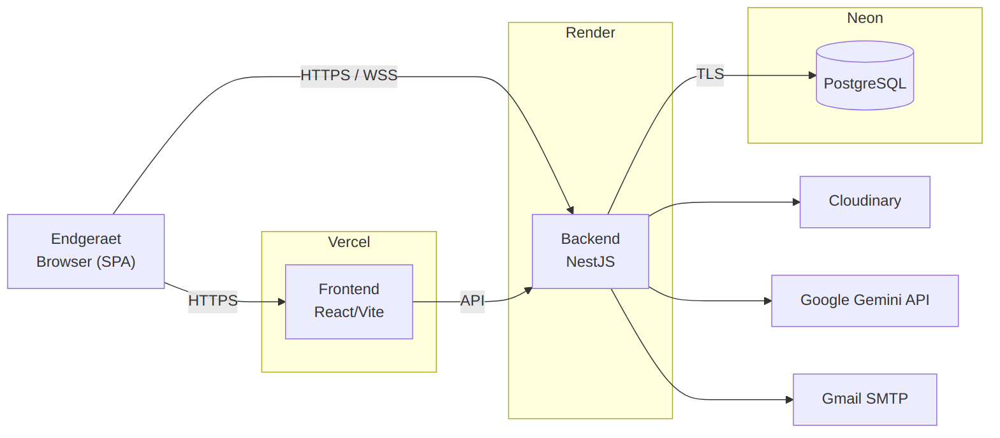

# 7. Verteilungssicht

Die Verteilungssicht beschreibt die Betriebsumgebung von THMarket auf kostenlosen Cloud-Tarifen. Die Softwarebausteine werden auf verschiedene Infrastruktur-Komponenten verteilt, um Wartbarkeit und einen kostenfreien Betrieb zu gewährleisten.

*Abbildung 11: Verteilungssicht Übersicht*

## 7.1 Infrastruktur Ebene 1

Infrastrukturkomponenten:

- **Clientgeräte:** Smartphones und Laptops/PCs mit Browser; Darstellung des Frontends (React, HTML, CSS, JS).
- **Frontend-Host (Vercel/Netlify):** Auslieferung der statischen React/Vite-Anwendung, kein Sleep.
- **Backend-Host (Render, Free):** NestJS-App mit allen fachlichen Modulen inkl. Socket.io-Gateway; persistenter Web-Service. Hinweis: Der Free-Tarif schläft nach ca. 15 min Inaktivität und benötigt beim Aufwachen 30–50 s (Kaltstart).
- **Datenbankserver (Neon/Supabase):** PostgreSQL mit den Tabellen User, Listing, Image, Conversation, Message (und optional Favorite).
- **Externe Dienste:** Gemini-API (KI-Beschreibung), Cloudinary (Bildspeicher), SMTP-Mailserver (Verifizierung) – jeweils eigenständige externe Server, per HTTPS bzw. SMTP angebunden und nicht Teil der eigenen Infrastruktur.

Deployment-Zuordnung der Bausteine:

- Frontend (React, Vite, TS) → Clientgeräte (ausgeliefert über Vercel/Netlify)
- Auth, User Management, Listing Handling, AI Service, Chat Gateway, Image Handling, API Proxy → Backend-Host (NestJS)
- Datenhaltung → Datenbankserver (PostgreSQL)
- Externe Schnittstellen → externe Dienste (Gemini, Cloudinary, SMTP)

## 7.2 Infrastruktur Ebene 2

Kommunikationsbeziehungen und Protokolle:

- Clientgeräte ↔ Backend: HTTPS/REST (GET/POST/PATCH/DELETE) für CRUD sowie WebSocket (Socket.io) für den Chat.
- Backend ↔ Datenbankserver: SQL-Verbindungen für CRUD-Operationen (über TypeORM/Prisma).
- Backend ↔ Gemini-API: REST über HTTPS, JSON-Antworten.
- Backend ↔ Cloudinary: HTTPS-Upload, Rückgabe der Bild-URL.
- Backend ↔ SMTP-Mailserver: SMTP für den Versand der Verifizierungs-Mails.

Diese Struktur erlaubt einen kostenfreien, aber realistischen Betrieb und lässt sich bei Bedarf auf kostenpflichtige Tarife mit Lastverteilung oder Containerisierung (z. B. Docker) heben.

# 8. Querschnittliche Konzepte

## 8.1 Persistenz

### Ziel

Einheitliches Muster für Datenbankzugriffe (CRUD) und sichere Passwortspeicherung.

### Technische Umsetzung

- PostgreSQL als persistente Datenbasis; Zugriff über einen ORM (TypeORM oder Prisma).
- Kern-Entitäten: User, Listing, Image, Conversation, Message (optional Favorite).
- Passwörter werden mit bcrypt/argon2 gehasht; niemals im Klartext gespeichert.
- Zugriff auf externe Dienste (Gemini, Cloudinary) wird nicht persistiert; nur resultierende Bild-URLs und Texte werden gespeichert.

### Datenmodell (vereinfacht)

| Entität | Wichtige Felder | Beziehung |
|---|---|---|
| User | id, thmEmail, passwordHash, displayName, verified, role, createdAt | 1:n zu Listing, Message |
| Listing | id, title, description, price, category, condition, status, sellerId, createdAt | n:1 zu User; 1:n zu Image |
| Image | id, url, listingId | n:1 zu Listing |
| Conversation | id, listingId, buyerId, sellerId, createdAt | n:1 zu Listing; 1:n zu Message |
| Message | id, conversationId, senderId, body, sentAt, readAt | n:1 zu Conversation, User |

*Tabelle 21: Kern-Datenmodell der THMarket-Anwendung*

## 8.2 API

### Ziel

THMarket stellt eine REST-API für CRUD-Operationen sowie eine Socket.io-Ereignisschnittstelle für den Echtzeit-Chat bereit. Die API ist die einzige Schnittstelle für das Frontend und sorgt für eine einheitliche Kommunikation.

### Technische Umsetzung

- Kommunikation: HTTPS-Requests; Antwortformat JSON.
- Authentifizierung: JWT (Bearer-Token); geschützte Endpunkte erfordern ein gültiges Token.
- Externe Aufrufe (Gemini, Cloudinary) erfolgen ausschließlich serverseitig.
- Fehlerbehandlung: konsistente JSON-Struktur (`{ "error": ... }` bzw. `{ "success": ... }`).

### REST-Endpunkte (Auswahl)

| Methode | Pfad | Zweck |
|---|---|---|
| POST | /auth/register | Registrierung (nur @thm.de), löst Verifizierungs-Mail aus |
| GET | /auth/verify | E-Mail-Verifizierung per Token |
| POST | /auth/login | Login, gibt JWT zurück |
| GET | /users/me | Eigenes Profil abrufen |
| GET | /listings | Inserate suchen/filtern (Kategorie, Preis, Suchbegriff) |
| GET | /listings/:id | Einzelnes Inserat abrufen |
| POST | /listings | Inserat erstellen |
| PATCH | /listings/:id | Inserat ändern |
| DELETE | /listings/:id | Inserat löschen |
| POST | /listings/:id/images | Bild hochladen (→ Cloudinary) |
| POST | /ai/describe | Beschreibung aus Bild generieren (→ Gemini) |
| GET | /conversations | Eigene Konversationen abrufen |
| POST | /conversations | Konversation zu einem Inserat starten |
| GET | /conversations/:id/messages | Nachrichtenverlauf abrufen |
| GET / DELETE | /admin/users, /admin/listings | Admin: Nutzer/Inserate verwalten |

*Tabelle 22: Übersicht der REST-Endpunkte der THMarket-Anwendung*

### Socket.io-Events (Chat)

| Event | Richtung | Zweck |
|---|---|---|
| connection | Client → Server | Verbindungsaufbau inkl. JWT-Handshake |
| join_conversation | Client → Server | Beitritt zum Raum einer Konversation |
| send_message | Client → Server | Nachricht senden (wird persistiert) |
| message_received | Server → Client | Nachricht in Echtzeit an Raumteilnehmer |
| typing / stop_typing | Client ↔ Server | Tipp-Indikator (optional) |
| disconnect | Client → Server | Verbindungsabbau |

*Tabelle 23: Socket.io-Events des Chat-Gateways*

## 8.3 Sicherheit

- **Geschlossener Zugang:** Registrierung nur mit @thm.de-Adresse und Pflicht zur E-Mail-Verifizierung.
- **Authentifizierung:** JWT für REST und für den Socket.io-Handshake; geschützte Endpunkte über Guards.
- **Passwörter:** ausschließlich gehasht gespeichert (bcrypt/argon2).
- **API-Key-Schutz:** Gemini- und Cloudinary-Schlüssel liegen ausschließlich serverseitig in Umgebungsvariablen (.env), niemals im Client.
- **Eingabevalidierung:** client- und serverseitig (DTOs/Validation Pipes in NestJS).

## 8.4 KI-Integration

Die KI-Beschreibung ist ein optionaler, klar gekapselter Baustein (AI Service). Der Aufruf läuft immer über das Backend, damit der API-Key geschützt bleibt. Bei Ausfall oder Erreichen der Free-Tier-Limits (Gemini) wird eine klare Meldung angezeigt und die manuelle Eingabe der Beschreibung bleibt möglich – die Erstellung eines Inserats ist damit nie von der Verfügbarkeit der KI abhängig. Das Modell ist über die Konfiguration austauschbar, sodass ein Wechsel des Anbieters ohne Änderung der übrigen Logik möglich ist.

## 8.5 Echtzeit-Kommunikation

Der Chat basiert auf Socket.io. Jede Konversation entspricht einem Raum (Raum-ID = Conversation-ID); Nachrichten werden gezielt an die Teilnehmer dieses Raums gesendet. Nachrichten werden zusätzlich in der Datenbank persistiert, damit der Verlauf nach einem Verbindungsabbruch oder erneutem Login vollständig geladen werden kann. Der Handshake ist über ein JWT abgesichert, sodass nur authentifizierte Nutzer eine Verbindung aufbauen können.

# 9. Entwurfsentscheidungen

| Entscheidung | Entscheider | Gründe, Konsequenzen, Alternativen |
|---|---|---|
| NestJS + Socket.io als Backend (statt Spring Boot) | Entwicklerteam Gruppe [XX] | Gründe: First-Class-Socket.io-Unterstützung, einheitlicher TS-Stack mit dem Frontend, klare Modulstruktur. Konsequenz: gute Wartbarkeit und Portfolio-Wirkung. Alternative: Spring Boot mit STOMP/WebSocket (mehr Ceremony beim Realtime-Teil). |
| React + Vite + TypeScript als Frontend | Entwicklerteam Gruppe [XX] | Gründe: schnelle Entwicklung, plattformunabhängig, keine Installation nötig, gemeinsamer TS-Stack. |
| PostgreSQL (Neon/Supabase) als Datenbank | Entwicklerteam Gruppe [XX] | Gründe: robustes relationales DBMS mit klaren Relationen, kostenloser Tarif. Alternative: SQLite (für lokale Prototypen, aber weniger für Cloud-Betrieb geeignet). |
| Gemini-API für KI-Beschreibung | Entwicklerteam Gruppe [XX] | Gründe: multimodal (Bild→Text), gut dokumentiert, kostenloser Basiszugang. Konsequenz negativ: Abhängigkeit von externem Dienst, Free-Tier-Limits. Hinweis: Aktivierung von Billing entfernt den Free-Tier. |
| Cloudinary für Bildspeicherung | Entwicklerteam Gruppe [XX] | Gründe: kostenloser Bildspeicher inkl. Auslieferung, entlastet den App-Server. DB speichert nur URLs. |
| Kostenloser Hosting-Stack (Vercel + Render + Neon) | Entwicklerteam Gruppe [XX] | Gründe: 0-€-Betrieb ohne Kreditkarte möglich. Konsequenz negativ: Kaltstart des Render-Free-Tarifs (30–50 s nach Inaktivität). |
| JWT + Domain-restringierte Registrierung | Entwicklerteam Gruppe [XX] | Gründe: kein Zugriff auf THM-SSO als Studierende; @thm.de-Beschränkung + E-Mail-Verifizierung beweist den THM-Account. Einheitliche Auth für REST und WebSocket. |
| Client-Server-Architektur | Entwicklerteam Gruppe [XX] | Gründe: Standardansatz, saubere Trennung von Präsentation, Logik und Datenhaltung. |

*Tabelle 24: Entwurfsentscheidungen (ADR-Übersicht)*

# 10. Glossar

| Begriff | Definition | Beispiel |
|---|---|---|
| API | Schnittstelle, über die Systeme Daten austauschen oder Funktionen bereitstellen. | Gemini-API liefert Beschreibungstexte |
| Cloudinary | Cloud-Dienst zur Speicherung und Auslieferung von Bildern. | Inseratsbild wird als URL gespeichert |
| Client-Server-Architektur | Aufbau, bei dem ein Client Anfragen an einen Server sendet. | Browser sendet Request an NestJS |
| Blackbox | Baustein-Darstellung nur mit Schnittstellen und Verhalten, ohne innere Details. | Blackbox „AI Service“ |
| CRUD | Create, Read, Update, Delete – Grundoperationen auf Daten. | Inserat anlegen, lesen, ändern, löschen |
| DTO | Data Transfer Object; strukturierte Ein-/Ausgabedaten mit Validierung. | CreateListingDto |
| Gemini | Multimodales KI-Modell von Google (hier: 2.5 Flash). | Bild → Beschreibungstext |
| Hashing | Einweg-Verfahren, das z. B. Passwörter in Zeichenketten umwandelt. | Passwort → bcrypt-Hash |
| JWT | JSON Web Token; signiertes Token zur Authentifizierung. | Bearer-Token im REST-Header |
| JSON | Leichtgewichtiges Datenformat zum Austausch strukturierter Daten. | `{ "title": "Fahrrad" }` |
| NestJS | Modulares Node.js-Framework (TypeScript) für Backends und APIs. | Feature-Module: auth, listings, chat |
| ORM | Object-Relational Mapper; bildet Objekte auf DB-Tabellen ab. | TypeORM/Prisma |
| PostgreSQL | Relationales Datenbankmanagementsystem. | Tabellen User, Listing, Message |
| Prototyp | Vorläufige Version zur Demonstration und Prüfung von Konzepten. | THMarket im Projektstatus |
| REST | Architekturprinzip für APIs über HTTP-Methoden. | /listings liefert Inserate |
| Room (Socket.io) | Logische Gruppe von Verbindungen für gezielten Broadcast. | Raum = Conversation-ID |
| Socket.io | Bibliothek für Echtzeit-Kommunikation über WebSocket. | Chat-Nachrichten in Echtzeit |
| SMTP | Protokoll zum Versand von E-Mails. | Verifizierungs-Mail an @thm.de |
| Stakeholder | Personen/Gruppen mit Interesse am oder Einfluss auf das System. | Entwickler, Prüfer, Nutzer |
| Use Case | Szenario, wie ein Nutzer mit dem System interagiert. | „Inserat erstellen“ |
| Verifizierung | Bestätigung, dass eine E-Mail-Adresse dem Nutzer gehört. | Klick auf Token-Link in der Mail |
| WebSocket | Bidirektionales, dauerhaftes Kommunikationsprotokoll. | Grundlage von Socket.io |
| Whitebox | Baustein-Darstellung mit inneren Strukturen und Unterbausteinen. | Whitebox „Chat Gateway“ |

*Tabelle 25: Glossar*
