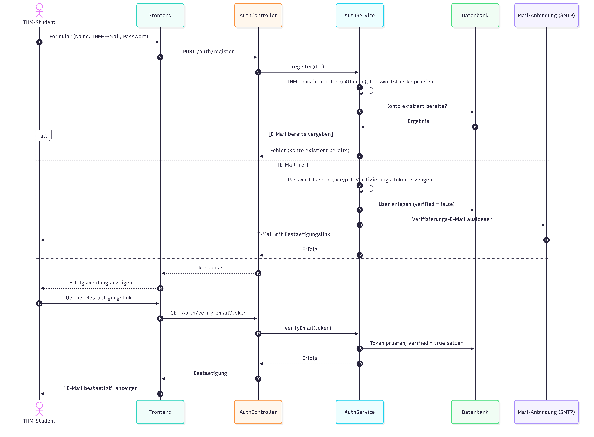

# 7. Verteilungssicht

Die Softwarebausteine werden auf verschiedene Infrastruktur-Komponenten verteilt.

*Abbildung 15: Verteilungssicht*

📊 Diagramm anzeigen

## 7.1 Infrastruktur Ebene 1

Ebene 1 benennt die beteiligten Infrastruktur-Knoten und beschreibt, welche Bausteine auf ihnen laufen und wofür der jeweilige Knoten zuständig ist.

| Knoten | Technologie / Umgebung | Beschreibung & enthaltene Bausteine |
|---|---|---|
| Clientgerät | Smartphone, Laptop/PC mit Browser | Führt das React-Frontend als Single-Page-Application aus (HTML, CSS, JavaScript) und stellt die Oberfläche dar. Hält keine dauerhaften Daten und spricht nie direkt mit Datenbank oder externen Diensten. |
| Frontend-Host | Vercel | Liefert die statisch gebaute React/Vite-Anwendung weltweit aus. Enthält keine Geschäftslogik. |
| Backend-Host | Render (Free-Tarif), NestJS | Betreibt das gesamte Backend: die fachlichen Kernmodule Auth, Listings, Wallet, Chat und Admin, die Integrationsmodule Mail, Cloudinary- und Gemini-Anbindung sowie das Socket.io-Gateway. Der Free-Tarif schläft nach Inaktivität ein (Kaltstart ca. 30–50 s). |
| Datenbankserver | Neon, PostgreSQL | Persistiert die sieben Kern-Entitäten User, Listing, Favorite, Report, AuditLogEntry, Conversation und Message. Bilder liegen nur als URL-Array am Inserat, nicht als Datei. |
| Externe Dienste | Google Gemini, Cloudinary, Gmail SMTP | Eigenständige, fremdbetriebene Server: Gemini (KI-Beschreibung/-Moderation), Cloudinary (Bildspeicherung), Gmail SMTP (E-Mail-Versand). Werden ausschließlich vom Backend angesprochen und sind nicht Teil der eigenen Infrastruktur. |

*Infrastrukturknoten der Verteilungssicht*

## 7.2 Infrastruktur Ebene 2

Ebene 2 beschreibt die Kommunikationsbeziehungen zwischen den Knoten samt der eingesetzten Protokolle. Alle Verbindungen sind in der Produktion transportverschlüsselt.

| Kommunikationsbeziehung | Protokoll | Zweck |
|---|---|---|
| Clientgerät ↔ Frontend-Host (Vercel) | HTTPS | Laden der Single-Page-Application. |
| Clientgerät ↔ Backend-Host (Render) | HTTPS / REST | Reguläre Anwendungsfunktionen (Auth, Inserate, Kauf, Favoriten, Admin) als JSON. |
| Clientgerät ↔ Backend-Host (Render) | WSS (Socket.io) | Echtzeit-Chat über eine dauerhafte WebSocket-Verbindung; JWT im Handshake. |
| Backend-Host ↔ Datenbankserver (Neon) | SQL über TLS (Prisma) | Alle lesenden und schreibenden Datenzugriffe (CRUD). |
| Backend-Host ↔ Cloudinary / Google Gemini | HTTPS | Bild-Upload sowie KI-Beschreibung und -Moderation. |
| Backend-Host ↔ Gmail SMTP | SMTP (App-Passwort) | Versand der Verifizierungs- und Passwort-Reset-E-Mails. |

*Kommunikationsbeziehungen und Protokolle*

