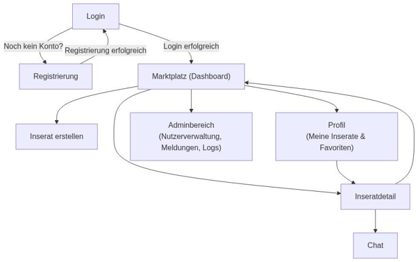

# 4. Benutzerschnittstelle
## 4.1 Dialoglandkarte
Die Dialoglandkarte zeigt die Struktur und Navigation der THMarket-Anwendung. Sie gliedert sich in drei Bereiche: öffentlich zugängliche Seiten (Login und Registrierung), den Benutzerbereich nach Login (Marktplatz, Inseratdetail, Inserat erstellen, Chat, Profil/Meine Inserate & Favoriten) sowie administrative Funktionen (Benutzerverwaltung, Meldungen, Logs).
Die Dialoglandkarte stellt vereinfacht dar, welche Dialoge es gibt und wie zwischen ihnen navigiert werden kann – etwa vom Login zum Marktplatz oder vom Marktplatz zur Inseratdetailseite und von dort in den Chat. Die genauen Abläufe, Auslöser und Wirkungen werden in Kapitel 4.2 beschrieben.
**Hinweis:** Ein Logout ist grundsätzlich von jedem Dialog aus möglich. Um die Darstellung nicht zu überladen, wird diese Möglichkeit nicht an jeder Stelle einzeln dargestellt, sondern gilt als durchgängig verfügbar.

*Abbildung 8: Dialoglandkarte der THMarket-Anwendung*

## 4.2 Dialogspezifikation
### 4.2.1 Login-Dialog

#### Allgemeine Beschreibung

- **Zweck des Dialogs:** Anmeldung registrierter, verifizierter Nutzer zur Nutzung der Plattform
- **Anwendungsfall:** „Benutzer meldet sich an“
- **Ergebnis:** Erfolgreiche Anmeldung führt zur Weiterleitung auf den Marktplatz
- **Sichtbar für:** Alle nicht angemeldeten Nutzer (Gäste)
- **Besonderheiten:** Link zur Registrierung, Dark-Mode-Schalter

#### Navigationsmöglichkeiten

- Über „Noch kein Konto? Jetzt registrieren“ zum Registrierungsdialog
- Nach erfolgreichem Login zum Marktplatz

#### Statik – Formular: Login-Formular (Felder)
