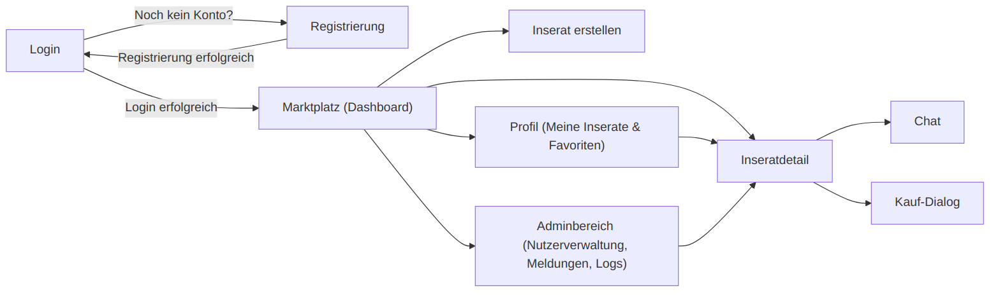

- [4. Benutzerschnittstelle](#4-benutzerschnittstelle)
  - [4.1 Dialoglandkarte](#41-dialoglandkarte)
  - [4.2 Dialogspezifikation](#42-dialogspezifikation)
    - [4.2.1 Login-Dialog](#421-login-dialog)
    - [4.2.2 Registrierungs-Dialog](#422-registrierungs-dialog)
    - [4.2.3 Marktplatz-Dialog (Dashboard)](#423-marktplatz-dialog-dashboard)
    - [4.2.4 Inseratdetail-Dialog](#424-inseratdetail-dialog)
    - [4.2.5 Inserat-erstellen-Dialog](#425-inserat-erstellen-dialog)
    - [4.2.6 Kauf-Dialog](#426-kauf-dialog)
    - [4.2.7 Chat-Dialog](#427-chat-dialog)
    - [4.2.8 Profil-Dialog (Meine Inserate & Favoriten)](#428-profil-dialog-meine-inserate--favoriten)
    - [4.2.9 Adminbereich-Dialog](#429-adminbereich-dialog)

# 4. Benutzerschnittstelle
## 4.1 Dialoglandkarte
Die Dialoglandkarte zeigt die Struktur und Navigation der THMarket-Anwendung. Sie gliedert sich in drei Bereiche: öffentlich zugängliche Seiten (Login und Registrierung), den Benutzerbereich nach Login (Marktplatz, Inseratdetail, Inserat erstellen, Chat, Profil/Meine Inserate & Favoriten) sowie administrative Funktionen (Benutzerverwaltung, Meldungen, Logs).
Die Dialoglandkarte stellt vereinfacht dar, welche Dialoge es gibt und wie zwischen ihnen navigiert werden kann – etwa vom Login zum Marktplatz oder vom Marktplatz zur Inseratdetailseite und von dort in den Chat. Die genauen Abläufe, Auslöser und Wirkungen werden in Kapitel 4.2 beschrieben.
**Hinweis:** Ein Logout ist grundsätzlich von jedem Dialog aus möglich. Um die Darstellung nicht zu überladen, wird diese Möglichkeit nicht an jeder Stelle einzeln dargestellt, sondern gilt als durchgängig verfügbar.

  

<em>Abbildung 8: Übersicht der Dialoglandkarte der Benutzeroberfläche</em>

## 4.2 Dialogspezifikation
### 4.2.1 Login-Dialog

#### Allgemeine Beschreibung

- **Zweck des Dialogs:** Anmeldung registrierter, verifizierter Nutzer zur Nutzung der Plattform
- **Anwendungsfall:** „Benutzer meldet sich an“
- **Ergebnis:** Erfolgreiche Anmeldung führt zur Weiterleitung auf den Marktplatz
- **Sichtbar für:** Alle nicht angemeldeten Nutzer (Gäste)
- **Besonderheiten:** Link zur Registrierung, Dark-Mode-Schalter

#### Navigationsmöglichkeiten

- Über „Noch kein Konto? Jetzt registrieren“ zum Registrierungsdialog
- Nach erfolgreichem Login zum Marktplatz

#### Statik – Formular: Login-Formular (Felder)
| Feldname | Typ | Pflicht | Vorbelegung | Validierung | Bezug zum Datenmodell |
|---|---|---|---|---|---|
| E-Mail | Textfeld | Ja | Nein | gültige THM-E-Mail | `Benutzer.email` |
| Passwort | Passwortfeld | Ja | Nein | mindestens 8 Zeichen | `Benutzer.password_hash` |

*Tab. 21: Dialogspezifikation Login-Dialog – Felder*
#### Dynamik – Aktionsliste

| Aktion | Auslöser | Wirkung | Bezug zum Datenmodell | Bezug zum Use Case |
|---|---|---|---|---|
| Anmeldung starten | Button „Anmelden“ | Validierung → Authentifizierung → Weiterleitung zum Marktplatz oder Fehlermeldung | `Benutzer.email`, `Benutzer.password_hash` | UC01 – Login |
| Registrierung öffnen | Link „Jetzt registrieren“ | Navigation zum Registrierungsdialog | Kein Bezug | UC02 – Registrierung |
| Dark Mode umschalten | Switch rechts oben | Wechsel des Designs | Kein Bezug | Kein Bezug |

*Tab. 22: Dialogspezifikation Login-Dialog – Aktionsliste*
#### Zustände

- Kein Fehler (Standard)
- Fehler: „Ungültige E-Mail oder Passwort“ → Anzeige einer Fehlermeldung über dem Formular
- Konto nicht verifiziert → Hinweis zur E-Mail-Bestätigung

### 4.2.2 Registrierungs-Dialog

Der Registrierungsdialog erlaubt es Studierenden, ein Konto für THMarket anzulegen. Nach Eingabe von THM-E-Mail-Adresse, Benutzername und Passwort wird ein unverifiziertes Konto angelegt und eine Bestätigungs-E-Mail versendet. Erst nach Klick auf den Verifizierungslink ist das Konto aktiv.

*Abbildung 10: Mockup „Registrierung“*

#### Allgemeine Beschreibung

- **Zweck des Dialogs:** Registrierung neuer Nutzer mit THM-E-Mail-Adresse
- **Anwendungsfall:** „Benutzer registriert sich“
- **Ergebnis:** Ein neues, nach E-Mail-Bestätigung verifiziertes Benutzerkonto wird erstellt
- **Sichtbar für:** Alle nicht angemeldeten Nutzer (Gäste)
- **Besonderheiten:** THM-Domain-Prüfung, E-Mail-Verifizierung, Link zur Login-Seite

#### Navigationsmöglichkeiten

- Nach erfolgreicher Registrierung und Verifizierung → zum Login-Dialog
- Über „Schon registriert? Jetzt anmelden“ → zurück zum Login-Dialog

 #### Statik – Formular: Registrierungsformular (Felder)

| Feldname | Typ | Pflicht | Vorbelegung | Validierung | Bezug zum Datenmodell |
|---|---|---|---|---|---|
| E-Mail | Textfeld | Ja | Nein | gültige THM-E-Mail | `Benutzer.email` |
| Benutzername | Textfeld | Ja | Nein | mindestens 3 Zeichen | `Benutzer.username` |
| Passwort | Passwortfeld | Ja | Nein | mindestens 8 Zeichen | `Benutzer.password_hash` |

*Tab. 23: Dialogspezifikation Registrierungsdialog – Felder*

#### Dynamik – Aktionsliste

| Aktion | Auslöser | Wirkung | Bezug zum Datenmodell | Bezug zum Use Case |
|---|---|---|---|---|
| Registrierung starten | Button „Registrieren“ | Validierung → Konto anlegen → Bestätigungs-E-Mail versenden | `Benutzer.email`, `Benutzer.username`, `Benutzer.password_hash` | UC02 – Registrierung |
| Anmeldung öffnen | Link „Jetzt anmelden“ | Navigation zum Login-Dialog | Kein Bezug | UC01 – Login |
| Dark Mode umschalten | Switch rechts oben | Wechsel des Designs | Kein Bezug | Kein Bezug |

*Tab. 24: Dialogspezifikation Registrierungsdialog – Aktionsliste*

#### Zustände

- Kein Fehler (Standard)
- Fehler: E-Mail ist keine THM-Adresse oder bereits vergeben → Fehlermeldung über dem Formular
- Erfolgreiche Registrierung → Hinweis: „Bitte bestätige deine E-Mail-Adresse“

### 4.2.3 Marktplatz-Dialog (Dashboard)

Der Marktplatz ist die Startseite nach dem Login. Hier werden die aktuellen Inserate als Kachel- oder Listenübersicht angezeigt. Über ein Suchfeld und Filter nach Kategorie, Angebotstyp und Preisbereich kann der Nutzer die Anzeige eingrenzen. Von hier gelangt er zur Detailansicht eines Inserats, zum Erstellen eines eigenen Inserats sowie zu seinem Profil.

> Mockup des Marktplatz-Dialogs wird noch ergänzt.

*Abbildung 11: Mockup „Marktplatz“*

#### Allgemeine Beschreibung

- **Zweck des Dialogs:** Anzeige, Suche und Filterung der Inserate
- **Anwendungsfall:** „Benutzer durchsucht den Marktplatz“
- - **Ergebnis:** Anzeige der passenden Inserate, Einstieg in die Detailansicht und weitere Funktionen
- **Sichtbar für:** Alle eingeloggten Nutzer
- **Besonderheiten:** Such- und Filterleiste, Zugang zu „Inserat erstellen“ und Profil

#### Navigationsmöglichkeiten

- Über ein Inserat → zur Inseratdetailseite
- Über „Inserat erstellen“ → zum Inserat-erstellen-Dialog
- Über „Profil/Meine Inserate“ → zum Profildialog
- Über Logout → zurück zum Login-Dialog

#### Statik – Formular: Such-/Filterformular (Felder)

| Feldname | Typ | Pflicht | Vorbelegung | Validierung | Bezug zum Datenmodell |
|---|---|---|---|---|---|
| Suchbegriff | Textfeld | Nein | Nein | Freitext | `Inserat.titel`, `Inserat.beschreibung` |
| Kategorie | Dropdown | Nein | „Alle“ | Auswahl aus Liste | `Kategorie.name` |
| Angebotstyp | Dropdown | Nein | „Alle“ | Verkauf / Miete | `Inserat.typ` |
| Preis von/bis | Zahlenfeld | Nein | Nein | numerisch, ≥ 0 | `Inserat.preis` |
| Campus | Dropdown | Nein | „Alle“ | Auswahl aus Liste | `Inserat.campus` |

*Tab. 25: Dialogspezifikation Marktplatz-Dialog – Felder*

#### Dynamik – Aktionsliste

| Aktion | Auslöser | Wirkung | Bezug zum Datenmodell | Bezug zum Use Case |
|---|---|---|---|---|
| Inserate suchen/filtern | Button „Suchen“ oder Filter | Abruf und Anzeige passender Inserate | `Inserat.*`, `Kategorie.name` | UC04 – Inserate durchsuchen und filtern |
| Inserat öffnen | Klick auf Inseratkachel | Navigation zur Detailansicht | `Inserat.id` | UC05 – Inseratdetails ansehen |
| Inserat erstellen | Button „Inserat erstellen“ | Navigation zum Erstellen-Dialog | `Inserat.*` | UC03 – Inserat erstellen |
| Profil öffnen | Button „Profil“ | Navigation zum Profildialog | `Benutzer.id` | UC09 – Eigene Inserate verwalten |

*Tab. 26: Dialogspezifikation Marktplatz-Dialog – Aktionsliste*
#### Zustände

- Standard: Inserate werden angezeigt
- Kein Treffer: Hinweis „Keine Inserate gefunden“
- Fehler (optional): Datenabruf fehlgeschlagen → Fehlermeldung

### 4.2.4 Inseratdetail-Dialog

Die Detailansicht zeigt alle Informationen zu einem Inserat: Bildergalerie, Titel, Beschreibung, Preis, Angebotstyp, Kategorie und Angaben zum Anbieter. Von hier kann der Nutzer das Inserat favorisieren, den Anbieter kontaktieren oder das Inserat melden.

> Mockup des Inseratdetail-Dialogs wird noch ergänzt.

*Abbildung 12: Mockup „Inseratdetail“*

#### Allgemeine Beschreibung

- **Zweck des Dialogs:** Anzeige aller Details eines Inserats und Einstieg in Folgeaktionen
- **Anwendungsfall:** „Benutzer sieht sich ein Inserat an“
- **Ergebnis:** Anzeige der Inseratdetails; Favorisieren, Kontaktieren oder Melden möglich
- **Sichtbar für:** Alle eingeloggten Nutzer
- **Besonderheiten:** Bildergalerie, Kontakt-, Favoriten- und Melde-Button

#### Navigationsmöglichkeiten

- Über „Anbieter kontaktieren“ → zum Chat-Dialog
- Über „Zurück“ → zum Marktplatz

#### Dynamik – Aktionsliste

| Aktion | Auslöser | Wirkung | Bezug zum Datenmodell | Bezug zum Use Case |
|---|---|---|---|---|
| Favorit speichern | Button „Favorit“ | Inserat wird der Favoritenliste hinzugefügt oder daraus entfernt | `Favorit.user_id`, `Favorit.inserat_id` | UC06 – Favorit speichern |
| Anbieter kontaktieren | Button „Kontaktieren“ | Öffnet oder erstellt eine Konversation und öffnet den Chat | `Konversation.*` | UC07 – Chat mit Nutzer führen |
| Inserat melden | Button „Melden“ | Öffnet das Meldeformular | `Meldung.*` | UC08 – Inserat melden |
| Kaufen | Button „Kaufen“ | Öffnet den Kauf-Dialog | `Transaktion.*` | UC12 – Kauf abschließen (neu) |

*Tab. 27: Dialogspezifikation Inseratdetail-Dialog – Aktionsliste*
#### Zustände

- Standard: Detaildaten und Bilder werden angezeigt
- Favorisiert: Favoriten-Button ist aktiv markiert
- Fehler: Inserat nicht mehr vorhanden → Hinweis

### 4.2.5 Inserat-erstellen-Dialog

In diesem Dialog legt der Nutzer ein neues Inserat an. Er gibt Titel, Beschreibung, Kategorie, Angebotstyp und Preis ein und lädt ein oder mehrere Bilder hoch. Nach dem Absenden wird das Inserat gespeichert und auf dem Marktplatz veröffentlicht.

> Mockup des Inserat-erstellen-Dialogs wird noch ergänzt.

*Abbildung 13: Mockup „Inserat erstellen“*

#### Allgemeine Beschreibung

- **Zweck des Dialogs:** Erstellen eines neuen Inserats inklusive Bild-Upload
- **Anwendungsfall:** „Benutzer erstellt ein Inserat“
- **Ergebnis:** Ein neues Inserat wird gespeichert und veröffentlicht
- **Sichtbar für:** Alle eingeloggten Nutzer
- **Besonderheiten:** Mehrfach-Bild-Upload, Validierung von Pflichtfeldern und Bildern

#### Navigationsmöglichkeiten

- Nach erfolgreichem Speichern → zurück zum Marktplatz oder zur Detailansicht des neuen Inserats
- Über „Abbrechen“ → zurück zum Marktplatz

#### Statik – Formular: Inserat-Formular (Felder)

| Feldname | Typ | Pflicht | Vorbelegung | Validierung | Bezug zum Datenmodell |
|---|---|---|---|---|---|
| Titel | Textfeld | Ja | Nein | mindestens 3 Zeichen | `Inserat.titel` |
| Beschreibung | Textbereich | Ja | Nein | mindestens 10 Zeichen | `Inserat.beschreibung` |
| Kategorie | Dropdown | Ja | „Bitte wählen“ | Auswahl treffen | `Kategorie.id` |
| Angebotstyp | Dropdown | Ja | „Verkauf“ | Verkauf / Miete | `Inserat.typ` |
| Preis | Zahlenfeld | Ja | Nein | numerisch, ≥ 0 | `Inserat.preis` |
| Campus | Dropdown | Ja | „Bitte wählen“ | Auswahl treffen | `Inserat.campus` |
| Bilder | Datei-Upload | Ja | Nein | Format und Größe | `Bild.*` |

*Tab. 28: Dialogspezifikation Inserat-erstellen-Dialog – Felder*

#### Dynamik – Aktionsliste

| Aktion | Auslöser | Wirkung | Bezug zum Datenmodell | Bezug zum Use Case |
|---|---|---|---|---|
| Inserat speichern | Button „Veröffentlichen“ | Validierung → Inserat und Bilder werden gespeichert oder Fehler angezeigt | `Inserat.*`, `Bild.*` | UC03 – Inserat erstellen |
| Bild hinzufügen | Datei-Upload | Bild wird der Vorschau hinzugefügt | `Bild.*` | UC03 – Inserat erstellen |
| Beschreibung vorschlagen | Button „Vorschlag generieren“ | Externer Dienst erzeugt Vorschlag für Titel/Beschreibung/Kategorie aus den Bildern | `Inserat.titel`, `Inserat.beschreibung`, `Kategorie.id` | UC03 – Inserat erstellen |
| Abbrechen | Button „Abbrechen“ | Rückkehr zum Marktplatz ohne Speicherung | Kein Bezug | Kein Bezug |

*Tab. 29: Dialogspezifikation Inserat-erstellen-Dialog – Aktionsliste*
#### Zustände

- Kein Fehler (Standard): Eingabe möglich
- Fehler: Leere Pflichtfelder oder ungültige Bilder → feldspezifische Fehlermeldungen
- Erfolg: Bestätigung und Weiterleitung

### 4.2.6 Kauf-Dialog

Im Kauf-Dialog schließt der Käufer den Erwerb eines Inserats ab. Er wählt einen Zahlungsmodus (Simulation oder In-App-Guthaben). Nach Abschluss der Transaktion kann der Käufer den Verkäufer bewerten.

> Mockup des Kauf-Dialogs wird noch ergänzt.

*Abbildung 17: Mockup „Kauf abschließen“*

#### Allgemeine Beschreibung

- **Zweck des Dialogs:** Abschluss eines simulierten Kaufs und optionale Bewertung
- **Anwendungsfall:** „Benutzer schließt einen Kauf ab“
- **Ergebnis:** Transaktion wird gespeichert, Inserat als verkauft markiert
- **Sichtbar für:** Eingeloggte Nutzer, die nicht selbst Anbieter des Inserats sind
- **Besonderheiten:** Zwei Zahlungsmodi, anschließende Bewertungsmöglichkeit

#### Navigationsmöglichkeiten

- Über „Kaufen“ im Inseratdetail-Dialog → zu diesem Dialog
- Nach Abschluss → zurück zur Inseratdetailseite oder zum Marktplatz

#### Statik – Formular: Kauf-Formular (Felder)

| Feldname | Typ | Pflicht | Vorbelegung | Validierung | Bezug zum Datenmodell |
|---|---|---|---|---|---|
| Zahlungsmodus | Radiobutton | Ja | „Simulation“ | Auswahl treffen | `Transaktion.zahlungsmodus` |

*Tab. 35: Dialogspezifikation Kauf-Dialog – Felder*

#### Statik – Formular: Bewertungsformular (Felder)

| Feldname | Typ | Pflicht | Vorbelegung | Validierung | Bezug zum Datenmodell |
|---|---|---|---|---|---|
| Sterne | Sternebewertung | Ja | Nein | 1 bis 5 | `Bewertung.sterne` |
| Kommentar | Textbereich | Nein | Nein | Freitext | `Bewertung.kommentar` |

*Tab. 36: Dialogspezifikation Kauf-Dialog – Bewertungsfelder*

#### Dynamik – Aktionsliste

| Aktion | Auslöser | Wirkung | Bezug zum Datenmodell | Bezug zum Use Case |
|---|---|---|---|---|
| Kauf abschließen | Button „Kauf bestätigen“ | Transaktion wird gespeichert, Inserat als verkauft markiert | `Transaktion.*`, `Inserat.status` | UC12 – Kauf abschließen (neu) |
| Bewertung abgeben | Button „Bewertung senden“ | Bewertung wird gespeichert | `Bewertung.*` | UC12 – Kauf abschließen (neu) |
| Abbrechen | Button „Abbrechen“ | Rückkehr ohne Kaufabschluss | Kein Bezug | Kein Bezug |

*Tab. 37: Dialogspezifikation Kauf-Dialog – Aktionsliste*

#### Zustände

- Standard: Zahlungsmodus-Auswahl möglich
- Erfolg: Bestätigung, anschließend Bewertungsformular
- Fehler: Datenbank nicht erreichbar → Fehlermeldung, Kauf wird nicht gespeichert

### 4.2.7 Chat-Dialog

Der Chat-Dialog ermöglicht die Echtzeit-Kommunikation zwischen Interessent und Anbieter zu einem Inserat. Links werden die vorhandenen Konversationen angezeigt, rechts der Nachrichtenverlauf der ausgewählten Konversation. Nachrichten werden über Socket.io in Echtzeit übertragen.

> Mockup des Chat-Dialogs wird noch ergänzt.

*Abbildung 14: Mockup „Chat“*

#### Allgemeine Beschreibung

- **Zweck des Dialogs:** Nachrichtenaustausch zwischen Nutzern zu einem Inserat
- **Anwendungsfall:** „Benutzer kommuniziert mit einem anderen Nutzer“
- **Ergebnis:** Nachrichten werden in Echtzeit ausgetauscht und gespeichert
- **Sichtbar für:** Die an der Konversation beteiligten eingeloggten Nutzer
- **Besonderheiten:** Echtzeit-Übertragung über Socket.io, Konversationsliste, Lesestatus

#### Navigationsmöglichkeiten

- Über eine Konversation in der Liste → Anzeige des jeweiligen Verlaufs
- Über das verknüpfte Inserat → zur Inseratdetailseite

#### Statik – Formular: Nachricht senden (Felder)

| Feldname | Typ | Pflicht | Vorbelegung | Validierung | Bezug zum Datenmodell |
|---|---|---|---|---|---|
| Nachricht | Textfeld | Ja | Nein | nicht leer | `Nachricht.inhalt` |

*Tab. 30: Dialogspezifikation Chat-Dialog – Felder*

#### Dynamik – Aktionsliste

| Aktion | Auslöser | Wirkung | Bezug zum Datenmodell | Bezug zum Use Case |
|---|---|---|---|---|
| Nachricht senden | Button „Senden“ | Validierung → Nachricht wird in Echtzeit übertragen und gespeichert | `Nachricht.*`, `Konversation.id` | UC07 – Chat mit Nutzer führen |
| Konversation wählen | Klick in der Liste | Anzeige des Nachrichtenverlaufs | `Konversation.id` | UC07 – Chat mit Nutzer führen |

*Tab. 31: Dialogspezifikation Chat-Dialog – Aktionsliste*

#### Zustände

- Standard: Konversationen und Verlauf werden angezeigt
- Empfänger offline: Nachricht wird gespeichert und später zugestellt
- Fehler: Verbindungsabbruch → Hinweis, dass die Nachricht nicht gesendet werden konnte

### 4.2.8 Profil-Dialog (Meine Inserate & Favoriten)

Im Profildialog verwaltet der Nutzer seine eigenen Inserate und sieht seine Favoriten. Eigene Inserate können bearbeitet, als abgeschlossen markiert oder gelöscht werden. Über die Favoritenliste gelangt der Nutzer schnell zu gemerkten Inseraten.

> Mockup des Profil-Dialogs wird noch ergänzt.

*Abbildung 15: Mockup „Profil / Meine Inserate & Favoriten“*
#### Allgemeine Beschreibung

- **Zweck des Dialogs:** Verwaltung der eigenen Inserate und Ansicht der Favoriten
- **Anwendungsfall:** „Benutzer verwaltet eigene Inserate und Favoriten“
- **Ergebnis:** Eigene Inserate sind aktuell; Favoriten sind schnell erreichbar
- **Sichtbar für:** Alle eingeloggten Nutzer
- **Besonderheiten:** Trennung in „Meine Inserate“ und „Favoriten“

#### Navigationsmöglichkeiten

- Über ein eigenes Inserat → zum Bearbeiten-Formular
- Über ein favorisiertes Inserat → zur Inseratdetailseite
- Über „Zurück“ → zum Marktplatz

#### Dynamik – Aktionsliste

| Aktion | Auslöser | Wirkung | Bezug zum Datenmodell | Bezug zum Use Case |
|---|---|---|---|---|
| Inserat bearbeiten | Button „Bearbeiten“ | Öffnet das Formular zur Änderung des Inserats | `Inserat.*` | UC09 – Eigene Inserate verwalten |
| Inserat löschen | Button „Löschen“ | Entfernt das Inserat inklusive Bilder | `Inserat.id`, `Bild.*` | UC09 – Eigene Inserate verwalten |
| Favorit öffnen | Klick auf Favorit | Navigation zur Inseratdetailseite | `Favorit.user_id`, `Favorit.inserat_id` | UC06 – Favorit speichern |

*Tab. 32: Dialogspezifikation Profil-Dialog – Aktionsliste*
#### Zustände

- Standard: Eigene Inserate und Favoriten werden angezeigt
- Keine Inserate oder Favoriten vorhanden → entsprechender Hinweis

### 4.2.9 Adminbereich-Dialog

Der Adminbereich stellt autorisierten Administratoren erweiterte Verwaltungsfunktionen zur Verfügung. Über eine Sidebar wechselt der Administrator zwischen Benutzerverwaltung, Meldungen und Logs beziehungsweise Aktivitäten. Der Bereich ist nur nach dem Login mit Adminrechten sichtbar.

> Mockup des Adminbereichs wird noch ergänzt.

*Abbildung 16: Mockup „Adminbereich“*

#### Allgemeine Beschreibung

- **Zweck des Dialogs:** Zentrale Verwaltungsaufgaben für Nutzer, Meldungen und Logs
- **Anwendungsfall:** „Admin verwaltet Nutzer und Meldungen“
- **Ergebnis:** Erfolgreiche Verwaltung von Nutzern und Meldungen sowie Einsicht in Logs
- **Sichtbar für:** Nur eingeloggte Nutzer mit Adminrechten
- **Besonderheiten:** Navigierbarer Mehrbereichsdialog mit Sidebar und drei Teilbereichen

#### Statik – Sidebar

| Element | Typ | Funktion | Bezug zum Datenmodell | Bezug zum Use Case |
|---|---|---|---|---|
| Benutzerverwaltung | Link/Button | Zeigt alle registrierten Nutzer | `Benutzer.*` | UC10 |
| Meldungen | Link/Button | Zeigt offene Meldungen zu Inseraten | `Meldung.*` | UC11 |
| Logs / Aktivitäten | Link/Button | Zeigt Login-Erfolge, Fehlversuche und Zeitstempel | Kein Bezug | UC10 |

*Tab. 33: Dialogspezifikation Adminbereich – Sidebar*
#### Dynamik – Aktionsliste

| Aktion | Auslöser | Wirkung | Bezug zum Datenmodell | Bezug zum Use Case |
|---|---|---|---|---|
| Bereich wechseln | Klick auf Sidebar | Anzeige des gewählten Verwaltungsbereichs | Kein Bezug | UC10 / UC11 |
| Nutzer bearbeiten, sperren oder löschen | Buttons in der Benutzerverwaltung | Änderung, Sperrung oder Löschung des Nutzers | `Benutzer.*` | UC10 – Nutzerkonten verwalten |
| Meldung bearbeiten | Buttons im Bereich „Meldungen“ | Verwarnung aussprechen, Inserat ausblenden oder Nutzer sperren | `Meldung.*`, `Inserat.id`, `Benutzer.id` | UC11 – Meldungen und Inserate moderieren |
| Logs lesen | Bereich „Logs / Aktivitäten“ | Anzeige der Login-Logs | Kein Bezug | UC10 – Nutzerkonten verwalten |

*Tab. 34: Dialogspezifikation Adminbereich – Aktionsliste*
#### Zustände

- Standard: Aktueller Bereich wird angezeigt, Daten sind geladen
- Fehler: Datenbank nicht erreichbar → Fehlermeldung
