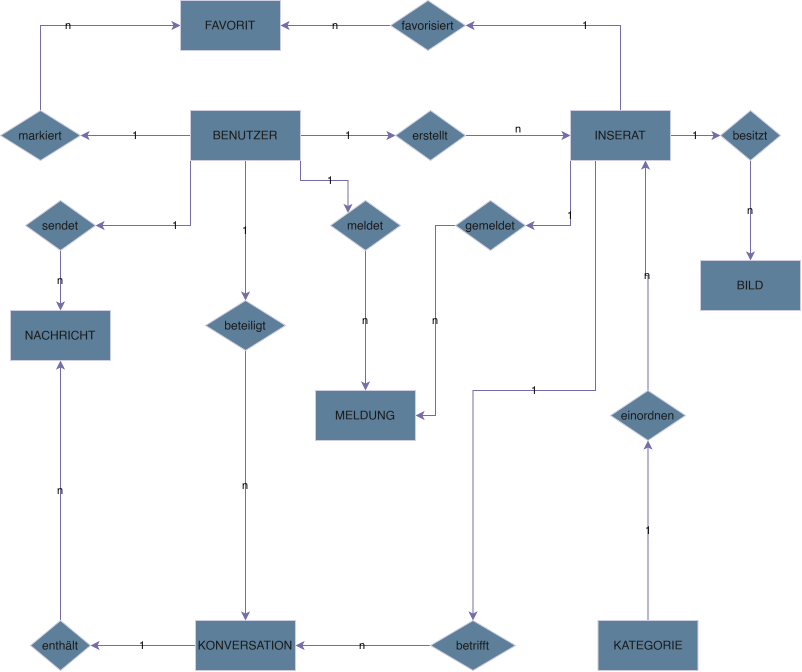

# 3.1 Datenmodell (ER-Diagramm)

Das Datenmodell von THMarket strukturiert die zentralen Informationen und deren Beziehungen. Zentrale Entität ist der **Benutzer**, der durch Attribute wie E-Mail-Adresse, Benutzername, Passwort-Hash und Verifizierungsstatus charakterisiert wird. Jeder Benutzer kann mehrere Inserate erstellen; jedes Inserat gehört genau einem Benutzer (Anbieter).

Jedem Inserat ist eine Kategorie zugeordnet, und jedes Inserat kann mehrere Bilder besitzen, die in einer eigenen Entität verwaltet werden. Über die Zwischentabelle Favorit wird die n:m-Beziehung zwischen Benutzer und Inserat abgebildet, da ein Benutzer mehrere Inserate favorisieren kann und ein Inserat von mehreren Benutzern favorisiert werden kann.

Für den Chat wird pro Inserat und Interessent eine Konversation angelegt, die den Käufer, den Verkäufer und das Inserat referenziert. Zu jeder Konversation gehören mehrere Nachrichten mit Sender, Inhalt und Zeitstempel. Meldungen zu Inseraten werden in einer eigenen Entität gespeichert, die das gemeldete Inserat und den meldenden Nutzer referenziert und Grund, Status sowie Zeitstempel enthält. Nach einem Kauf entsteht eine Transaktion, die das betroffene Inserat sowie Käufer und Verkäufer referenziert und den gewählten Zahlungsmodus sowie den Status festhält. Nach Abschluss eines Verkaufs können sich die beteiligten Nutzer im Rahmen einer Bewertung gegenseitig einschätzen.

*Abbildung 7: Datenmodell von THMarket (ER-Diagramm)* 