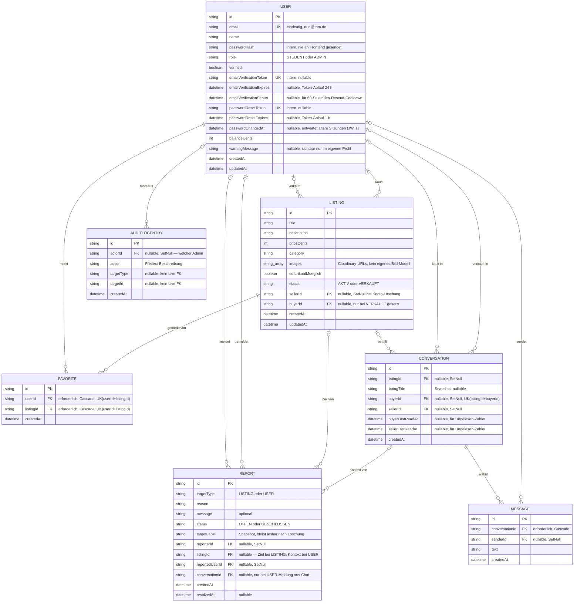

# D1 Datenmodell

Zentrale Entität ist USER. Jeder Nutzer kann mehrere Inserate als Verkäufer anlegen (sellerId) und nach einem Kauf als Käufer referenziert werden (buyerId). Favoriten bilden die n:m-Beziehung zwischen Nutzer und Inserat ab. Meldungen (REPORT) referenzieren wahlweise ein Inserat oder einen Nutzer als Ziel und protokollieren zusätzlich einen Snapshot des gemeldeten Namens/Titels, damit die Meldung auch nach einer späteren Löschung noch lesbar bleibt. Für den Chat wird pro Inserat und Interessent eine CONVERSATION angelegt, die mehrere MESSAGE-Einträge enthält. Jede Admin-Aktion wird als AUDITLOGENTRY protokolliert. Ändert ein Nutzer sein Passwort, wird USER.passwordChangedAt gesetzt — alle zuvor ausgestellten Sitzungstoken (JWTs) werden dadurch serverseitig ungültig.

Die meisten Fremdschlüssel-Beziehungen sind bewusst nullable und nutzen SET NULL beim Löschen der referenzierten Seite (z. B. LISTING.sellerId, REPORT.reporterId, CONVERSATION.buyerId). Dadurch bleiben abhängige Datensätze gelöschter Konten oder Inserate (wie abgeschlossene Käufe, Meldungen oder Chatverläufe) weiterhin lesbar, anstatt kaskadierend gelöscht zu werden.

Es gibt bewusst keine eigenständigen Entitäten für Bilder, Kategorien, Transaktionen oder Bewertungen. Bilder sind eine einfache URL-Liste direkt am Inserat, die Kategorie ist ein Textfeld mit fester Werteliste, ein Kauf wird durch das Setzen von status/buyerId am Inserat selbst abgebildet.

*Abbildung 1: Datenmodell von THMarket (ER-Diagramm)*

Diagramm anzeigen

*(Mermaid-Quelldatei: [`diagrams-code/d1-datenmodell.mermaid`](diagrams-code/d1-datenmodell.mermaid))*
