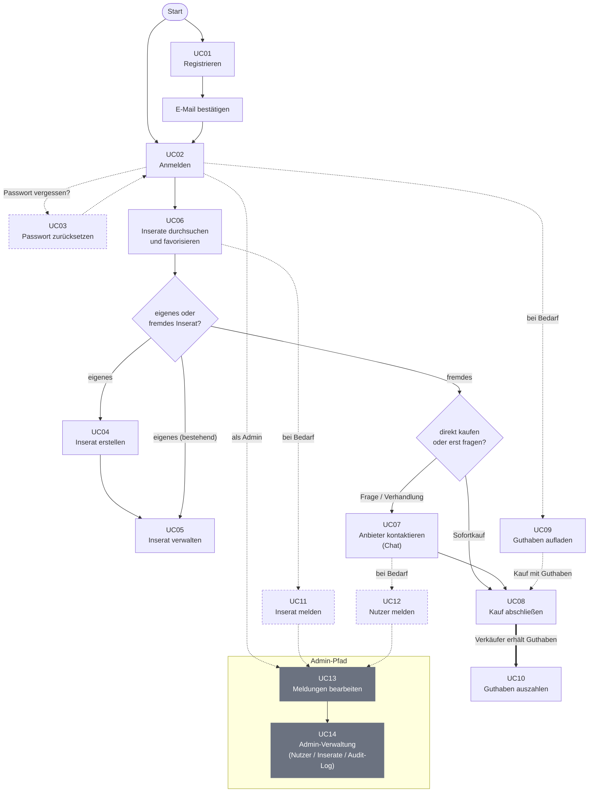

# F1 Geschäftsprozesse

THMarket unterstützt den Verkauf und die Vermietung von Gegenständen zwischen Studierenden der THM. Der zentrale Geschäftsprozess beginnt mit der Registrierung eines Nutzers und reicht über die Nutzung des Marktplatzes bis zur Kontaktaufnahme zwischen Interessent und Anbieter. Zusätzlich gibt es Verwaltungs- und Moderationsprozesse, die durch einen Administrator durchgeführt werden.

## F1.1 Akteure

In THMarket gibt es vier Akteure. Jeder hat eigene Rechte und typische Aktionen und bildet die Grundlage für die in Kapitel F2 beschriebenen Use Cases.

 

### 1. Gast

Der Gast ist ein Besucher ohne aktive Sitzung. Er sieht ausschließlich die Landingpage, das Impressum sowie Registrierung und Login — keine Inserate, keine Nutzerdaten.

**Typische Aktionen:**
- Registrierung durchführen (UC01)
- Login starten (UC02)
- Passwort-zurücksetzen-Vorgang starten (UC03)

 
 

### 2. Registrierter Nutzer

Der registrierte Nutzer hat ein Konto angelegt, dessen E-Mail-Adresse aber noch nicht über den Bestätigungslink verifiziert wurde. Er kann sich noch nicht anmelden; die einzige mögliche Aktion ist, den Verifizierungslink zu öffnen oder einen neuen anzufordern.

**Typische Aktionen:**
- Verifizierungslink öffnen (Teil von UC01)
- Neuen Verifizierungslink anfordern (Teil von UC01)

 
 

### 3. Student (angemeldet)

Der Student ist die aktive Form eines verifizierten Nutzers nach erfolgreichem Login (Rolle `STUDENT`). Er hat Zugriff auf sämtliche Marktplatzfunktionen: Inserate durchsuchen, erstellen und verwalten, chatten, kaufen, sein In-App-Guthaben verwalten sowie Inserate und Nutzer melden.

**Typische Aktionen:**
- Inserate durchsuchen und favorisieren (UC06)
- Inserat erstellen und verwalten (UC04, UC05)
- Anbieter kontaktieren / chatten (UC07)
- Kauf abschließen (UC08)
- Guthaben aufladen und auszahlen (UC09, UC10)
- Inserat oder Nutzer melden (UC11, UC12)

 
 

### 4. Administrator

Der Administrator ist ein spezieller Akteur mit Rolle `ADMIN`, angelegt über ein Seed-Skript. Er meldet sich über denselben Login-Dialog an wie ein Student, sieht nach dem Login aber eine eigene, rollenbasierte Oberfläche statt des Marktplatzes. Er nutzt selbst keine Marktplatzfunktionen und kann insbesondere keine eigenen Inserate erstellen.

**Typische Aktionen:**
- Meldungen bearbeiten (UC13)
- Nutzerkonten verwalten, insbesondere löschen (UC14)
- Inserate verwalten, insbesondere löschen (UC14)
- Audit-Log einsehen (UC14)

 

## F1.2 Typischer Geschäftsprozess

Der typische Lebenszyklus eines Nutzers durchläuft folgende Stationen, die in den Use Cases UC01–UC14 im Detail beschrieben sind:

*Abbildung 1: Geschäftsprozessüberblick von THMarket (gestrichelt = optionaler Pfad, grau = Admin-Pfad)*

Diagramm anzeigen

*(Mermaid-Quelldatei: [`diagrams-code/f1-geschaeftsprozess.mermaid`](diagrams-code/f1-geschaeftsprozess.mermaid))*
