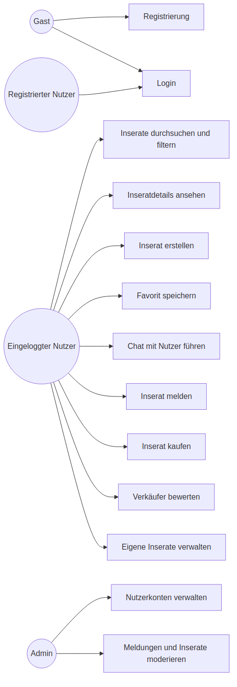
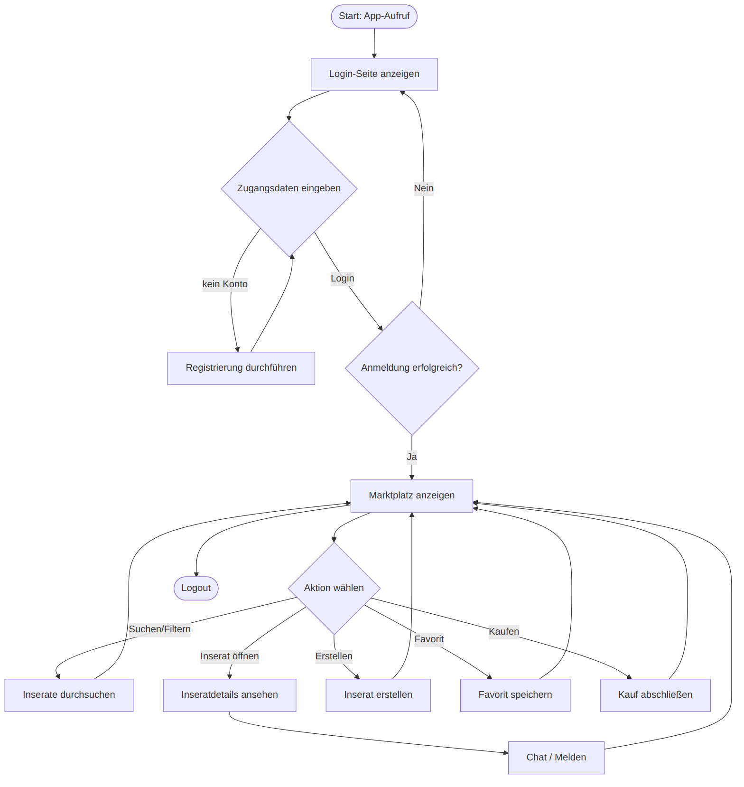

# F1 Geschäftsprozesse

THMarket unterstützt den Verkauf und die Vermietung von Gegenständen zwischen Studierenden der THM. Der zentrale Geschäftsprozess beginnt mit der Registrierung eines Nutzers und reicht über die Nutzung des Marktplatzes bis zur Kontaktaufnahme zwischen Interessent und Anbieter. Zusätzlich gibt es Verwaltungs- und Moderationsprozesse, die durch einen Administrator durchgeführt werden.

### Beteiligte Akteure

In THMarket gibt es vier verschiedene Arten von Akteuren. Jede Rolle hat eigene Rechte, Aufgaben und Verantwortlichkeiten und bildet die Grundlage für die im Use-Case-Diagramm dargestellten Anwendungsfälle.

#### 1. Gast

Der Gast ist ein nicht eingeloggter Besucher von THMarket. Da die Plattform geschlossen ist, kann er ausschließlich die Login- und Registrierungsseite sehen. Inserate, der Marktplatz und alle personalisierten Inhalte sind für ihn nicht zugänglich.

Typische Aktionen:

- Registrierung mit THM-E-Mail starten
- Login starten

#### 2. User (registrierter Nutzer)

Der User ist ein registrierter Nutzer, dessen THM-E-Mail-Adresse bereits verifiziert wurde. Er kann sich anmelden und wird nach dem Login zum „eingeloggten Nutzer“. Diese Rolle beschreibt den registrierten Zustand ohne aktive Sitzung.

Typische Aktionen:

- Login starten

#### 3. Eingeloggter Nutzer

Der eingeloggte Nutzer ist die aktive Form des Users nach erfolgreicher Anmeldung. Er hat Zugriff auf alle Kernfunktionen der Plattform. Er kann sowohl als Anbieter (Inserate erstellen und verwalten) als auch als Interessent (Inserate suchen, Favoriten speichern, Kontakt aufnehmen) auftreten – beide Rollen werden durch denselben Nutzer wahrgenommen.

Typische Aktionen:

- Inserat erstellen (mit Bildern)
- Inserate durchsuchen und filtern
- Inseratdetails ansehen
- Favorit speichern
- Chat mit anderen Nutzern führen
- Inserat melden
- Inserat kaufen
- Verkäufer bewerten
- Eigene Inserate verwalten (bearbeiten/löschen)

#### 4. Admin

Der Admin ist ein spezieller Akteur mit erweiterten Verwaltungs- und Kontrollrechten. Er kümmert sich um die Pflege der Nutzerkonten sowie die Bearbeitung von Meldungen und unangemessenen Inseraten. Die Marktplatzfunktionen selbst nutzt er im Rahmen seiner Rolle nicht.

Typische Aktionen:

- Nutzerkonten verwalten (bearbeiten, sperren, löschen)
- Gemeldete Inserate prüfen und Maßnahmen ergreifen (Verwarnung, Ausblenden, Sperre)
- Meldungen bearbeiten
- Logs/Aktivitäten einsehen

*Abbildung 3: Use-Case-Diagramm der THMarket-Anwendung*

### Typischer Geschäftsprozess

Der typische Ablauf beginnt mit dem Aufruf der Anwendung und der Weiterleitung auf die Login-Seite. Dort meldet sich der Nutzer entweder mit bestehenden Zugangsdaten an oder legt über die Registrierung ein neues Konto an, das anschließend per E-Mail-Verifizierung bestätigt werden muss. Nach erfolgreichem Login gelangt der Nutzer auf den Marktplatz, auf dem Inserate angezeigt, durchsucht und geöffnet werden können. Von dort sind alle weiteren Kernfunktionen wie Inserat erstellen, Favorit speichern, Chat, Kaufen und Melden erreichbar.

Kommt ein Kauf zustande, schließt der Käufer diesen über den simulierten Kauf-Dialog ab; eine Anbindung an einen echten Zahlungsdienstleister gibt es nicht. Die eigentliche Übergabe des Gegenstands klären Interessent und Anbieter über den integrierten Chat und regeln sie außerhalb des Systems.

Gemeldete Inserate werden im Adminbereich angezeigt. Ein Administrator prüft die Meldung und kann eine Verwarnung aussprechen, das Inserat ausblenden oder den Nutzer sperren.

*Abbildung 4: Aktivitätsdiagramm „Marktplatznutzung nach Login beim App-Start“*

Neben dem typischen Ablauf der Marktplatznutzung gibt es einen Moderationsprozess für gemeldete Inserate sowie Verwaltungsprozesse für Nutzerkonten. Diese Abläufe werden in F2 genauer beschrieben.
