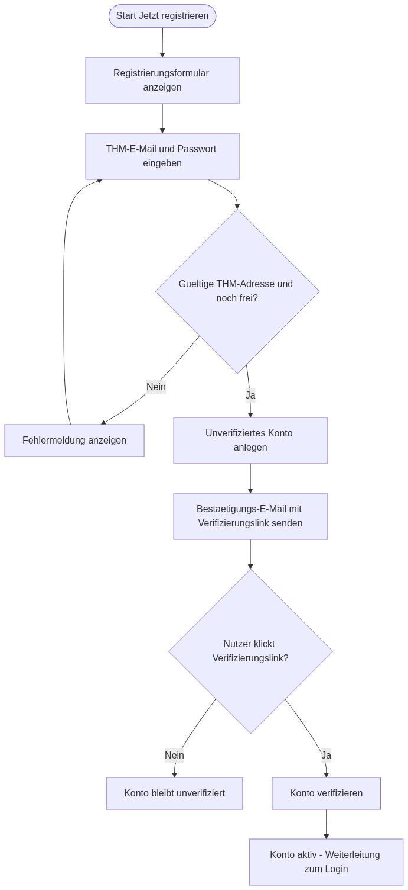

# F2 Anwendungsfälle

In den folgenden Abschnitten werden die identifizierten Anwendungsfälle (Use Cases) im Detail beschrieben. Jeder Use Case ist nach einem einheitlichen Schema dokumentiert, das Auslöser, Akteure, Vor- und Nachbedingungen, Haupt- und Alternativszenarien sowie Qualitätsanforderungen umfasst.

### UC01 – Login

| Nr. | Abschnitt | Inhalt / Erläuterung |
| --- | --- | --- |
| 01 | Bezeichner | UC01 |
| 02 | Name | Login |
| 03 | Autoren | Projektteam |
| 04 | Priorität | Hoch. Voraussetzung für jede Nutzung der Plattform. |
| 05 | Kritikalität | Sehr hoch. Ohne Login ist keine Nutzung möglich. |
| 06 | Verantwortlicher | Backend-Team (Nutzerverwaltung), Frontend-Team (Formulare, UI) |
| 07 | Beschreibung | Beim Aufruf der Webseite wird sofort die Login-Maske angezeigt. Die Anmeldung erfolgt über die THM-E-Mail-Adresse und ein Passwort. Nur verifizierte Konten können sich anmelden. |
| 08 | Auslösendes Ereignis | Der Nutzer ruft die Webseite auf. |
| 09 | Akteure | Registrierte Nutzer, die den Marktplatz nutzen möchten. |
| 10 | Vorbedingung | Die Webseite ist aufrufbar; der Nutzer hat sich bereits registriert und seine THM-E-Mail-Adresse verifiziert. |
| 11 | Nachbedingung | Der Nutzer ist eingeloggt und wird auf den Marktplatz weitergeleitet. |
| 12 | Ergebnis | Der Nutzer ist angemeldet und hat Zugriff auf alle Marktplatzfunktionen. |
| 13 | Hauptszenario | 1. Nutzer öffnet die Webseite. 2. Die Login-Maske erscheint sofort. 3. Nutzer gibt E-Mail-Adresse und Passwort ein. 4. System prüft die Eingaben und den Verifizierungsstatus. 5. Bei Erfolg wird der Nutzer zum Marktplatz weitergeleitet. |
| 14 | Alternativszenarien | Bei falschen Zugangsdaten wird eine Fehlermeldung angezeigt. Ist das Konto noch nicht verifiziert, erhält der Nutzer einen entsprechenden Hinweis. |
| 15 | Ausnahme Szenario | Backend oder Datenbank nicht erreichbar – es wird eine Fehlermeldung angezeigt. |
| 16 | Qualitäten | Der Anmeldevorgang soll in maximal 5 Sekunden abgeschlossen sein. Nutzer erhalten visuelles Feedback bei Erfolg oder Fehler. |

*Tabelle 2: Use Case UC01 – Login*

### UC02 – Registrierung

| Nr. | Abschnitt | Inhalt / Erläuterung |
| --- | --- | --- |
| 01 | Bezeichner | UC02 |
| 02 | Name | Registrierung |
| 03 | Autoren | Projektteam |
| 04 | Priorität | Hoch. Ermöglicht die Nutzung der geschlossenen Plattform. |
| 05 | Kritikalität | Hoch. Notwendig für den Zugang und die Eingrenzung auf THM-Studierende. |
| 06 | Verantwortlicher | Backend-Team (Nutzerverwaltung, Mailversand), Frontend-Team (Formulare, UI) |
| 07 | Beschreibung | Nutzer legen ein Konto an, indem sie ihre THM-E-Mail-Adresse, einen Benutzernamen und ein selbstgewähltes Passwort angeben. Das System prüft, ob es sich um eine gültige THM-Adresse handelt, und versendet eine Bestätigungs-E-Mail mit einem Verifizierungslink. Erst nach Klick auf den Link ist das Konto aktiv. |
| 08 | Auslösendes Ereignis | Der Nutzer klickt auf „Jetzt registrieren“. |
| 09 | Akteure | Studierende der THM, die ein Konto erstellen möchten. |
| 10 | Vorbedingung | Die Webseite ist aufrufbar; der Nutzer besitzt eine gültige THM-E-Mail-Adresse. |
| 11 | Nachbedingung | Ein neues, noch nicht verifiziertes Konto ist angelegt und eine Bestätigungs-E-Mail wurde versendet. Nach Klick auf den Link ist das Konto verifiziert. |
| 12 | Ergebnis | Ein verifiziertes Benutzerkonto steht für die Anmeldung bereit. |
| 13 | Hauptszenario | 1. Der Nutzer klickt auf „Jetzt registrieren“. 2. Ein Formular wird angezeigt. 3. Der Nutzer gibt THM-E-Mail-Adresse, Benutzername und Passwort ein. 4. Das System prüft die Eingaben und die THM-Domain und legt ein unverifiziertes Konto an. 5. Eine Bestätigungs-E-Mail mit Verifizierungslink wird versendet. 6. Der Nutzer öffnet den Link und das Konto wird verifiziert; anschließend erfolgt die Weiterleitung zum Login (UC01). |
| 14 | Alternativszenarien | Ist die E-Mail-Adresse bereits vergeben, wird der Nutzer darauf hingewiesen. Bei einer Nicht-THM-Adresse wird die Registrierung abgelehnt. Wurde die Bestätigungs-E-Mail nicht zugestellt oder ist der Link abgelaufen, kann der Nutzer einen neuen Verifizierungslink anfordern. |
| 15 | Ausnahme Szenario | Datenbank oder E-Mail-Dienst nicht erreichbar – es erscheint eine Meldung, dass aktuell keine Registrierung möglich ist. |
| 16 | Qualitäten | Formulare validieren Eingaben client- und serverseitig. Das Passwort wird ausschließlich als Hash (mit Salt) gespeichert. Der Verifizierungslink ist zeitlich begrenzt gültig. |

*Tabelle 3: Use Case UC02 – Registrierung*

*Abbildung 5: Verfeinerung der Aktivität „Registrierung durchführen“*

### UC03 – Inserat erstellen

| Nr. | Abschnitt | Inhalt / Erläuterung |
| --- | --- | --- |
| 01 | Bezeichner | UC03 |
| 02 | Name | Inserat erstellen |
| 03 | Autoren | Projektteam |
| 04 | Priorität | Hoch. Kernfunktion der Plattform. |
| 05 | Kritikalität | Hoch. Ohne Inserate hat der Marktplatz keinen Inhalt. |
| 06 | Verantwortlicher | Frontend-Team (Formular, Bild-Upload), Backend-Team (Speicherung) |
| 07 | Beschreibung | Der eingeloggte Nutzer kann ein neues Inserat anlegen. Dazu gibt er Titel, Beschreibung, Kategorie, Angebotstyp (Verkauf oder Miete) und Preis an und lädt ein oder mehrere Bilder hoch. Die Bilddateien werden gespeichert; ihre Zuordnung zum Inserat und der jeweilige Speicherpfad werden in der Datenbank hinterlegt. |
| 08 | Auslösendes Ereignis | Der Nutzer klickt auf „Inserat erstellen“. |
| 09 | Akteure | Eingeloggte Nutzer (als Anbieter). |
| 10 | Vorbedingung | Der Nutzer ist eingeloggt. |
| 11 | Nachbedingung | Das Inserat und die Zuordnungen zu den gespeicherten Bildern sind dauerhaft gespeichert; das Inserat ist auf dem Marktplatz sichtbar. |
| 12 | Ergebnis | Ein neues Inserat ist veröffentlicht und für andere Nutzer auffindbar. |
| 13 | Hauptszenario | 1. Der Nutzer klickt auf „Inserat erstellen“. 2. Das Inserat-Formular wird angezeigt. 3. Der Nutzer füllt Titel, Beschreibung, Kategorie, Typ und Preis aus. 4. Der Nutzer lädt ein oder mehrere Bilder hoch. 5. Das System validiert die Eingaben und Bilder. 6. Das Inserat wird gespeichert und der Nutzer erhält eine Erfolgsmeldung. |
| 14 | Alternativszenarien | Bei fehlenden Pflichtfeldern oder ungültigen Bildern (Format/Größe) wird eine Fehlermeldung angezeigt. Der Nutzer kann den Vorgang abbrechen. |
| 15 | Ausnahme Szenario | Datenbank nicht erreichbar – das Inserat wird nicht gespeichert und eine Fehlermeldung wird angezeigt. |
| 16 | Qualitäten | Bilder werden auf Format und Größe geprüft. Das Speichern soll in maximal 5 Sekunden erfolgen. Nutzer erhalten visuelles Feedback bei Erfolg oder Fehler. |

*Tabelle 4: Use Case UC03 – Inserat erstellen*

### UC04 – Inserate durchsuchen und filtern

| Nr. | Abschnitt | Inhalt / Erläuterung |
| --- | --- | --- |
| 01 | Bezeichner | UC04 |
| 02 | Name | Inserate durchsuchen und filtern |
| 03 | Autoren | Projektteam |
| 04 | Priorität | Hoch. Zentral für das Auffinden von Angeboten. |
| 05 | Kritikalität | Mittel. Wichtig für die Nutzerfreundlichkeit, aber nicht sicherheitsrelevant. |
| 06 | Verantwortlicher | Frontend-Team, Backend-Team (Suchlogik) |
| 07 | Beschreibung | Der eingeloggte Nutzer kann den Marktplatz durchsuchen. Über ein Suchfeld sowie Filter (z. B. Kategorie, Angebotstyp, Preisbereich) kann er die angezeigten Inserate eingrenzen. Die Ergebnisse werden als Liste bzw. Kachelübersicht dargestellt. |
| 08 | Auslösendes Ereignis | Der Nutzer gibt einen Suchbegriff ein oder wählt einen Filter. |
| 09 | Akteure | Eingeloggte Nutzer (als Interessent). |
| 10 | Vorbedingung | Der Nutzer ist eingeloggt und befindet sich auf dem Marktplatz. |
| 11 | Nachbedingung | Die zur Suche/Filterung passenden Inserate werden angezeigt. |
| 12 | Ergebnis | Der Nutzer sieht eine gefilterte Liste relevanter Inserate. |
| 13 | Hauptszenario | 1. Der Nutzer befindet sich auf dem Marktplatz. 2. Der Nutzer gibt einen Suchbegriff ein und/oder wählt Filter (Kategorie, Typ, Preis). 3. Das System übernimmt und prüft die Eingaben. 4. Die passenden Inserate werden aus der Datenbank abgerufen. 5. Die Ergebnisse werden im Hauptbereich angezeigt. |
| 14 | Alternativszenarien | Liefert die Suche keine Treffer, wird ein entsprechender Hinweis angezeigt. |
| 15 | Ausnahme Szenario | Datenbank nicht erreichbar – es wird eine Fehlermeldung angezeigt. |
| 16 | Qualitäten | Die Ergebnisanzeige soll maximal zwei Sekunden nach der Eingabe erfolgen. Die Darstellung erfolgt in konsistenter Struktur. |

*Tabelle 5: Use Case UC04 – Inserate durchsuchen und filtern*

### UC05 – Inseratdetails ansehen

| Nr. | Abschnitt | Inhalt / Erläuterung |
| --- | --- | --- |
| 01 | Bezeichner | UC05 |
| 02 | Name | Inseratdetails ansehen |
| 03 | Autoren | Projektteam |
| 04 | Priorität | Hoch. Grundlage für Kontaktaufnahme und Favorisierung. |
| 05 | Kritikalität | Niedrig. Funktional wichtig, aber nicht systemkritisch. |
| 06 | Verantwortlicher | Frontend-Team, Backend-Team (Datenabruf) |
| 07 | Beschreibung | Der Nutzer öffnet ein Inserat, um alle Details einzusehen: Titel, Beschreibung, Bilder, Preis, Angebotstyp, Kategorie und Angaben zum Anbieter. Von der Detailansicht aus kann der Nutzer das Inserat favorisieren, den Anbieter kontaktieren oder das Inserat melden. |
| 08 | Auslösendes Ereignis | Der Nutzer klickt in der Übersicht auf ein Inserat. |
| 09 | Akteure | Eingeloggte Nutzer (als Interessent). |
| 10 | Vorbedingung | Der Nutzer ist eingeloggt; das Inserat existiert. |
| 11 | Nachbedingung | Die Detailansicht des Inserats wird angezeigt. |
| 12 | Ergebnis | Der Nutzer sieht alle Informationen zum Inserat und mögliche Folgeaktionen. |
| 13 | Hauptszenario | 1. Der Nutzer klickt in der Übersicht auf ein Inserat. 2. Das System ruft die Detaildaten inklusive Bilder ab. 3. Die Detailansicht wird angezeigt. 4. Dem Nutzer werden die Aktionen Favorisieren, Kontaktieren und Melden angeboten. |
| 14 | Alternativszenarien | Wurde das Inserat zwischenzeitlich gelöscht, wird ein entsprechender Hinweis angezeigt. |
| 15 | Ausnahme Szenario | Datenbank nicht erreichbar – es wird eine Fehlermeldung angezeigt. |
| 16 | Qualitäten | Die Detailansicht soll innerhalb von zwei Sekunden geladen werden. Bilder werden in konsistenter Qualität dargestellt. |

*Tabelle 6: Use Case UC05 – Inseratdetails ansehen*

### UC06 – Favorit speichern

| Nr. | Abschnitt | Inhalt / Erläuterung |
| --- | --- | --- |
| 01 | Bezeichner | UC06 |
| 02 | Name | Favorit speichern |
| 03 | Autoren | Projektteam |
| 04 | Priorität | Mittel bis hoch. Erhöht den Komfort bei wiederholter Nutzung. |
| 05 | Kritikalität | Niedrig. Funktional nützlich, aber für das System nicht kritisch. |
| 06 | Verantwortlicher | Frontend-Team (Nutzerinteraktion), Backend-Team (Datenbankzugriff) |
| 07 | Beschreibung | Nutzer können Inserate, die sie im Auge behalten möchten, als Favorit markieren. Die Favoriten werden serverseitig im Nutzerprofil gespeichert und sind über eine eigene Favoritenliste erreichbar. |
| 08 | Auslösendes Ereignis | Der Nutzer klickt bei einem Inserat auf „Favorit speichern“. |
| 09 | Akteure | Eingeloggte Nutzer. |
| 10 | Vorbedingung | Der Nutzer ist eingeloggt und betrachtet ein Inserat. |
| 11 | Nachbedingung | Das Inserat ist als Favorit markiert und erscheint in der Favoritenliste des Nutzers. |
| 12 | Ergebnis | Das favorisierte Inserat ist beim nächsten Besuch direkt abrufbar. |
| 13 | Hauptszenario | 1. Der Nutzer ruft ein Inserat auf. 2. Der Nutzer klickt auf „Favorit speichern“. 3. Das System speichert die Zuordnung im Nutzerprofil. 4. Die Favoritenliste wird sofort aktualisiert. |
| 14 | Alternativszenarien | Ist das Inserat bereits favorisiert, kann der Nutzer es durch erneutes Klicken wieder entfernen. |
| 15 | Ausnahme Szenario | Datenbank temporär nicht erreichbar – der Vorgang wird abgebrochen und das Inserat nicht gespeichert. |
| 16 | Qualitäten | Favoriten sollen mit einem Klick speicherbar sein. Die Daten werden sicher im Nutzerprofil abgelegt. |

*Tabelle 7: Use Case UC06 – Favorit speichern*

### UC07 – Chat mit Nutzer führen

| Nr. | Abschnitt | Inhalt / Erläuterung |
| --- | --- | --- |
| 01 | Bezeichner | UC07 |
| 02 | Name | Chat mit Nutzer führen |
| 03 | Autoren | Projektteam |
| 04 | Priorität | Hoch. Zentrale Funktion für die Kontaktaufnahme. |
| 05 | Kritikalität | Mittel. Wichtig für den Handel, aber nicht systemkritisch. |
| 06 | Verantwortlicher | Frontend-Team (Chat-UI), Backend-Team (Socket.io, Speicherung) |
| 07 | Beschreibung | Über den integrierten Echtzeit-Chat können Interessent und Anbieter zu einem Inserat Nachrichten austauschen. Beim ersten Kontakt zu einem Inserat wird eine Konversation angelegt. Nachrichten werden über Socket.io in Echtzeit übertragen und in der Datenbank gespeichert. |
| 08 | Auslösendes Ereignis | Der Nutzer klickt in einem Inserat auf „Anbieter kontaktieren“ oder öffnet eine bestehende Konversation. |
| 09 | Akteure | Eingeloggte Nutzer (Interessent und Anbieter). |
| 10 | Vorbedingung | Beide Nutzer sind registriert; der Nutzer ist eingeloggt. |
| 11 | Nachbedingung | Die Nachricht ist zugestellt und gespeichert; die Konversation ist für beide Nutzer sichtbar. |
| 12 | Ergebnis | Interessent und Anbieter können in Echtzeit kommunizieren. |
| 13 | Hauptszenario | 1. Der Nutzer klickt bei einem Inserat auf „Anbieter kontaktieren“. 2. Das System öffnet die (ggf. neu angelegte) Konversation. 3. Der Nutzer verfasst eine Nachricht und sendet sie ab. 4. Die Nachricht wird über Socket.io in Echtzeit übertragen und gespeichert. 5. Der Empfänger sieht die Nachricht in seiner Konversationsübersicht. |
| 14 | Alternativszenarien | Ist der Empfänger offline, wird die Nachricht gespeichert und beim nächsten Aufruf der Konversation angezeigt. Bei einem Verbindungsabbruch versucht das System, die Verbindung erneut herzustellen. Der Nutzer kann das Verfassen abbrechen. |
| 15 | Ausnahme Szenario | Verbindungsabbruch oder Datenbankfehler – die Nachricht wird nicht zugestellt und eine Fehlermeldung wird angezeigt. |
| 16 | Qualitäten | Nachrichten sollen bei bestehender Verbindung in unter einer Sekunde zugestellt werden. Der Chat ist nur zwischen den beteiligten Nutzern sichtbar. |

*Tabelle 8: Use Case UC07 – Chat mit Nutzer führen*

*Abbildung 6: Verfeinerung der Aktivität „Nachricht im Chat senden“*

### UC08 – Inserat melden

| Nr. | Abschnitt | Inhalt / Erläuterung |
| --- | --- | --- |
| 01 | Bezeichner | UC08 |
| 02 | Name | Inserat melden |
| 03 | Autoren | Projektteam |
| 04 | Priorität | Mittel. Wichtig für die Sicherheit und Qualität der Plattform. |
| 05 | Kritikalität | Mittel. Nicht systemkritisch, aber betriebsrelevant. |
| 06 | Verantwortlicher | Frontend-Team (UI), Backend-Team (Speicherung, Routing an Admin) |
| 07 | Beschreibung | Nutzer können unangemessene oder verdächtige Inserate melden (z. B. verbotene Ware, Betrugsverdacht). Die Meldung wird mit Grund und optionaler Beschreibung gespeichert und im Adminbereich zur Bearbeitung angezeigt. |
| 08 | Auslösendes Ereignis | Der Nutzer klickt bei einem Inserat auf „Melden“. |
| 09 | Akteure | Eingeloggte Nutzer. |
| 10 | Vorbedingung | Der Nutzer ist eingeloggt und betrachtet ein Inserat. |
| 11 | Nachbedingung | Die Meldung ist gespeichert und im Adminbereich zur Bearbeitung verfügbar. |
| 12 | Ergebnis | Die Meldung wird im Adminbereich angezeigt und kann dort bearbeitet werden. |
| 13 | Hauptszenario | 1. Der Nutzer klickt bei einem Inserat auf „Melden“. 2. Ein Meldeformular mit Auswahl des Grundes wird eingeblendet. 3. Der Nutzer wählt einen Grund und gibt optional eine Beschreibung an. 4. Das System validiert und speichert die Meldung. 5. Dem Nutzer wird eine Bestätigung angezeigt. |
| 14 | Alternativszenarien | Der Nutzer bricht das Formular ab – keine Speicherung. Bei ungültiger Eingabe wird eine Fehlermeldung angezeigt. |
| 15 | Ausnahme Szenario | Datenbank nicht erreichbar – die Meldung wird nicht gespeichert und eine Fehlermeldung wird angezeigt. |
| 16 | Qualitäten | Das Meldeformular ist klar strukturiert. Eingaben werden validiert. Die Übermittlung erfolgt in maximal drei Sekunden. |

*Tabelle 9: Use Case UC08 – Inserat melden*

### UC09 – Eigene Inserate verwalten

| Nr. | Abschnitt | Inhalt / Erläuterung |
| --- | --- | --- |
| 01 | Bezeichner | UC09 |
| 02 | Name | Eigene Inserate verwalten |
| 03 | Autoren | Projektteam |
| 04 | Priorität | Mittel bis hoch. Wichtig für die Pflege eigener Angebote. |
| 05 | Kritikalität | Mittel. Betrifft die eigenen Daten des Nutzers. |
| 06 | Verantwortlicher | Frontend-Team (UI), Backend-Team (Logik, Speicherung) |
| 07 | Beschreibung | Der eingeloggte Nutzer kann seine eigenen Inserate einsehen, bearbeiten (z. B. Preis, Beschreibung, Bilder ändern) oder löschen. Verkaufte bzw. vermietete Artikel können als abgeschlossen markiert oder entfernt werden. |
| 08 | Auslösendes Ereignis | Der Nutzer öffnet den Bereich „Meine Inserate“. |
| 09 | Akteure | Eingeloggte Nutzer (als Anbieter). |
| 10 | Vorbedingung | Der Nutzer ist eingeloggt. |
| 11 | Nachbedingung | Das betroffene Inserat wurde wie gewünscht geändert oder entfernt. |
| 12 | Ergebnis | Die eigenen Inserate sind aktuell und korrekt. |
| 13 | Hauptszenario | 1. Der Nutzer öffnet „Meine Inserate“. 2. Der Nutzer wählt ein Inserat. 3. Der Nutzer bearbeitet die Angaben oder löscht das Inserat. 4. Das System validiert und speichert die Änderung. |
| 14 | Alternativszenarien | Der Nutzer bricht den Vorgang ab, ohne zu speichern. Besitzt der Nutzer noch keine eigenen Inserate, zeigt das System einen entsprechenden Hinweis an. |
| 15 | Ausnahme Szenario | Die Änderung kann aufgrund eines Server- oder Datenbankfehlers nicht gespeichert werden. |
| 16 | Qualitäten | Nur der Ersteller darf sein Inserat bearbeiten oder löschen. Änderungen sind sofort wirksam und dauerhaft gespeichert. |

*Tabelle 10: Use Case UC09 – Eigene Inserate verwalten*

### UC10 – Nutzerkonten verwalten (Admin)

| Nr. | Abschnitt | Inhalt / Erläuterung |
| --- | --- | --- |
| 01 | Bezeichner | UC10 |
| 02 | Name | Nutzerkonten verwalten (Admin) |
| 03 | Autoren | Projektteam |
| 04 | Priorität | Hoch. Notwendig zur Pflege der Nutzerbasis. |
| 05 | Kritikalität | Hoch. Systempflege, sicherheitsrelevant. |
| 06 | Verantwortlicher | Backend-Team (Logik), Frontend-Team (Admin-Oberfläche) |
| 07 | Beschreibung | Der Administrator kann über die Adminoberfläche Nutzerkonten einsehen, bearbeiten, sperren oder löschen. Zusätzlich kann er Logs und Aktivitäten einsehen. |
| 08 | Auslösendes Ereignis | Der Admin öffnet den Bereich „Benutzerverwaltung“ oder „Logs / Aktivitäten“. |
| 09 | Akteure | Administrator. |
| 10 | Vorbedingung | Der Admin ist erfolgreich eingeloggt. |
| 11 | Nachbedingung | Das betroffene Nutzerkonto wurde wie gewünscht geändert; beim reinen Einsehen von Logs werden keine Daten verändert. |
| 12 | Ergebnis | Das Nutzerkonto ist aktuell, z. B. gesperrt, gelöscht oder bearbeitet, oder die ausgewählten Logs wurden angezeigt. |
| 13 | Hauptszenario | 1. Der Admin loggt sich in den Adminbereich ein. 2. Der Admin öffnet die Benutzerübersicht. 3. Der Admin wählt ein Konto. 4. Der Admin nimmt die gewünschte Änderung vor. |
| 14 | Alternativszenarien | Der Admin bricht den Vorgang ab, ohne Änderungen zu speichern. Alternativ öffnet er den Bereich „Logs / Aktivitäten“, um protokollierte Systemereignisse einzusehen. |
| 15 | Ausnahme Szenario | Die Änderungen können aufgrund eines Server- oder Datenbankfehlers nicht gespeichert werden. |
| 16 | Qualitäten | Nur autorisierte Administratoren haben Zugriff. Änderungen sind sofort wirksam und dauerhaft gespeichert. |

*Tabelle 11: Use Case UC10 – Nutzerkonten verwalten (Admin)*

### UC11 – Meldungen & Inserate moderieren (Admin)

| Nr. | Abschnitt | Inhalt / Erläuterung |
| --- | --- | --- |
| 01 | Bezeichner | UC11 |
| 02 | Name | Meldungen & Inserate moderieren (Admin) |
| 03 | Autoren | Projektteam |
| 04 | Priorität | Mittel bis hoch. Wichtig für die Qualität der Plattform. |
| 05 | Kritikalität | Mittel. Nicht systemkritisch, aber betriebsrelevant. |
| 06 | Verantwortlicher | Backend-Team (Logik), Frontend-Team (Admin-Oberfläche) |
| 07 | Beschreibung | Der Administrator sieht im Adminbereich offene Meldungen zu Inseraten und kann diese prüfen. Er kann eine Verwarnung aussprechen, das Inserat ausblenden oder den Nutzer sperren. |
| 08 | Auslösendes Ereignis | Der Admin öffnet den Bereich „Meldungen“. |
| 09 | Akteure | Administrator. |
| 10 | Vorbedingung | Der Admin ist eingeloggt und hat Berechtigung zur Bearbeitung von Meldungen. |
| 11 | Nachbedingung | Die betroffene Meldung ist bearbeitet; die Maßnahme (Verwarnung, Ausblenden oder Sperre) wurde umgesetzt. |
| 12 | Ergebnis | Die Meldung wurde verarbeitet und der Zustand der Plattform aktualisiert. |
| 13 | Hauptszenario | 1. Der Admin öffnet die Meldungsübersicht. 2. Der Admin wählt eine Meldung. 3. Der Admin prüft das gemeldete Inserat. 4. Der Admin trifft eine Entscheidung (Verwarnung / ausblenden / Sperre). 5. Die Entscheidung wird gespeichert. |
| 14 | Alternativszenarien | Der Admin schließt den Vorgang ohne Entscheidung. |
| 15 | Ausnahme Szenario | Die Datenbank ist nicht erreichbar. Die Meldung kann nicht bearbeitet werden; eine Fehlermeldung wird angezeigt. |
| 16 | Qualitäten | Nur berechtigte Admins dürfen Zugriff haben. Entscheidungen sind sofort wirksam und werden protokolliert. |

*Tabelle 12: Use Case UC11 – Meldungen & Inserate moderieren (Admin)*

### UC12 – Kauf abschließen

| Nr. | Abschnitt | Inhalt / Erläuterung |
| --- | --- | --- |
| 01 | Bezeichner | UC12 |
| 02 | Name | Kauf abschließen |
| 03 | Autoren | Projektteam |
| 04 | Priorität | Hoch. Kernfunktion für den Abschluss eines Handels. |
| 05 | Kritikalität | Mittel. Wichtig für den Ablauf, aber ohne echten Geldfluss. |
| 06 | Verantwortlicher | Backend-Team (Logik, Speicherung), Frontend-Team (Kauf- und Bewertungsformular) |
| 07 | Beschreibung | Ein eingeloggter Nutzer schließt den Kauf eines fremden Inserats ab. Er wählt einen Zahlungsmodus (Simulation oder In-App-Guthaben). Das System speichert die Transaktion und markiert das Inserat als verkauft. Im Anschluss kann der Käufer den Verkäufer bewerten. |
| 08 | Auslösendes Ereignis | Der Nutzer klickt bei einem fremden Inserat auf „Kaufen“. |
| 09 | Akteure | Eingeloggte Nutzer (als Käufer). |
| 10 | Vorbedingung | Der Nutzer ist eingeloggt und betrachtet ein Inserat, dessen Anbieter er nicht selbst ist. |
| 11 | Nachbedingung | Die Transaktion ist gespeichert, das Inserat ist als verkauft markiert; bei Nutzung des In-App-Guthabens wurde der Betrag verrechnet. |
| 12 | Ergebnis | Der Kauf ist abgeschlossen; optional wurde eine Bewertung abgegeben. |
| 13 | Hauptszenario | 1. Der Nutzer klickt bei einem Inserat auf „Kaufen“. 2. Der Kauf-Dialog öffnet sich. 3. Der Nutzer wählt einen Zahlungsmodus. 4. Der Nutzer bestätigt den Kauf. 5. Das System speichert die Transaktion und markiert das Inserat als verkauft. 6. Der Nutzer kann optional eine Bewertung abgeben. |
| 14 | Alternativszenarien | Der Nutzer bricht den Kauf ab – keine Speicherung. Er verzichtet auf die Bewertung – der Kauf bleibt trotzdem gültig. |
| 15 | Ausnahme Szenario | Datenbank nicht erreichbar – der Kauf wird nicht gespeichert und eine Fehlermeldung wird angezeigt. |
| 16 | Qualitäten | Es findet keine echte Zahlungsabwicklung statt. Der Kaufabschluss soll in maximal drei Sekunden erfolgen. |

*Tabelle 13: Use Case UC12 – Kauf abschließen*
