# F2 Anwendungsfälle

In den folgenden Abschnitten werden die identifizierten Anwendungsfälle (Use Cases) im Detail beschrieben. Jeder Use Case ist nach einem einheitlichen Schema dokumentiert, das Auslöser, Akteure, Vor- und Nachbedingungen, Haupt- und Alternativszenarien sowie Qualitätsanforderungen umfasst.

## 2.3 UC01 – Registrieren

| Abschnitt | Inhalt / Erläuterung |
|---|---|
| **Bezeichner** | UC01 |
| **Name** | Registrieren |
| **Autoren** | Projektteam |
| **Priorität** | Hoch. Voraussetzung für jede Nutzung der Plattform. |
| **Kritikalität** | Hoch. Ohne Registrierung ist keine Teilnahme am Marktplatz möglich. |
| **Verantwortlicher** | Backend (Nutzerverwaltung, Mailversand), Frontend (Formular, UI) |
| **Beschreibung** | Ein Gast legt ein Konto an, indem er seinen Namen, eine THM-E-Mail-Adresse und ein selbstgewähltes Passwort angibt. Das System prüft Format und Domain, legt bei Erfolg ein unverifiziertes Konto an und versendet eine Bestätigungs-E-Mail mit einem 24 Stunden gültigen Verifizierungslink. Erst nach Klick auf den Link ist das Konto anmeldebereit. |
| **Auslösendes Ereignis** | Der Gast klickt auf „Jetzt registrieren". |
| **Akteure** | Gast (Student mit THM-E-Mail-Adresse). |
| **Vorbedingung** | Der Gast besitzt eine gültige `@thm.de`-Adresse (inkl. Subdomains wie `@mnd.thm.de`). |
| **Nachbedingung** | Ein neues, verifiziertes Konto ist angelegt und anmeldebereit. |
| **Ergebnis** | Der Gast kann sich mit seinen neuen Zugangsdaten anmelden (UC02). |
| **Hauptszenario** | 1. Gast öffnet die Registrierung und gibt Name, THM-E-Mail-Adresse und Passwort ein. 2. System prüft Format (Domain, Passwortstärke). 3. System prüft, ob die E-Mail-Adresse bereits registriert ist. 4. System legt ein unverifiziertes Konto an und erzeugt einen 24 Stunden gültigen Bestätigungslink. 5. System löst den Versand der Bestätigungs-E-Mail aus und zeigt eine Erfolgsmeldung. 6. Gast öffnet den Bestätigungslink aus der E-Mail. 7. System prüft den Link auf Gültigkeit und setzt das Konto bei Erfolg auf verifiziert. |
| **Alternativszenarien** | Ist der Bestätigungslink abgelaufen oder unbekannt, kann höchstens alle 60 Sekunden ein neuer Link angefordert werden. |
| **Ausnahmeszenario** | Ist die Datenbank oder der E-Mail-Dienst nicht erreichbar, wird die Registrierung abgebrochen und eine Fehlermeldung angezeigt. |
| **Qualitäten** | Das Passwort wird ausschließlich als bcrypt-Hash gespeichert (NFA-02). Nur `@thm.de`-Adressen werden akzeptiert (NFA-03). Der Bestätigungslink ist zeitlich begrenzt gültig. |

*Tabelle: Use Case UC01 – Registrieren*

#### Sequenzdiagramm UC01 – Registrieren

Diagramm anzeigen

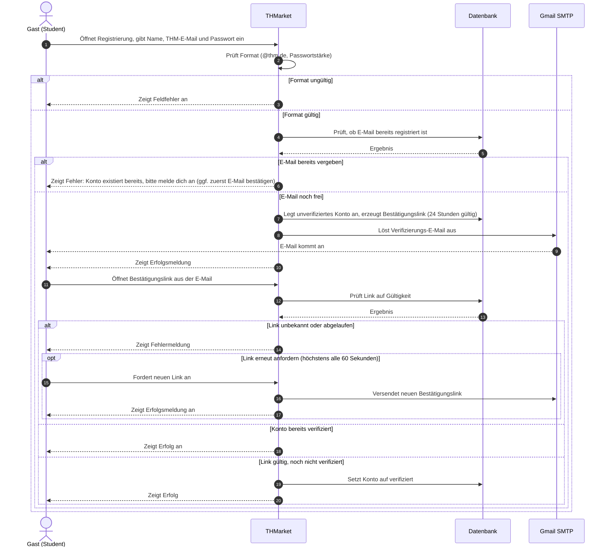
```mermaid
sequenceDiagram
    autonumber
    actor Gast as Gast (Student)
    participant System as THMarket
    participant DB as Datenbank
    participant Mail as Gmail SMTP

    Gast->>System: Öffnet Registrierung, gibt Name, THM-E-Mail und Passwort ein
    System->>System: Prüft Format (@thm.de, Passwortstärke)

    alt Format ungültig
        System-->>Gast: Zeigt Feldfehler an
    else Format gültig
        System->>DB: Prüft, ob E-Mail bereits registriert ist
        DB-->>System: Ergebnis

        alt E-Mail bereits vergeben
            System-->>Gast: Zeigt Fehler: Konto existiert bereits, bitte melde dich an (ggf. zuerst E-Mail bestätigen)
        else E-Mail noch frei
            System->>DB: Legt unverifiziertes Konto an, erzeugt Bestätigungslink (24 Stunden gültig)
            System->>Mail: Löst Verifizierungs-E-Mail aus
            Mail-->>Gast: E-Mail kommt an
            System-->>Gast: Zeigt Erfolgsmeldung

            Gast->>System: Öffnet Bestätigungslink aus der E-Mail
            System->>DB: Prüft Link auf Gültigkeit
            DB-->>System: Ergebnis

            alt Link unbekannt oder abgelaufen
                System-->>Gast: Zeigt Fehlermeldung
                opt Link erneut anfordern (höchstens alle 60 Sekunden)
                    Gast->>System: Fordert neuen Link an
                    System->>Mail: Versendet neuen Bestätigungslink
                    System-->>Gast: Zeigt Erfolgsmeldung an
                end
            else Konto bereits verifiziert
                System-->>Gast: Zeigt Erfolg an
            else Link gültig, noch nicht verifiziert
                System->>DB: Setzt Konto auf verifiziert
                System-->>Gast: Zeigt Erfolg
            end
        end
    end
```

*(Mermaid-Quelldatei: [`diagrams-code/f2-uc01-register.mermaid`](diagrams-code/f2-uc01-register.mermaid))*

## 2.4 UC02 – Anmelden

| Abschnitt | Inhalt / Erläuterung |
|---|---|
| **Bezeichner** | UC02 |
| **Name** | Anmelden |
| **Autoren** | Projektteam |
| **Priorität** | Hoch. Voraussetzung für jede Nutzung der Plattform. |
| **Kritikalität** | Sehr hoch. Ohne Login ist keine Nutzung möglich. |
| **Verantwortlicher** | Backend (Nutzerverwaltung, Sitzungsverwaltung), Frontend (Formular, UI) |
| **Beschreibung** | Ein registrierter Nutzer meldet sich mit E-Mail-Adresse und Passwort an. Das System sucht das Konto in einem einzigen Datenbankzugriff, prüft anschließend den Verifizierungsstatus und das Passwort gegen die bereits geladenen Kontodaten. Bei Erfolg wird eine Sitzung erstellt und der Nutzer entsprechend seiner Rolle weitergeleitet. |
| **Auslösendes Ereignis** | Der Nutzer ruft die Login-Seite auf und gibt seine Zugangsdaten ein. |
| **Akteure** | Registrierter Nutzer (Student oder Administrator). |
| **Vorbedingung** | Das Konto existiert und ist verifiziert. |
| **Nachbedingung** | Eine Sitzung ist erstellt und der Nutzer ist angemeldet. |
| **Ergebnis** | Student wird zum Marktplatz, Administrator zum Admin-Bereich weitergeleitet. |
| **Hauptszenario** | 1. Nutzer gibt E-Mail-Adresse und Passwort ein. 2. System sucht das Konto zur E-Mail-Adresse. 3. System prüft den Verifizierungsstatus. 4. System prüft das Passwort. 5. System erstellt eine Sitzung und leitet zum Marktplatz bzw. Admin-Bereich weiter. |
| **Alternativszenarien** | Existiert kein Konto zur E-Mail-Adresse oder ist das Passwort falsch, wird eine Fehlermeldung angezeigt. Ist das Konto noch nicht verifiziert, erscheint stattdessen ein Hinweis zur Verifizierung. |
| **Ausnahmeszenario** | Ist die Datenbank nicht erreichbar, wird eine Fehlermeldung angezeigt. |
| **Qualitäten** | Der Anmeldevorgang benötigt nur einen einzigen Datenbankzugriff. Passwörter werden nie im Klartext verglichen, sondern als Hash geprüft (NFA-02). |

*Tabelle: Use Case UC02 – Anmelden*

#### Sequenzdiagramm UC02 – Anmelden

Diagramm anzeigen

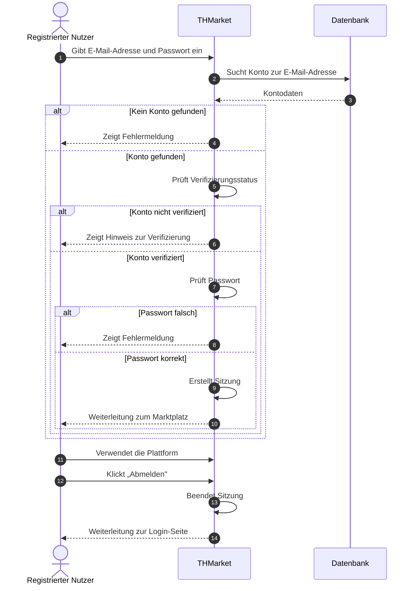
```mermaid
sequenceDiagram
    autonumber
    actor Nutzer as Registrierter Nutzer
    participant System as THMarket
    participant DB as Datenbank

    Nutzer->>System: Gibt E-Mail-Adresse und Passwort ein
    System->>DB: Sucht Konto zur E-Mail-Adresse
    DB-->>System: Kontodaten

    alt Kein Konto gefunden
        System-->>Nutzer: Zeigt Fehlermeldung
    else Konto gefunden
        System->>System: Prüft Verifizierungsstatus

        alt Konto nicht verifiziert
            System-->>Nutzer: Zeigt Hinweis zur Verifizierung
        else Konto verifiziert
            System->>System: Prüft Passwort

            alt Passwort falsch
                System-->>Nutzer: Zeigt Fehlermeldung
            else Passwort korrekt
                System->>System: Erstellt Sitzung
                System-->>Nutzer: Weiterleitung zum Marktplatz
            end
        end
    end

    Nutzer->>System: Verwendet die Plattform

    Nutzer->>System: Klickt „Abmelden"
    System->>System: Beendet Sitzung
    System-->>Nutzer: Weiterleitung zur Login-Seite
```

*(Mermaid-Quelldatei: [`diagrams-code/f2-uc02-login.mermaid`](diagrams-code/f2-uc02-login.mermaid))*

## 2.5 UC03 – Passwort zurücksetzen

| Abschnitt | Inhalt / Erläuterung |
|---|---|
| **Bezeichner** | UC03 |
| **Name** | Passwort zurücksetzen |
| **Autoren** | Projektteam |
| **Priorität** | Mittel. Wichtig für die Kontowiederherstellung, aber kein täglicher Ablauf. |
| **Kritikalität** | Mittel. Ohne diese Funktion wäre ein vergessenes Passwort ein endgültiger Kontoverlust. |
| **Verantwortlicher** | Backend (Nutzerverwaltung, Mailversand), Frontend (Formular, UI) |
| **Beschreibung** | Ein Nutzer, der sein Passwort vergessen hat, fordert über seine E-Mail-Adresse einen Reset-Link an. Über den zeitlich begrenzten Link kann anschließend ein neues Passwort gesetzt werden. |
| **Auslösendes Ereignis** | Der Nutzer klickt auf „Passwort vergessen". |
| **Akteure** | Nutzer, der sein Passwort vergessen hat. |
| **Vorbedingung** | Der Nutzer kennt seine registrierte E-Mail-Adresse. |
| **Nachbedingung** | Bei gültigem Link ist ein neues Passwort gesetzt. |
| **Ergebnis** | Der Nutzer kann sich mit dem neuen Passwort anmelden (UC02). |
| **Hauptszenario** | 1. Nutzer gibt seine E-Mail-Adresse ein. 2. System sucht das Konto und erstellt bei einem verifizierten Treffer einen Reset-Link. 3. System zeigt in jedem Fall denselben Hinweis zur Sendung der E-Mail. 4. Nutzer öffnet den Reset-Link und gibt ein neues Passwort ein. 5. System prüft den Link auf Gültigkeit und setzt bei Erfolg das neue Passwort. |
| **Alternativszenarien** | Ist das Konto zur Adresse zwar vorhanden, aber unverifiziert, erhält der Nutzer einen Hinweis zur Verifizierung statt eines Reset-Links. |
| **Ausnahmeszenario** | Ist der Reset-Link ungültig oder abgelaufen, wird eine Fehlermeldung angezeigt und kein Passwort gesetzt. |
| **Qualitäten** | Der Reset-Link ist zeitlich begrenzt gültig. |

*Tabelle: Use Case UC03 – Passwort zurücksetzen*

#### Sequenzdiagramm UC03 – Passwort zurücksetzen

Diagramm anzeigen

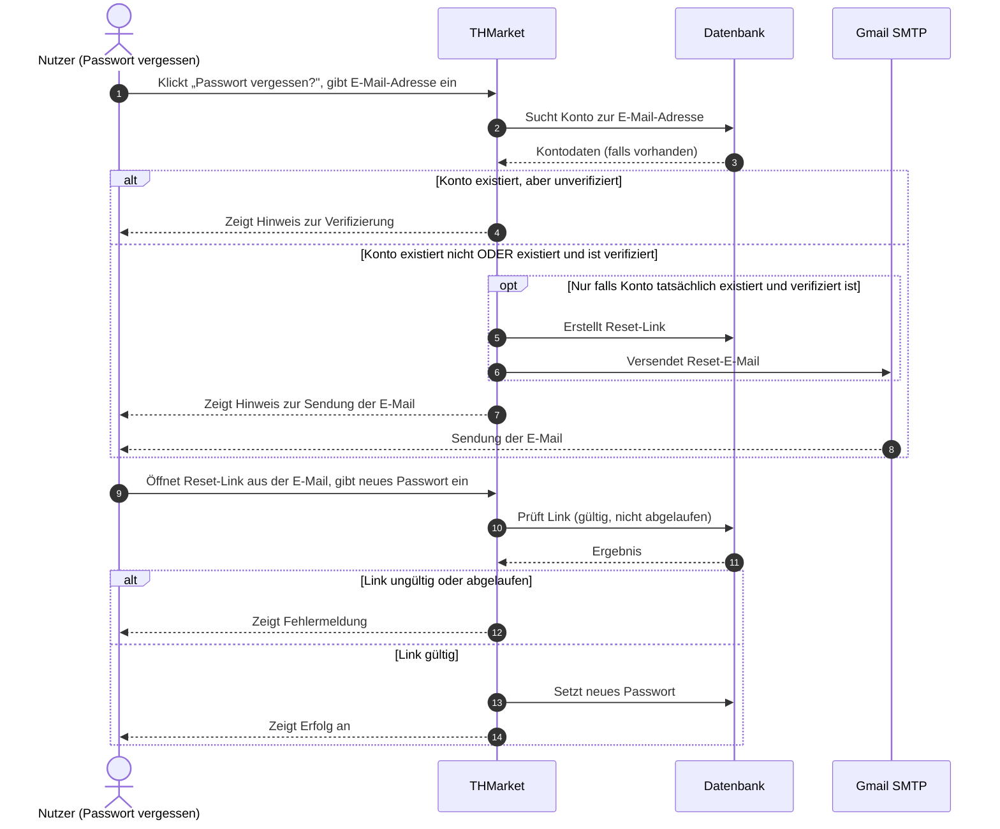
```mermaid
sequenceDiagram
    autonumber
    actor Nutzer as Nutzer (Passwort vergessen)
    participant System as THMarket
    participant DB as Datenbank
    participant Mail as Gmail SMTP

    Nutzer->>System: Klickt „Passwort vergessen?", gibt E-Mail-Adresse ein
    System->>DB: Sucht Konto zur E-Mail-Adresse
    DB-->>System: Kontodaten (falls vorhanden)

    alt Konto existiert, aber unverifiziert
        System-->>Nutzer: Zeigt Hinweis zur Verifizierung
    else Konto existiert nicht ODER existiert und ist verifiziert
        opt Nur falls Konto tatsächlich existiert und verifiziert ist
            System->>DB: Erstellt Reset-Link
            System->>Mail: Versendet Reset-E-Mail
        end
        System-->>Nutzer: Zeigt Hinweis zur Sendung der E-Mail
        Mail-->>Nutzer: Sendung der E-Mail
    end

    Nutzer->>System: Öffnet Reset-Link aus der E-Mail, gibt neues Passwort ein
    System->>DB: Prüft Link (gültig, nicht abgelaufen)
    DB-->>System: Ergebnis

    alt Link ungültig oder abgelaufen
        System-->>Nutzer: Zeigt Fehlermeldung
    else Link gültig
        System->>DB: Setzt neues Passwort
        System-->>Nutzer: Zeigt Erfolg an
    end
```

*(Mermaid-Quelldatei: [`diagrams-code/f2-uc03-passwort_zuruecksetzen.mermaid`](diagrams-code/f2-uc03-passwort_zuruecksetzen.mermaid))*

## 2.6 UC04 – Inserat erstellen

| Abschnitt | Inhalt / Erläuterung |
|---|---|
| **Bezeichner** | UC04 |
| **Name** | Inserat erstellen |
| **Autoren** | Projektteam |
| **Priorität** | Hoch. Kernfunktion der Plattform. |
| **Kritikalität** | Hoch. Ohne Inserate hat der Marktplatz keinen Inhalt. |
| **Verantwortlicher** | Frontend (Formular, Bild-Upload), Backend (Speicherung), externe Dienste (Cloudinary, Gemini) |
| **Beschreibung** | Ein angemeldeter Student legt ein neues Inserat an. Er gibt Titel, Beschreibung, Kategorie, Preis und Sofortkauf-Option ein und wählt mindestens ein Foto aus. Optional kann er sich von Gemini einen Beschreibungsvorschlag generieren lassen. Nach Validierung wird das Inserat gespeichert und ist sofort im Marktplatz sichtbar. |
| **Auslösendes Ereignis** | Der Student klickt auf „Inserat erstellen". |
| **Akteure** | Student (als Anbieter). |
| **Vorbedingung** | Der Nutzer ist angemeldet. |
| **Nachbedingung** | Das Inserat und die zugehörigen Bild-URLs sind dauerhaft gespeichert. |
| **Ergebnis** | Ein neues Inserat ist veröffentlicht und für andere Nutzer im Marktplatz auffindbar (UC06). |
| **Hauptszenario** | 1. Student öffnet „Inserat erstellen". 2. Student gibt Titel, Kategorie, Preis, Sofortkauf-Option und Beschreibung ein. 3. Student wählt ein oder mehrere Fotos aus. 4. Optional: System sendet Details an Gemini und übernimmt den gelieferten Beschreibungsvorschlag. 5. Student klickt „Inserat veröffentlichen". 6. System prüft die Pflichtfelder. 7. Bei Erfolg speichert das System das Inserat und zeigt eine Erfolgsmeldung. |
| **Alternativszenarien** | Fehlen Pflichtfelder oder Fotos, zeigt das System Feldfehler an und speichert nicht. Schlägt der KI-Vorschlag fehl, bleibt die manuelle Eingabe der Beschreibung uneingeschränkt möglich (NFA-06). |
| **Ausnahmeszenario** | Ist die Datenbank nicht erreichbar, wird das Inserat nicht gespeichert und eine Fehlermeldung angezeigt. |
| **Qualitäten** | – |

*Tabelle: Use Case UC04 – Inserat erstellen*

#### Sequenzdiagramm UC04 – Inserat erstellen

 Diagramm anzeigen

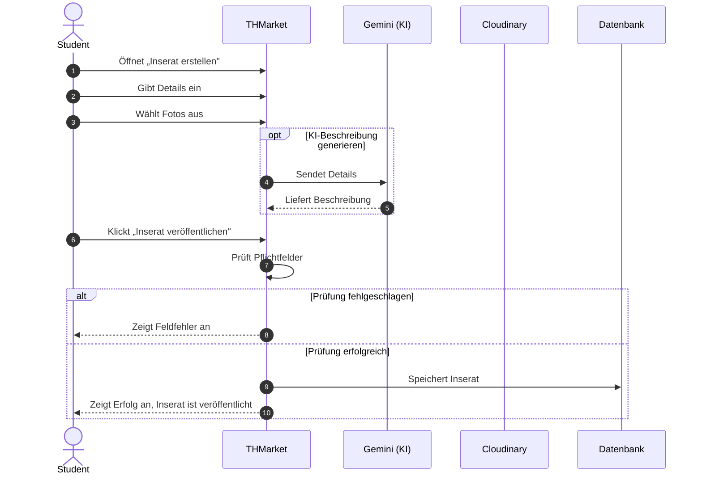
```mermaid
sequenceDiagram
    autonumber
    actor Student as Student
    participant System as THMarket
    participant KI as Gemini (KI)
    participant Bilder as Cloudinary
    participant DB as Datenbank

    Student->>System: Öffnet „Inserat erstellen"
    Student->>System: Gibt Details ein
    Student->>System: Wählt Fotos aus

    opt KI-Beschreibung generieren
        System->>KI: Sendet Details
        KI-->>System: Liefert Beschreibung
    end

    Student->>System: Klickt „Inserat veröffentlichen"
    System->>System: Prüft Pflichtfelder

        alt Prüfung fehlgeschlagen
            System-->>Student: Zeigt Feldfehler an
        else Prüfung erfolgreich
            System->>DB: Speichert Inserat
            System-->>Student: Zeigt Erfolg an, Inserat ist veröffentlicht
    end
```

*(Mermaid-Quelldatei: [`diagrams-code/f2-uc04-inserat_erstellen.mermaid`](diagrams-code/f2-uc04-inserat_erstellen.mermaid))*

## 2.7 UC05 – Inserat verwalten

| Abschnitt | Inhalt / Erläuterung |
|---|---|
| **Bezeichner** | UC05 |
| **Name** | Inserat verwalten |
| **Autoren** | Projektteam |
| **Priorität** | Mittel bis hoch. Wichtig für die Pflege eigener Angebote. |
| **Kritikalität** | Mittel. Betrifft nur die eigenen Daten des Nutzers. |
| **Verantwortlicher** | Frontend (UI), Backend (Logik, Speicherung) |
| **Beschreibung** | Der Verkäufer öffnet über sein Profil ein eigenes Inserat und kann es von dort bearbeiten, manuell als verkauft markieren oder löschen. Bearbeiten führt zum selben Formular wie beim Erstellen (UC04), vorbefüllt mit den bestehenden Werten. |
| **Auslösendes Ereignis** | Der Verkäufer klickt im Profil auf ein eigenes aktives Inserat und wählt eine Aktion. |
| **Akteure** | Verkäufer (Eigentümer eines Inserats). |
| **Vorbedingung** | Der Nutzer ist angemeldet und besitzt mindestens ein eigenes Inserat. |
| **Nachbedingung** | Das Inserat ist geändert, als verkauft markiert oder entfernt. |
| **Ergebnis** | Die eigenen Inserate sind aktuell. |
| **Hauptszenario** | 1. Verkäufer öffnet Profil und klickt auf ein eigenes aktives Inserat. 2. System zeigt die Inserat-Detailseite. 3. Verkäufer klickt „Bearbeiten". 4. System zeigt die vorbefüllte Bearbeiten-Seite. 5a. Bearbeiten: Verkäufer ändert Felder und speichert, System speichert die Änderungen. 5b. Als verkauft markieren: System zeigt eine Warnung, Verkäufer bestätigt, System setzt den Status. 5c. Löschen: System zeigt eine Warnung, Verkäufer bestätigt, System entfernt das Inserat. |
| **Alternativszenarien** | Bei „Als verkauft markieren" und „Löschen" muss der Verkäufer die vorangehende Warnung explizit bestätigen, bevor die Aktion ausgeführt wird. |
| **Ausnahmeszenario** | Kann die Änderung wegen eines Server- oder Datenbankfehlers nicht gespeichert werden, erscheint eine Fehlermeldung. |
| **Qualitäten** | Nur der Eigentümer darf sein Inserat bearbeiten, als verkauft markieren oder löschen. |

*Tabelle: Use Case UC05 – Inserat verwalten*

#### Sequenzdiagramm UC05 – Inserat verwalten

Diagramm anzeigen

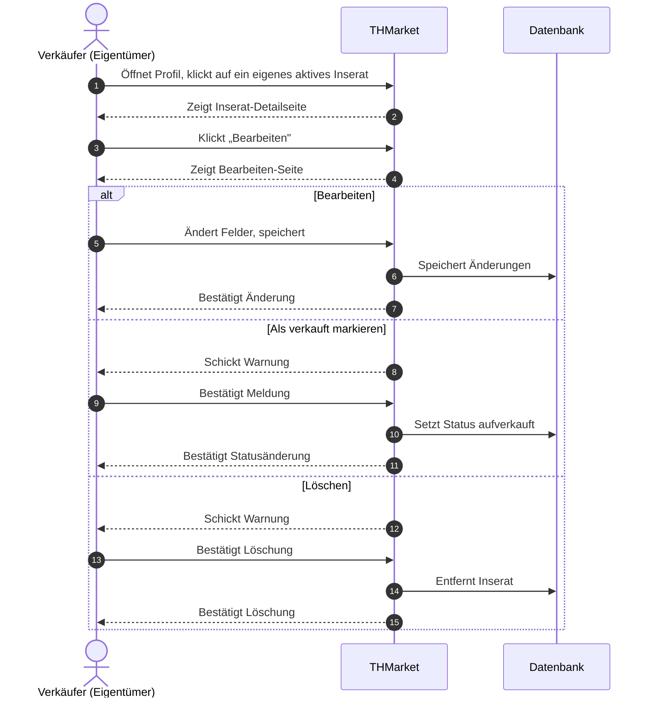
```mermaid
sequenceDiagram
    autonumber
    actor Verkaeufer as Verkäufer (Eigentümer)
    participant System as THMarket
    participant DB as Datenbank

    Verkaeufer->>System: Öffnet Profil, klickt auf ein eigenes aktives Inserat
    System-->>Verkaeufer: Zeigt Inserat-Detailseite
    Verkaeufer->>System: Klickt „Bearbeiten"
    System-->>Verkaeufer: Zeigt Bearbeiten-Seite

    alt Bearbeiten
    Verkaeufer->>System: Ändert Felder, speichert
    System->>DB: Speichert Änderungen
    System-->>Verkaeufer: Bestätigt Änderung


    else Als verkauft markieren
        System-->>Verkaeufer: Schickt Warnung
        Verkaeufer->>System: Bestätigt Meldung
        System->>DB: Setzt Status aufverkauft
        System-->>Verkaeufer: Bestätigt Statusänderung

    else Löschen
            System-->>Verkaeufer: Schickt Warnung
            Verkaeufer->>System: Bestätigt Löschung
            System->>DB: Entfernt Inserat
            System-->>Verkaeufer: Bestätigt Löschung
    end
```

*(Mermaid-Quelldatei: [`diagrams-code/f2-uc05-inserate_verwalten.mermaid`](diagrams-code/f2-uc05-inserate_verwalten.mermaid))*

## 2.8 UC06 – Inserat durchsuchen und favorisieren

| Abschnitt | Inhalt / Erläuterung |
|---|---|
| **Bezeichner** | UC06 |
| **Name** | Inserat durchsuchen und favorisieren |
| **Autoren** | Projektteam |
| **Priorität** | Hoch. Zentral für das Auffinden von Angeboten. |
| **Kritikalität** | Mittel. Wichtig für die Nutzerfreundlichkeit, nicht sicherheitsrelevant. |
| **Verantwortlicher** | Frontend (Such-/Filterlogik, Detailansicht) |
| **Beschreibung** | Der angemeldete Nutzer sieht beim Öffnen der Startseite alle aktiven Inserate. Über Suchfeld, Kategorie-Filter und Sortierung kann er die Anzeige eingrenzen, ohne dass dafür erneute Serveranfragen nötig sind. Aus der Detailansicht heraus kann er ein fremdes Inserat favorisieren. |
| **Auslösendes Ereignis** | Der Nutzer öffnet die Startseite bzw. gibt einen Suchbegriff ein/wählt einen Filter. |
| **Akteure** | Eingeloggter Nutzer (als Interessent). |
| **Vorbedingung** | Der Nutzer ist angemeldet. |
| **Nachbedingung** | Die passenden Inserate werden angezeigt; ein Favorit ist gesetzt oder entfernt. |
| **Ergebnis** | Der Nutzer sieht eine gefilterte Liste relevanter Inserate bzw. hat ein Inserat favorisiert. |
| **Hauptszenario** | 1. Nutzer öffnet die Startseite. 2. System lädt einmalig alle aktiven Inserate. 3. Nutzer gibt einen Suchbegriff ein, wählt einen Kategorie-Filter oder ändert die Sortierung; die Anzeige aktualisiert sich sofort. 4. Nutzer klickt auf ein Inserat und sieht die Detailansicht. 5. Ist der Nutzer nicht Eigentümer, kann er über das Herz-Symbol das Inserat favorisieren oder entfavorisieren. |
| **Alternativszenarien** | Liefert die Suche keinen Treffer, erscheint der Hinweis „Keine Inserate gefunden". Ist der Nutzer Eigentümer des betrachteten Inserats, ist der Merken-Button nicht verfügbar. |
| **Ausnahmeszenario** | Ist die Datenbank beim initialen Laden nicht erreichbar, wird eine Fehlermeldung angezeigt. |
| **Qualitäten** | Suche, Filter und Sortierung laufen vollständig clientseitig auf der bereits geladenen Liste. |

*Tabelle: Use Case UC06 – Inserat durchsuchen und favorisieren*

#### Sequenzdiagramm UC06 – Inserat durchsuchen und favorisieren

Diagramm anzeigen

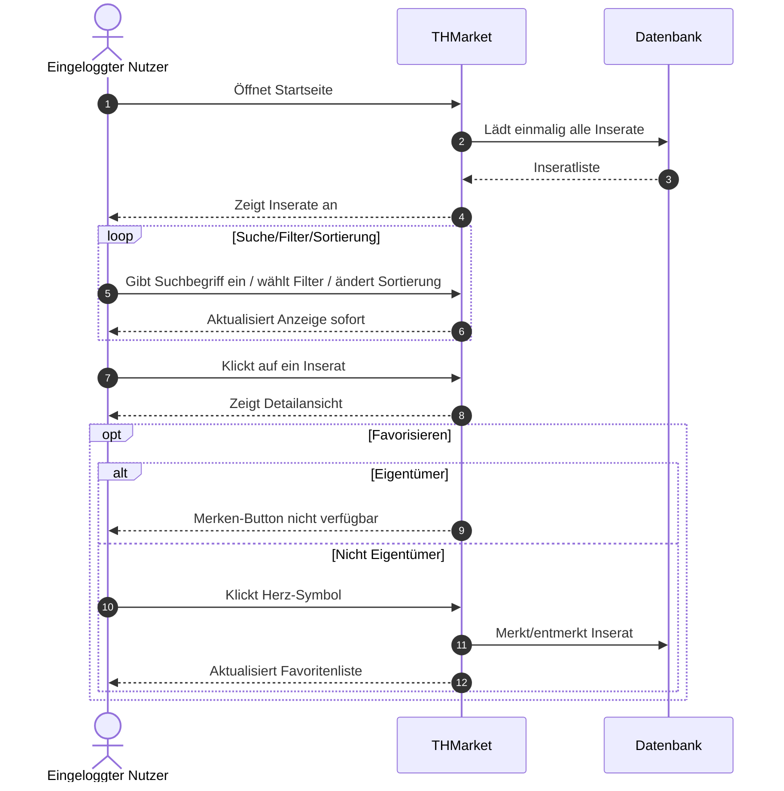
```mermaid
sequenceDiagram
    autonumber
    actor Nutzer as Eingeloggter Nutzer
    participant System as THMarket
    participant DB as Datenbank

    Nutzer->>System: Öffnet Startseite
    System->>DB: Lädt einmalig alle Inserate
    DB-->>System: Inseratliste
    System-->>Nutzer: Zeigt Inserate an

    loop Suche/Filter/Sortierung
        Nutzer->>System: Gibt Suchbegriff ein / wählt Filter / ändert Sortierung
        System-->>Nutzer: Aktualisiert Anzeige sofort
    end

    Nutzer->>System: Klickt auf ein Inserat
    System-->>Nutzer: Zeigt Detailansicht

    opt Favorisieren
        alt Eigentümer
            System-->>Nutzer: Merken-Button nicht verfügbar
        else Nicht Eigentümer
                Nutzer->>System: Klickt Herz-Symbol
                System->>DB: Merkt/entmerkt Inserat
                System-->>Nutzer: Aktualisiert Favoritenliste
        end
    end
```

*(Mermaid-Quelldatei: [`diagrams-code/f2-uc06-inserat_durchsuchen.mermaid`](diagrams-code/f2-uc06-inserat_durchsuchen.mermaid))*

## 2.9 UC07 – Chat mit Nutzer führen

| Abschnitt | Inhalt / Erläuterung |
|---|---|
| **Bezeichner** | UC07 |
| **Name** | Chat mit Nutzer führen |
| **Autoren** | Projektteam |
| **Priorität** | Hoch. Zentrale Funktion für die Kontaktaufnahme; wichtigstes Feature der Plattform. |
| **Kritikalität** | Mittel. Wichtig für den Handel, nicht systemkritisch. |
| **Verantwortlicher** | Frontend (Chat-UI), Backend (Socket.io, Speicherung) |
| **Beschreibung** | Interessent und Anbieter tauschen zu einem Inserat Nachrichten in Echtzeit aus. Beim ersten Kontakt zu einem Inserat wird eine Konversation angelegt bzw. eine bestehende geöffnet. Jede Nachricht wird zunächst gespeichert und danach über Socket.io zugestellt. |
| **Auslösendes Ereignis** | Der Interessent klickt bei einem Inserat auf „Anbieter kontaktieren" oder öffnet eine bestehende Konversation. |
| **Akteure** | Interessent (Chat-Initiator), Anbieter (Empfänger). |
| **Vorbedingung** | Beide Nutzer sind registriert und angemeldet; das Inserat ist nicht das eigene und noch nicht verkauft. |
| **Nachbedingung** | Die Nachricht ist zugestellt und gespeichert; die Konversation ist für beide Nutzer sichtbar. |
| **Ergebnis** | Interessent und Anbieter können in Echtzeit kommunizieren. |
| **Hauptszenario** | 1. Interessent klickt bei einem Inserat auf „Anbieter kontaktieren". 2. System prüft, ob bereits eine Unterhaltung zu diesem Inserat existiert, und öffnet sie oder legt eine neue an. 3. Interessent schreibt und sendet eine Nachricht. 4. System prüft die Teilnehmerschaft. 5. System speichert die Nachricht und stellt sie über Socket.io zu; ist die Konversation beim Empfänger gerade geöffnet, erscheint sie sofort als gelesen, sonst als Benachrichtigung mit Sprung nach oben in der Liste. |
| **Alternativszenarien** | Ist das Inserat das eigene oder bereits verkauft, ist der Button „Anbieter kontaktieren" nicht verfügbar. Schlägt eine Prüfung fehl, zeigt das System einen passenden Fehler. |
| **Ausnahmeszenario** | Bei Verbindungsabbruch versucht das System automatisch, die Verbindung wiederherzustellen. |
| **Qualitäten** | Der Chat ist nur zwischen den beteiligten Nutzern sichtbar. |

*Tabelle: Use Case UC07 – Chat mit Nutzer führen*

#### Sequenzdiagramm UC07 – Chat mit Nutzer führen

Diagramm anzeigen

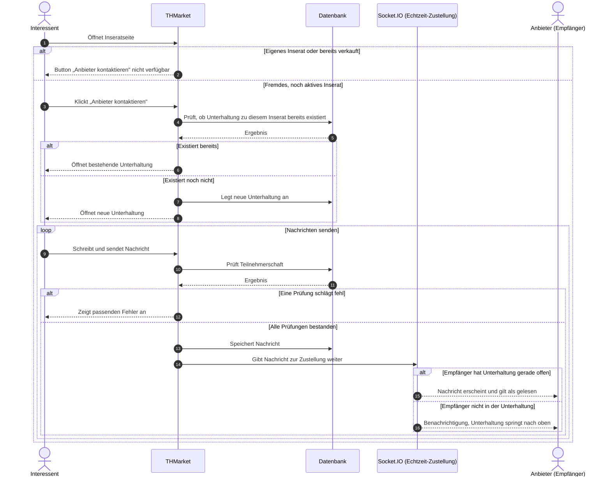
```mermaid
sequenceDiagram
    autonumber
    actor Interessent as Interessent
    participant System as THMarket
    participant DB as Datenbank
    participant Socket as Socket.IO (Echtzeit-Zustellung)
    actor Anbieter as Anbieter (Empfänger)

    Interessent->>System: Öffnet Inseratseite

    alt Eigenes Inserat oder bereits verkauft
        System-->>Interessent: Button „Anbieter kontaktieren" nicht verfügbar
    else Fremdes, noch aktives Inserat
        Interessent->>System: Klickt „Anbieter kontaktieren"
        System->>DB: Prüft, ob Unterhaltung zu diesem Inserat bereits existiert
        DB-->>System: Ergebnis
        alt Existiert bereits
            System-->>Interessent: Öffnet bestehende Unterhaltung
        else Existiert noch nicht
            System->>DB: Legt neue Unterhaltung an
            System-->>Interessent: Öffnet neue Unterhaltung
        end

        loop Nachrichten senden
            Interessent->>System: Schreibt und sendet Nachricht
            System->>DB: Prüft Teilnehmerschaft
            DB-->>System: Ergebnis

            alt Eine Prüfung schlägt fehl
                System-->>Interessent: Zeigt passenden Fehler an
            else Alle Prüfungen bestanden
                System->>DB: Speichert Nachricht
                System->>Socket: Gibt Nachricht zur Zustellung weiter

                alt Empfänger hat Unterhaltung gerade offen
                    Socket-->>Anbieter: Nachricht erscheint und gilt als gelesen
                else Empfänger nicht in der Unterhaltung
                    Socket-->>Anbieter: Benachrichtigung, Unterhaltung springt nach oben
                end
            end
        end
    end
```

*(Mermaid-Quelldatei: [`diagrams-code/f2-uc07-nachrichten_verschicken.mermaid`](diagrams-code/f2-uc07-nachrichten_verschicken.mermaid))*

## 2.10 UC08 – Kauf abschließen

| Abschnitt | Inhalt / Erläuterung |
|---|---|
| **Bezeichner** | UC08 |
| **Name** | Kauf abschließen |
| **Autoren** | Projektteam |
| **Priorität** | Hoch. Kernfunktion für den Abschluss eines Handels. |
| **Kritikalität** | Mittel. Wichtig für den Ablauf, aber ohne echten Geldfluss. |
| **Verantwortlicher** | Backend (Logik, Guthabenverrechnung), Frontend (Kauf-Formular) |
| **Beschreibung** | Ein Student schließt den Kauf eines fremden, aktiven Inserats mit aktivierter Sofortkauf-Option ab. Er wählt zwischen zwei simulierten Zahlungsmodi: Simulation (Testkarteneingabe, kein Geldfluss) oder In-App-Guthaben (Verrechnung über den eigenen Kontostand). In beiden Fällen wird das Inserat als verkauft markiert. |
| **Auslösendes Ereignis** | Der Nutzer klickt bei einem kaufbaren, fremden Inserat auf „Kaufen". |
| **Akteure** | Student (als Käufer). |
| **Vorbedingung** | Der Nutzer ist angemeldet, nicht Eigentümer/Admin, das Inserat ist aktiv und Sofortkauf ist aktiviert. |
| **Nachbedingung** | Das Inserat ist als verkauft markiert; bei Guthaben-Modus wurde der Betrag umgebucht. |
| **Ergebnis** | Der Kauf ist abgeschlossen. |
| **Hauptszenario** | 1. Käufer klickt auf „Kaufen". 2. Käufer wählt den Zahlungsmodus. 3a. Simulation: Käufer gibt Testkartendaten ein, System validiert die Karte und markiert bei Erfolg das Inserat als verkauft. 3b. Guthaben: Käufer bestätigt den Kauf, System prüft, ob das Guthaben ausreicht, bucht bei Erfolg den Betrag vom Käufer ab, schreibt ihn dem Verkäufer gut und markiert das Inserat als verkauft. |
| **Alternativszenarien** | Ist das Inserat für Admins gesperrt, das eigene Inserat, bereits verkauft oder Sofortkauf deaktiviert, ist der „Kaufen"-Button nicht verfügbar. Ist die Testkarte ungültig oder das Guthaben unzureichend, wird eine Fehlermeldung angezeigt und der Kauf nicht durchgeführt. |
| **Ausnahmeszenario** | Ist die Datenbank nicht erreichbar, wird der Kauf nicht gespeichert. |
| **Qualitäten** | Es findet keine echte Zahlungsabwicklung statt. |

*Tabelle: Use Case UC08 – Kauf abschließen*

#### Sequenzdiagramm UC08 – Kauf abschließen

Diagramm anzeigen

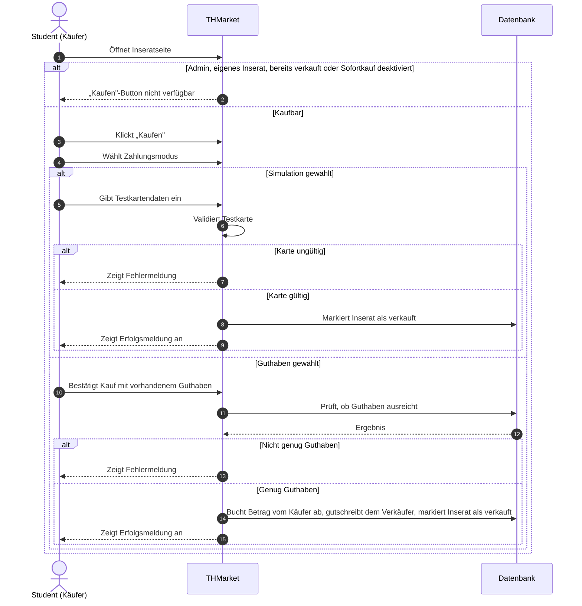
```mermaid
sequenceDiagram
    autonumber
    actor Kaeufer as Student (Käufer)
    participant System as THMarket
    participant DB as Datenbank

    Kaeufer->>System: Öffnet Inseratseite

    alt Admin, eigenes Inserat, bereits verkauft oder Sofortkauf deaktiviert
        System-->>Kaeufer: „Kaufen"-Button nicht verfügbar
    else Kaufbar
        Kaeufer->>System: Klickt „Kaufen"
        Kaeufer->>System: Wählt Zahlungsmodus

        alt Simulation gewählt
            Kaeufer->>System: Gibt Testkartendaten ein
            System->>System: Validiert Testkarte
            alt Karte ungültig
                System-->>Kaeufer: Zeigt Fehlermeldung
            else Karte gültig
                System->>DB: Markiert Inserat als verkauft
                System-->>Kaeufer: Zeigt Erfolgsmeldung an
            end
        else Guthaben gewählt
            Kaeufer->>System: Bestätigt Kauf mit vorhandenem Guthaben
            System->>DB: Prüft, ob Guthaben ausreicht
            DB-->>System: Ergebnis
            alt Nicht genug Guthaben
                System-->>Kaeufer: Zeigt Fehlermeldung
            else Genug Guthaben
                System->>DB: Bucht Betrag vom Käufer ab, gutschreibt dem Verkäufer, markiert Inserat als verkauft
                System-->>Kaeufer: Zeigt Erfolgsmeldung an
            end
        end
    end
```

*(Mermaid-Quelldatei: [`diagrams-code/f2-uc08-kauf_abschliessen.mermaid`](diagrams-code/f2-uc08-kauf_abschliessen.mermaid))*

## 2.11 UC09 – Guthaben aufladen

| Abschnitt | Inhalt / Erläuterung |
|---|---|
| **Bezeichner** | UC09 |
| **Name** | Guthaben aufladen |
| **Autoren** | Projektteam |
| **Priorität** | Mittel. Voraussetzung für den Zahlungsmodus „Guthaben" in UC08. |
| **Kritikalität** | Niedrig. Funktional wichtig, nicht systemkritisch. |
| **Verantwortlicher** | Frontend (Formular), Backend (Guthabenverwaltung) |
| **Beschreibung** | Der Nutzer lädt über sein Profil sein In-App-Guthaben mit einem simulierten Betrag zwischen 5 € und 500 € auf. Nach Eingabe einer Testkarte wird der Betrag dem Kontostand gutgeschrieben. |
| **Auslösendes Ereignis** | Der Nutzer öffnet sein Profil und klickt auf „Aufladen". |
| **Akteure** | Eingeloggter Nutzer. |
| **Vorbedingung** | Der Nutzer ist angemeldet. |
| **Nachbedingung** | Das Guthaben ist um den eingezahlten Betrag erhöht. |
| **Ergebnis** | Der neue Kontostand wird angezeigt. |
| **Hauptszenario** | 1. Nutzer öffnet Profil, klickt „Aufladen". 2. System zeigt das Eingabefeld. 3. Nutzer gibt einen Betrag ein. 4. System prüft die Betragsgrenzen (5–500 €). 5. Nutzer gibt Testkartendaten ein. 6. System validiert die Testkarte und erhöht bei Erfolg das Guthaben. |
| **Alternativszenarien** | Liegt der Betrag außerhalb von 5–500 € oder ist die Testkarte ungültig, wird eine Fehlermeldung angezeigt und das Guthaben nicht verändert. |
| **Ausnahmeszenario** | Ein Server- oder Datenbankfehler beim Speichern wird als Fehlermeldung angezeigt. |
| **Qualitäten** | Es findet keine echte Zahlungsabwicklung statt. Der gültige Betragsbereich ist fest auf 5–500 € begrenzt. |

*Tabelle: Use Case UC09 – Guthaben aufladen*

> **Hinweis:** Gültiger Bereich: 5 € bis 500 € pro Aufladung.

#### Sequenzdiagramm UC09 – Guthaben aufladen

Diagramm anzeigen

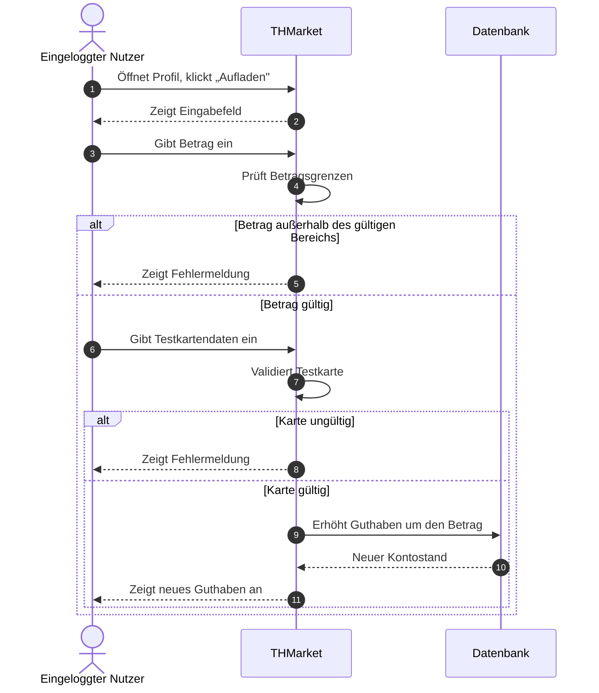
```mermaid
sequenceDiagram
    autonumber
    actor Nutzer as Eingeloggter Nutzer
    participant System as THMarket
    participant DB as Datenbank

    Nutzer->>System: Öffnet Profil, klickt „Aufladen"
    System-->>Nutzer: Zeigt Eingabefeld
    Nutzer->>System: Gibt Betrag ein
    System->>System: Prüft Betragsgrenzen

    alt Betrag außerhalb des gültigen Bereichs
        System-->>Nutzer: Zeigt Fehlermeldung
    else Betrag gültig
        Nutzer->>System: Gibt Testkartendaten ein
        System->>System: Validiert Testkarte

        alt Karte ungültig
            System-->>Nutzer: Zeigt Fehlermeldung
        else Karte gültig
            System->>DB: Erhöht Guthaben um den Betrag
            DB-->>System: Neuer Kontostand
            System-->>Nutzer: Zeigt neues Guthaben an
        end
    end
```

*(Mermaid-Quelldatei: [`diagrams-code/f2-uc09-guthaben_aufladen.mermaid`](diagrams-code/f2-uc09-guthaben_aufladen.mermaid))*

## 2.12 UC10 – Guthaben auszahlen

| Abschnitt | Inhalt / Erläuterung |
|---|---|
| **Bezeichner** | UC10 |
| **Name** | Guthaben auszahlen |
| **Autoren** | Projektteam |
| **Priorität** | Mittel. Ergänzt UC09 um den Gegenvorgang. |
| **Kritikalität** | Niedrig. Funktional wichtig, nicht systemkritisch. |
| **Verantwortlicher** | Frontend (Formular), Backend (Guthabenverwaltung) |
| **Beschreibung** | Der Nutzer zahlt über sein Profil einen Teil oder sein gesamtes In-App-Guthaben simuliert aus. |
| **Auslösendes Ereignis** | Der Nutzer öffnet sein Profil und klickt auf „Auszahlen". |
| **Akteure** | Eingeloggter Nutzer. |
| **Vorbedingung** | Der Nutzer ist angemeldet. |
| **Nachbedingung** | Das Guthaben ist um den ausgezahlten Betrag verringert. |
| **Ergebnis** | Der neue Kontostand wird angezeigt. |
| **Hauptszenario** | 1. Nutzer öffnet Profil, klickt „Auszahlen". 2. System prüft, ob Guthaben vorhanden ist, und zeigt das Eingabefeld. 3. Nutzer gibt einen Betrag ein. 4. System prüft, ob der Betrag gültig und innerhalb des verfügbaren Guthabens liegt. 5. Nutzer gibt Testkartendaten ein. 6. System validiert die Testkarte, prüft das Guthaben ein zweites Mal und verringert es bei Erfolg um den Betrag. |
| **Alternativszenarien** | Ist kein Guthaben vorhanden, erscheint sofort „Kein Guthaben zum Auszahlen vorhanden". Ist der Betrag ungültig, über dem verfügbaren Guthaben oder die Testkarte ungültig, wird eine Fehlermeldung angezeigt. |
| **Ausnahmeszenario** | Das Guthaben wird unmittelbar vor der Verrechnung ein zweites Mal serverseitig geprüft, um ein zwischenzeitlich verändertes Guthaben abzufangen. |
| **Qualitäten** | Es findet keine echte Zahlungsabwicklung statt. |

*Tabelle: Use Case UC10 – Guthaben auszahlen*

#### Sequenzdiagramm UC10 – Guthaben auszahlen

Diagramm anzeigen

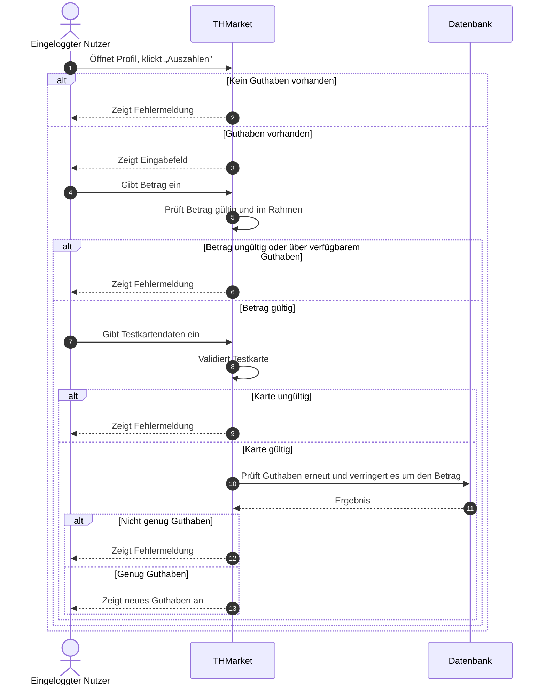
```mermaid
sequenceDiagram
    autonumber
    actor Nutzer as Eingeloggter Nutzer
    participant System as THMarket
    participant DB as Datenbank

    Nutzer->>System: Öffnet Profil, klickt „Auszahlen"

    alt Kein Guthaben vorhanden
        System-->>Nutzer: Zeigt Fehlermeldung
    else Guthaben vorhanden
        System-->>Nutzer: Zeigt Eingabefeld
        Nutzer->>System: Gibt Betrag ein
        System->>System: Prüft Betrag gültig und im Rahmen

        alt Betrag ungültig oder über verfügbarem Guthaben
            System-->>Nutzer: Zeigt Fehlermeldung
        else Betrag gültig
            Nutzer->>System: Gibt Testkartendaten ein
            System->>System: Validiert Testkarte

            alt Karte ungültig
                System-->>Nutzer: Zeigt Fehlermeldung
            else Karte gültig
                System->>DB: Prüft Guthaben erneut und verringert es um den Betrag
                DB-->>System: Ergebnis

                alt Nicht genug Guthaben
                    System-->>Nutzer: Zeigt Fehlermeldung
                else Genug Guthaben
                    System-->>Nutzer: Zeigt neues Guthaben an
                end
            end
        end
    end
```

*(Mermaid-Quelldatei: [`diagrams-code/f2-uc10-guthaben_auszahlen.mermaid`](diagrams-code/f2-uc10-guthaben_auszahlen.mermaid))*

## 2.13 UC11 – Inserat melden

| Abschnitt | Inhalt / Erläuterung |
|---|---|
| **Bezeichner** | UC11 |
| **Name** | Inserat melden |
| **Autoren** | Projektteam |
| **Priorität** | Mittel. Wichtig für Sicherheit und Qualität der Plattform. |
| **Kritikalität** | Mittel. Nicht systemkritisch, aber betriebsrelevant. |
| **Verantwortlicher** | Frontend (Meldeformular), Backend (Speicherung, Routing an Admin) |
| **Beschreibung** | Ein Student kann ein fremdes Inserat wegen unangemessener Inhalte oder Betrugsverdacht melden. Die Meldung wird mit Grund gespeichert und erscheint im Admin-Bereich zur Bearbeitung (UC13). |
| **Auslösendes Ereignis** | Der Student klickt bei einem Inserat auf „Inserat melden". |
| **Akteure** | Student. |
| **Vorbedingung** | Der Nutzer betrachtet ein fremdes Inserat und ist nicht Admin. |
| **Nachbedingung** | Die Meldung ist gespeichert und im Admin-Bereich sichtbar. |
| **Ergebnis** | Die Meldung kann von einem Admin bearbeitet werden. |
| **Hauptszenario** | 1. Student öffnet die Inserat-Detailseite. 2. Student klickt „Inserat melden" und wählt einen Grund. 3. Student klickt „Melden". 4. System prüft, ob das Inserat existiert und ob bereits eine offene eigene Meldung dazu vorliegt. 5. Bei Erfolg speichert das System die Meldung und zeigt eine Bestätigung. |
| **Alternativszenarien** | Ist der Nutzer Admin oder Eigentümer des Inserats, ist der Button „Inserat melden" nicht verfügbar. Liegt bereits eine offene eigene Meldung vor oder existiert das Inserat nicht mehr, wird eine Fehlermeldung angezeigt. |
| **Ausnahmeszenario** | Ist die Datenbank nicht erreichbar, wird die Meldung nicht gespeichert. |
| **Qualitäten** | Pro Nutzer und Inserat ist immer nur eine offene Meldung gleichzeitig möglich. |

*Tabelle: Use Case UC11 – Inserat melden*

#### Sequenzdiagramm UC11 – Inserat melden

Diagramm anzeigen

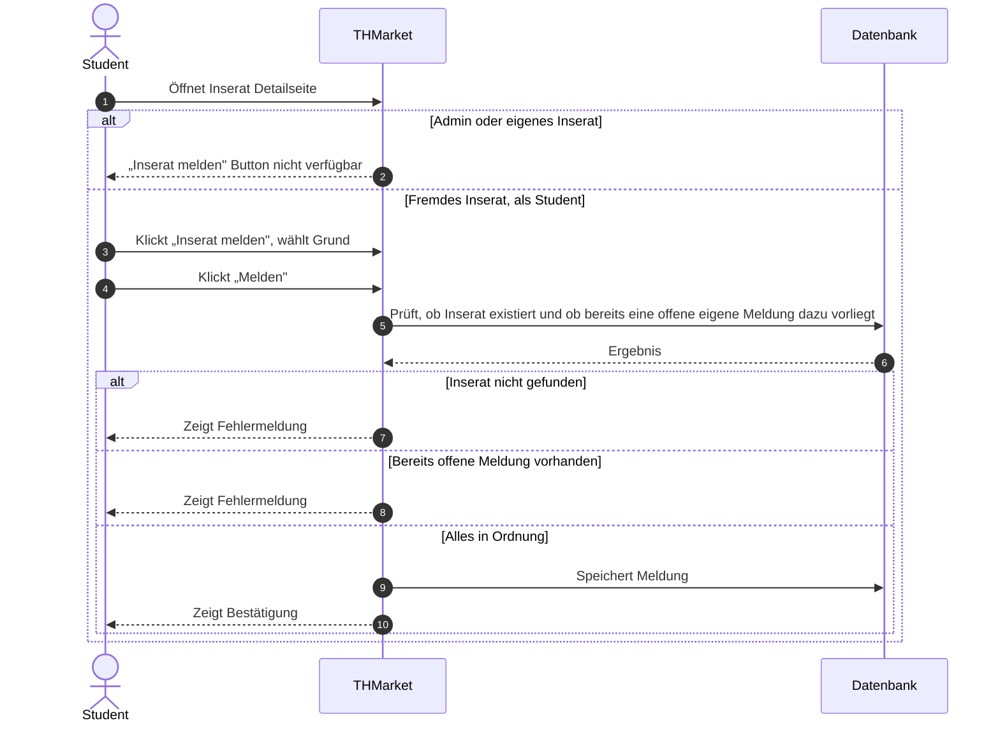
```mermaid
sequenceDiagram
    autonumber
    actor Student as Student
    participant System as THMarket
    participant DB as Datenbank

    Student->>System: Öffnet Inserat Detailseite

    alt Admin oder eigenes Inserat
        System-->>Student: „Inserat melden" Button nicht verfügbar
    else Fremdes Inserat, als Student
        Student->>System: Klickt „Inserat melden", wählt Grund
        Student->>System: Klickt „Melden"

        System->>DB: Prüft, ob Inserat existiert und ob bereits eine offene eigene Meldung dazu vorliegt
        DB-->>System: Ergebnis

        alt Inserat nicht gefunden
            System-->>Student: Zeigt Fehlermeldung
        else Bereits offene Meldung vorhanden
            System-->>Student: Zeigt Fehlermeldung
        else Alles in Ordnung
            System->>DB: Speichert Meldung
            System-->>Student: Zeigt Bestätigung
        end
    end
```

*(Mermaid-Quelldatei: [`diagrams-code/f2-uc11-inserat_melden.mermaid`](diagrams-code/f2-uc11-inserat_melden.mermaid))*

## 2.14 UC12 – Nutzer melden

| Abschnitt | Inhalt / Erläuterung |
|---|---|
| **Bezeichner** | UC12 |
| **Name** | Nutzer melden |
| **Autoren** | Projektteam |
| **Priorität** | Mittel. Wichtig für Sicherheit und Qualität der Plattform. |
| **Kritikalität** | Mittel. Nicht systemkritisch, aber betriebsrelevant. |
| **Verantwortlicher** | Frontend (Meldeformular), Backend (Speicherung, Routing an Admin) |
| **Beschreibung** | Ein Student kann aus einer laufenden Chat-Konversation heraus den anderen beteiligten Nutzer melden. Die Meldung wird mit dem Konversationskontext gespeichert und erscheint im Admin-Bereich zur Bearbeitung (UC13). |
| **Auslösendes Ereignis** | Der Student klickt im Chat auf „Melden". |
| **Akteure** | Student. |
| **Vorbedingung** | Der Nutzer befindet sich in einer Konversation mit dem zu meldenden Nutzer. |
| **Nachbedingung** | Die Meldung ist gespeichert und im Admin-Bereich sichtbar. |
| **Ergebnis** | Die Meldung kann von einem Admin bearbeitet werden. |
| **Hauptszenario** | 1. Student klickt im Chat auf „Melden". 2. Student wählt einen Grund. 3. Student klickt „Melden". 4. System prüft, ob der gemeldete Nutzer existiert und ob bereits eine offene eigene Meldung gegen ihn vorliegt. 5. Bei Erfolg prüft das System den Konversationskontext, speichert die Meldung und zeigt eine Bestätigung. |
| **Alternativszenarien** | Existiert der gemeldete Nutzer nicht mehr oder liegt bereits eine offene eigene Meldung gegen denselben Nutzer vor, wird eine Fehlermeldung angezeigt. |
| **Ausnahmeszenario** | Ist die Datenbank nicht erreichbar, wird die Meldung nicht gespeichert. |
| **Qualitäten** | Die Meldung wird zusätzlich mit dem Konversationskontext verknüpft, damit ein Admin den Chatverlauf einsehen kann (siehe UC13). |

*Tabelle: Use Case UC12 – Nutzer melden*

#### Sequenzdiagramm UC12 – Nutzer melden

Diagramm anzeigen

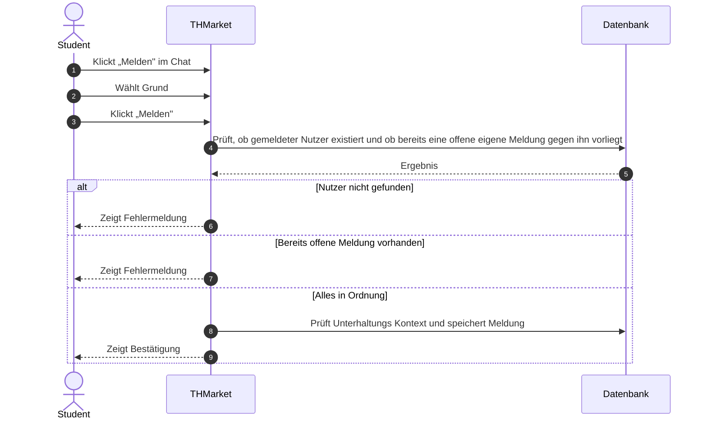
```mermaid
sequenceDiagram
    autonumber
    actor Student as Student
    participant System as THMarket
    participant DB as Datenbank

    Student->>System: Klickt „Melden" im Chat
    Student->>System: Wählt Grund
    Student->>System: Klickt „Melden"

    System->>DB: Prüft, ob gemeldeter Nutzer existiert und ob bereits eine offene eigene Meldung gegen ihn vorliegt
    DB-->>System: Ergebnis

    alt Nutzer nicht gefunden
        System-->>Student: Zeigt Fehlermeldung
    else Bereits offene Meldung vorhanden
        System-->>Student: Zeigt Fehlermeldung
    else Alles in Ordnung
        System->>DB: Prüft Unterhaltungs Kontext und speichert Meldung
        System-->>Student: Zeigt Bestätigung
    end
```

*(Mermaid-Quelldatei: [`diagrams-code/f2-uc12-nutzer_melden.mermaid`](diagrams-code/f2-uc12-nutzer_melden.mermaid))*

## 2.15 UC13 – Meldungen bearbeiten (Admin)

| Abschnitt | Inhalt / Erläuterung |
|---|---|
| **Bezeichner** | UC13 |
| **Name** | Meldungen bearbeiten (Admin) |
| **Autoren** | Projektteam |
| **Priorität** | Mittel bis hoch. Wichtig für die Qualität der Plattform. |
| **Kritikalität** | Mittel. Nicht systemkritisch, aber betriebsrelevant. |
| **Verantwortlicher** | Backend (Logik, Audit-Log), Frontend (Admin-Oberfläche) |
| **Beschreibung** | Der Administrator sieht im Admin-Bereich alle offenen Meldungen zu Inseraten und Nutzern. Er kann bei Bedarf den Kontext prüfen (verlinktes Inserat bzw. Chat-Verlauf) und anschließend eine Maßnahme umsetzen. Welche Maßnahme zulässig ist, hängt vom Meldungstyp ab. |
| **Auslösendes Ereignis** | Der Admin öffnet den Tab „Meldungen". |
| **Akteure** | Administrator. |
| **Vorbedingung** | Der Admin ist angemeldet. |
| **Nachbedingung** | Die Meldung ist geschlossen; die gewählte Maßnahme wurde umgesetzt. |
| **Ergebnis** | Die Meldung ist bearbeitet und der Zustand der Plattform ggf. aktualisiert. |
| **Hauptszenario** | 1. Admin öffnet die Meldungsübersicht. 2. Admin wählt eine offene Meldung. 3. Optional: Admin öffnet das verlinkte Inserat bzw. klappt den Chat-Verlauf ein. 4. Admin trifft eine Entscheidung. 5. Bei Inserat-Meldung: System schließt die Meldung ohne Maßnahme oder löscht das Inserat. 6. Bei Nutzer-Meldung: System schließt die Meldung ohne Maßnahme, setzt einen Warnhinweis auf das Konto oder löscht das Konto. |
| **Alternativszenarien** | Der Admin kann die Meldung jederzeit ohne Maßnahme schließen. |
| **Ausnahmeszenario** | Ist die Datenbank nicht erreichbar, kann die Meldung nicht bearbeitet werden. |
| **Qualitäten** | Nur berechtigte Admins haben Zugriff. |

*Tabelle: Use Case UC13 – Meldungen bearbeiten (Admin)*

#### Sequenzdiagramm UC13 – Meldungen bearbeiten

Diagramm anzeigen

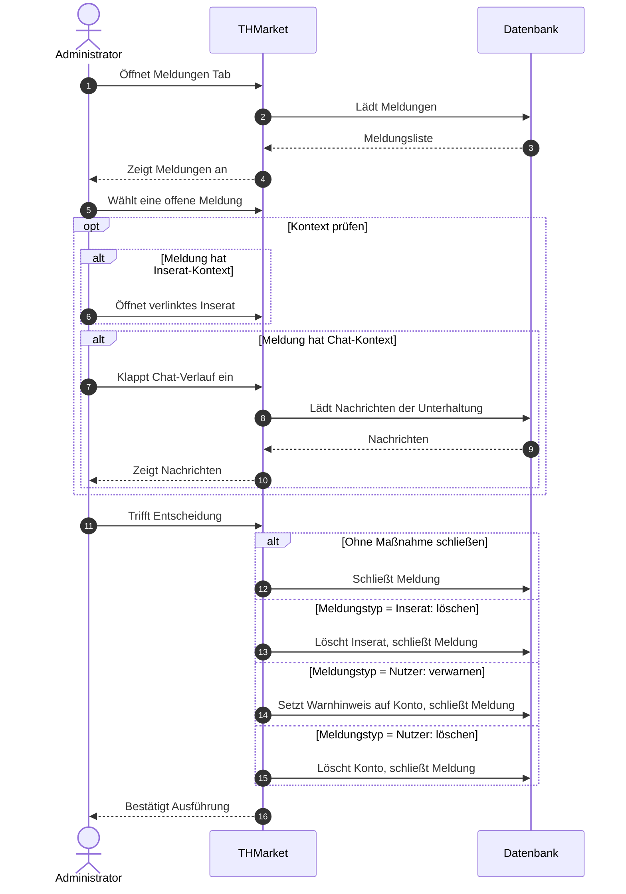
```mermaid
sequenceDiagram
    autonumber
    actor Admin as Administrator
    participant System as THMarket
    participant DB as Datenbank

    Admin->>System: Öffnet Meldungen Tab
    System->>DB: Lädt Meldungen
    DB-->>System: Meldungsliste
    System-->>Admin: Zeigt Meldungen an
    Admin->>System: Wählt eine offene Meldung

    opt Kontext prüfen
        alt Meldung hat Inserat-Kontext
            Admin->>System: Öffnet verlinktes Inserat
        end
        alt Meldung hat Chat-Kontext
            Admin->>System: Klappt Chat-Verlauf ein
            System->>DB: Lädt Nachrichten der Unterhaltung
            DB-->>System: Nachrichten
            System-->>Admin: Zeigt Nachrichten
        end
    end

    Admin->>System: Trifft Entscheidung

    alt Ohne Maßnahme schließen
        System->>DB: Schließt Meldung
    else Meldungstyp = Inserat: löschen
        System->>DB: Löscht Inserat, schließt Meldung
    else Meldungstyp = Nutzer: verwarnen
        System->>DB: Setzt Warnhinweis auf Konto, schließt Meldung
    else Meldungstyp = Nutzer: löschen
        System->>DB: Löscht Konto, schließt Meldung
    end

    System-->>Admin: Bestätigt Ausführung
```

*(Mermaid-Quelldatei: [`diagrams-code/f2-uc13-meldungen_verwalten.mermaid`](diagrams-code/f2-uc13-meldungen_verwalten.mermaid))*

## 2.16 UC14 – Admin-Verwaltung (Nutzer, Inserate, Audit-Log)

| Abschnitt | Inhalt / Erläuterung |
|---|---|
| **Bezeichner** | UC14 |
| **Name** | Admin-Verwaltung (Nutzer, Inserate, Audit-Log) |
| **Autoren** | Projektteam |
| **Priorität** | Hoch. Notwendig zur Pflege der Nutzer- und Inseratbasis. |
| **Kritikalität** | Hoch. Systempflege, sicherheitsrelevant. |
| **Verantwortlicher** | Backend (Logik, Löschregeln), Frontend (Admin-Oberfläche) |
| **Beschreibung** | Der Administrator kann über drei weitere Tabs alle Nutzerkonten und Inserate einsehen und löschen sowie das chronologische Audit-Log aller Admin-Aktionen einsehen. |
| **Auslösendes Ereignis** | Der Admin öffnet den Tab „Nutzer", „Inserate" oder „Audit-Log". |
| **Akteure** | Administrator. |
| **Vorbedingung** | Der Admin ist angemeldet. |
| **Nachbedingung** | Das betroffene Konto/Inserat ist gelöscht; beim reinen Einsehen des Audit-Logs werden keine Daten verändert. |
| **Ergebnis** | Der Nutzer-/Inseratbestand ist aktuell, bzw. die Log-Einträge wurden angezeigt. |
| **Hauptszenario** | 1a. Tab „Nutzer": Admin öffnet den Tab, System lädt und zeigt alle Nutzerkonten. Admin klickt „Löschen" bei einem Konto. System prüft, dass es kein eigenes oder anderes Admin-Konto ist und keine aktiven Inserate mehr vorhanden sind, und löscht bei Erfolg das Konto. 1b. Tab „Inserate": Admin öffnet den Tab, System lädt und zeigt alle Inserate. Admin klickt „Löschen" bei einem Inserat, System löscht es. 1c. Tab „Audit-Log": Admin öffnet den Tab, System lädt und zeigt die chronologische Liste aller Admin-Aktionen. |
| **Alternativszenarien** | Ist ein Konto nicht löschbar, zeigt das System eine Fehlermeldung und lehnt die Löschung ab. |
| **Ausnahmeszenario** | Ist die Datenbank nicht erreichbar, kann die Änderung nicht gespeichert werden. |
| **Qualitäten** | Nur autorisierte Administratoren haben Zugriff. Änderungen sind sofort wirksam und werden protokolliert (Audit-Log). |

*Tabelle: Use Case UC14 – Admin-Verwaltung (Nutzer, Inserate, Audit-Log)*

#### Sequenzdiagramm UC14 – Admin-Verwaltung

Diagramm anzeigen

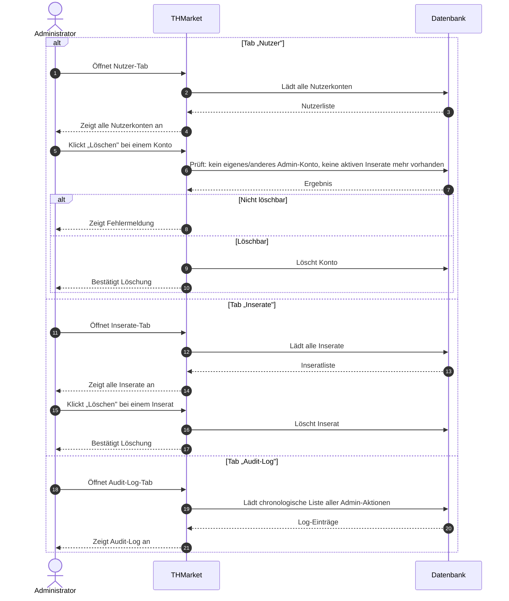
```mermaid
sequenceDiagram
    autonumber
    actor Admin as Administrator
    participant System as THMarket
    participant DB as Datenbank

    alt Tab „Nutzer"
        Admin->>System: Öffnet Nutzer-Tab
        System->>DB: Lädt alle Nutzerkonten
        DB-->>System: Nutzerliste
        System-->>Admin: Zeigt alle Nutzerkonten an
        Admin->>System: Klickt „Löschen" bei einem Konto
        System->>DB: Prüft: kein eigenes/anderes Admin-Konto, keine aktiven Inserate mehr vorhanden
        DB-->>System: Ergebnis

        alt Nicht löschbar
            System-->>Admin: Zeigt Fehlermeldung
        else Löschbar
            System->>DB: Löscht Konto
            System-->>Admin: Bestätigt Löschung
        end

    else Tab „Inserate"
        Admin->>System: Öffnet Inserate-Tab
        System->>DB: Lädt alle Inserate
        DB-->>System: Inseratliste
        System-->>Admin: Zeigt alle Inserate an
        Admin->>System: Klickt „Löschen" bei einem Inserat
        System->>DB: Löscht Inserat
        System-->>Admin: Bestätigt Löschung

    else Tab „Audit-Log"
        Admin->>System: Öffnet Audit-Log-Tab
        System->>DB: Lädt chronologische Liste aller Admin-Aktionen
        DB-->>System: Log-Einträge
        System-->>Admin: Zeigt Audit-Log an
    end
```

*(Mermaid-Quelldatei: [`diagrams-code/f2-uc14-admin_nutzerkonten_verwalten.mermaid`](diagrams-code/f2-uc14-admin_nutzerkonten_verwalten.mermaid))*
