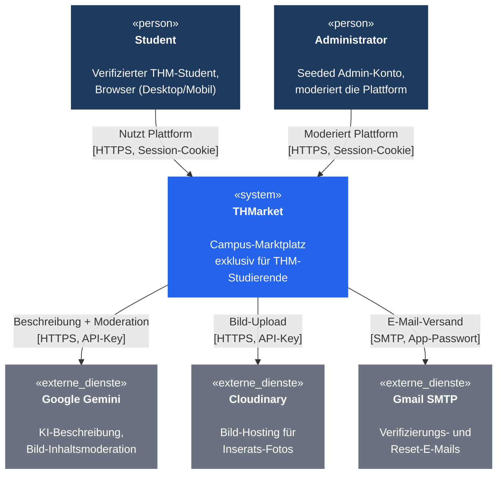

# P2 Architekturüberblick

## P2.1 Systemkontext

THMarket besteht aus einem React/Vite-Frontend (Vercel) und einem NestJS-Backend (Render) mit einer PostgreSQL-Datenbank (Neon, über Prisma angebunden). Für drei Aufgaben werden externe Dienste angebunden: Versand von Verifizierungs- und Reset-E-Mails (Gmail SMTP), Speicherung von Inseratbildern (Cloudinary) und automatische Beschreibungsvorschläge sowie Bildmoderation (Google Gemini). Die Datenbank ist kein externes Nachbarsystem, sondern Teil von THMarket selbst, und wird deshalb hier nicht als eigener Akteur dargestellt.

*Abbildung 1: Systemkontextdiagramm von THMarket*

Diagramm anzeigen

*(Mermaid-Quelldatei: [`diagrams-code/p2-systemkontext.mermaid`](diagrams-code/p2-systemkontext.mermaid))*

## P2.2 Technischer Rahmen

| Baustein | Technologie |
|---|---|
| Frontend | React 19, Vite, TypeScript, React Router, Deployment: Vercel |
| Backend | NestJS 11, Deployment: Render |
| Datenbank | PostgreSQL (Neon), Zugriff über Prisma 6 |
| Echtzeit-Chat | Socket.io v4 |
| Bildspeicher | Cloudinary |
| KI-Beschreibung/-Moderation | Google Gemini (`@google/genai`) |
| E-Mail-Versand | Gmail SMTP |
