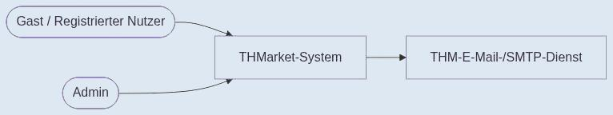
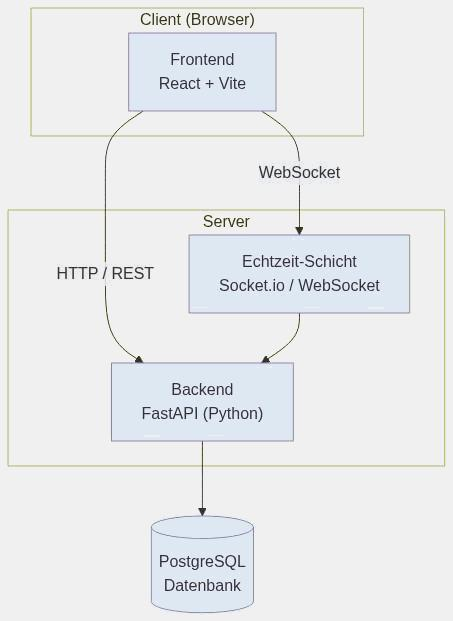

# 1.3 Systemkontext

THMarket ist die Vermittlungsplattform zwischen Studierenden der THM. Um die App zu nutzen, muss man sich mit seiner THM-Mail registrieren und den Account über einen Bestätigungslink freischalten. Die Bestätigungsmail dafür verschickt das System über einen externen E-Mail-Dienst (SMTP).

Ist man eingeloggt, kann man Inserate erstellen, durchsuchen und über den Chat mit anderen Nutzern schreiben. Zusätzlich gibt es einen Admin, der Nutzerkonten verwaltet und sich um gemeldete Inserate kümmert.

*Abbildung 1: Systemkontextdiagramm der THMarket-Anwendung*

# 1.4 Architekturüberblick

THMarket läuft nach dem Client-Server-Prinzip und besteht aus vier Teilen: Frontend, Backend, Datenbank und einer Echtzeit-Schicht für den Chat. Das Frontend ist mit React gebaut und wird über Vite gebündelt — es ist das, was der Nutzer im Browser sieht, und schickt seine Eingaben ans Backend weiter. Das Backend läuft mit FastAPI (Python) und kümmert sich um Login, Registrierung, das Anlegen und Suchen von Inseraten sowie Favoriten und Meldungen.

Gespeichert wird alles in einer PostgreSQL-Datenbank: Nutzer, Inserate samt Bildern, Kategorien, Favoriten, Konversationen, Chat-Nachrichten und Meldungen. Für den Chat selbst wird Socket.io verwendet — darüber läuft eine WebSocket-Verbindung, sodass Nachrichten sofort ankommen, ohne dass die Seite neu geladen werden muss.

Wir haben die App modular aufgebaut, damit man später leicht weitere Funktionen oder externe Dienste ergänzen kann. Frontend, Backend, Datenbank und Echtzeit-Schicht sind sauber getrennt, das macht es einfacher, das Projekt später zu warten oder weiterzuentwickeln.

**Verwendete Technologien:**

- **Sprachen:** JavaScript, Python, SQL
- **Frameworks/Bibliotheken:** React, FastAPI, Socket.io
- **Datenbank:** PostgreSQL
- **Build-Tool:** Vite

*Abbildung 2: Architekturüberblick der THMarket-Anwendung*